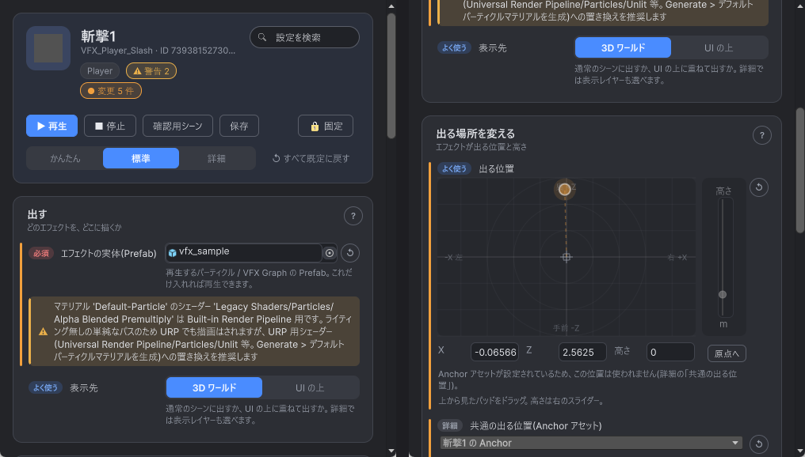

# 1008. 専用エディターの UI/UX 全面見直し（サンプルエディターで方向を決める）

> 起票 2026-10-10。持ち込み先（MS2026）から「**学習コストが高い**」「**パラメータが多すぎてどれを触ればいいか把握できていない**」という声が上がった。個別の欠陥修正（U-xx 系）ではなく情報の出し方そのものを見直す。**まずサンプルエディターを複数作り、ユーザーが触って方向を決める**（ユーザー指示）。UI/UX の観点で有効な便利機能の追加は可。
> 関連: [09_editor_tools.md](09_editor_tools.md) §6〜§8（ウィンドウ規約）/ [reviews/19](reviews/19_vfx_usability_review.md)（VFX の使い勝手レビュー）/ [1004_tasks.md](1004_tasks.md) UX 節（チケット）

## 1. 現状（2026-10-10 の調査、コードと docs から）

| 事実 | 影響 |
|---|---|
| 専用エディターは約 20 ウィンドウ。共通 UI 部品（セクション・ヘルプ・開閉記憶）も USS/UXML も無く、各ウィンドウが C# でインラインに組んでいる | 見た目・構造の一貫性が無く、1 つ覚えても次に活きない。横断的な改善は全ファイルに及ぶ |
| 全 Data に共通欄が約 14（Id / DisplayName / Description / Category / Tags / Icon / Assignee / SpecUrl / Version / Author / UpdatedAt / ChangeNote / Flags / Events）、その下に固有欄（Vfx 10、Se 14、Canvas 16 + ネスト）が並ぶ | 「最初の 1 つ」を作るのに必須なのは多くが 1〜2 欄（Vfx = Prefab、Se = Clip、Canvas = Prefab）なのに、画面上では区別が付かない |
| 段階表示（基本/詳細、初級/上級）の仕組みが無い。隠し方は「閉じた Foldout」だけで、VFX の「基本設定」「Anchor」「パラメータ」、Presentation の「共通設定」は既定で開いている | 最小経路に不要な節が最初から見える |
| Canvas Editor は最小経路の Prefab 欄が最下部の既定 Inspector 内にあり、上部は追従・自動収集・プリセット一括など Prefab と無関係の操作列 | 「最初に触る欄」が最も見つけにくい位置にある |
| 「雛形から作る」プリセットは Shake/Haptics・Slider・UI Tween だけ。VFX / Presentation / Canvas / SE は空から始まる | 何を埋めればよいか分からない |
| ウィンドウ内に「次にやること」を示す仕組みが無い。検証（`DataValidationSection`）は問題の列挙で、手順の案内ではない | 学習はマニュアル頼み。マニュアルは項目解説型で「触らなくてよい欄」を示していない。導線ページは SE 1 件の「はじめての 15 分」のみ |
| Tooltip は Vfx/Se/Bgm/Material/Model/Anchor がほぼ 100%、Canvas 50%、AnchorGroup 31%、ControlSkin 22%。ネスト構造（ButtonWire 等）の欄は無いものが多い | 欄名だけでは意味が分からない |

## 2. 方針

1. **欄を減らさない**（互換性ポリシー [42](42_distribution.md) §5: シリアライズ形式は追加のみ）。**見せ方を変える**。
2. **「必須 / よく使う / 詳細」の 3 段**に欄を分類する根拠はコードにある（Validator が Error にする欄 = 必須、既定値で警告が出ない欄 = 詳細）。分類は種別ごとの静的な表（`FieldGuide`）として 1 箇所に置き、どのサンプルも同じ表を使う。表には **平易な日本語ラベル・一言説明・検索語**も持たせる。
3. **サンプルは同じ Data 種別（`VfxData`）で 3 方向**作り、同じ土俵で比べる。VFX は必須欄が 1 つ（Prefab）、プレビューの基盤（`SceneVfxPreviewDriver`）と検証（`DataValidationSection`）が揃っていて、使い勝手レビュー（[19](reviews/19_vfx_usability_review.md)）の前例がある。
4. **サンプルは開発リポジトリの `Assets/EditorPrototypes/Editor/`** に置く（パッケージ `com.ddrive.core` に入れない。asmdef `DDrive.EditorPrototypes` が `DDrive.Editor` / `DDrive.Runtime` / `DDrive.Foundation` を参照）。既存の `VfxEditorWindow` は触らない。メニューは `DDriveMenu.Root + "Prototypes/"`。採用が決まった方向を本実装するときに、パッケージ側へ共通部品として移す。
5. サンプルでも [09](09_editor_tools.md) §7 の規約（`ScrollView` ルート、横幅 500px で見切れない）と §0 の禁止事項（Data を書くときは `Undo.RecordObject` + `SetDirty`）は守る。プレビューは既存の `SceneVfxPreviewDriver` を使い、ウィンドウ内描画はしない。

## 3. サンプル 3 方向

同じ `VfxData` を開き、同じ `FieldGuide` を使う。違いは「欄をどう見せ、どう辿らせるか」。

### A. 段階表示（かんたん / 標準 / 詳細）+「次にやること」

- 上部に **モード切替**（かんたん / 標準 / 詳細）。かんたん = 必須欄 + プレビューのみ、標準 = + よく使う欄、詳細 = 全欄（既存 Inspector 相当）。選んだモードは EditorPrefs に記憶。
- 最上部に **「次にやること」カード**: Validator の結果と欄の状態から、今やるべき 1 手を 1 行で出す（例: 「1. Prefab を設定する → 2. ▶ で確認する → 3. 保存」。完了した手は ✓）。
- 隠れている欄がある節には「あと N 個の設定（詳細で表示）」のリンクを出す。
- 便利機能: 欄の右に **「既定に戻す」**（既定値と違う欄だけ目印が付く）。
- 狙い: 「何を触ればよいか」をモードが答える。既存エディターへの移植が最も素直。

### B. ステップ型（作る → 見る → 整える → 登録）+ 雛形から始める

- **ページ送り**（戻る / 次へ、上部に進捗 1/4〜4/4）。1 ページに出す欄は 1〜3 個。
  1. **選ぶ**: 雛形（ヒット一発 / 常駐ループ / UI の上に出す / 空から）と Prefab
  2. **見る**: 確認用シーンで ▶（リピート・速度）。ここで「良ければ次へ」
  3. **整える**: 出る位置（Anchor の 2D パッド・高さ）と長さ（LifeMode / Duration）だけ
  4. **登録**: 検証の結果 → 表示名・カテゴリ → 保存。完了後は「すべての設定を見る」で標準エディターへ
- 雛形は `VfxData` の欄の組（LifeMode / Duration / FadeOut / Render / Anchor）を一括で入れる（Undo 1 回）。
- 狙い: 初回の学習コストを最小にする。2 回目以降は A や C が速いので、「新規作成のとき」専用になる想定。

### C. 目的別カード + 設定の検索

- 構造（Data のフィールド順）ではなく **「何をしたい？」** で束ねたカード: 「出す」「出る場所を変える」「長さ・消え方を変える」「見た目を調整する（Params）」「音・イベントと合わせる」「管理情報」。各カードは 1〜4 欄で、平易なラベル + 一言説明（FieldGuide から）。
- 上部に **設定の検索欄**（例: 「高さ」「ループ」「レイヤー」と打つとその欄だけ出る。ラベル・説明・検索語・元のフィールド名に一致）。
- フィルタ: **「変更済みだけ」**（既定値と違う欄だけ表示）/ 「必須だけ」。
- 各カードに「？」（マニュアルの該当節を開く。既存 `ManualLauncher`）。
- 狙い: 欄数が多いまま「探せる」ようにする。Canvas のように欄が多い種別に向く。

### D. デザイン重視（専用テーマ + ビジュアル部品）— 2026-10-10 追加（ユーザー指示「D でデザインをかなり凝ったもの」）

A〜C は「情報の出し方」の比較だったが、D は **見た目と触り心地を本気で作り込む**。機能は A の段階表示 + C の検索を土台にし、以下を専用の USS テーマで実装する（インラインスタイル禁止。`Assets/EditorPrototypes/Editor/Theme/` に USS を置き、`styleSheets.Add`）。Unity の Light / Dark テーマ両対応。

| 部品 | 内容 |
|---|---|
| ヘッダー（ヒーロー） | 左にアセットのアイコン（`Icon` があればそれ、無ければ種別の既定アイコンを大きく）、右に表示名（大きめの太字）・ID・カテゴリのチップ・状態チップ（✓ 検証 OK / ⚠ 警告 N / ✕ エラー N を色付き）。下に主操作のボタン列（▶ 再生 / ■ 停止 / 確認用シーン / 保存）を「主ボタンは塗り、副ボタンは枠だけ」で区別 |
| 段のバッジ | 欄のラベル左に 必須（赤系）/ よく使う（青系）/ 詳細（灰）の小さなバッジ。モード切替はヘッダー直下の **セグメントコントロール**（かんたん / 標準 / 詳細）。切替はアニメーション無しでよいが、選択中は塗りで明示 |
| カード | 目的ごとのカード（C と同じ束ね方）。角丸・薄い枠・見出し + 一言説明・右上に「？」。カード内の欄は 2 段組み（ラベル列固定幅、入力列伸縮）。空のカードは「この設定は既定のままで大丈夫です」の薄いプレースホルダー |
| ビジュアル入力 | **長さ**: LifeMode / Duration / FadeOut を 1 本の横バー（OneShot = 固定長バー + 末尾のフェード部分を半透明で、Loop = 無限記号）で表し、バー上のドラッグで Duration、端のドラッグで FadeOut を編集（Undo 対応）。**位置**: Anchor を上から見た 2D パッド（B より大きめ、グリッド + 中心マーク + 現在位置の点、側面に高さスライダー）。**レイヤー**: Render / RenderLayer をトグル + ドロップダウンで横並び |
| 検索 | ヘッダー右の検索欄。入力中はカードが絞られ、一致した語をラベル内でハイライト（太字 or 背景色） |
| 変更の可視化 | 既定値と違う欄は左端に細い色付きバー。ヘッダーの状態チップに「変更 N 件」。「↺ すべて既定に戻す」は確認ダイアログ付き |
| 検証 | `DataValidationSection` の中身を、カード内の該当欄の下に **インラインの注意行**（アイコン + 1 行 + 修正ボタン）としても出す |
| 空状態 | 対象未選択のときは、中央に大きめの案内（「Project で VfxData を選ぶか、ここにドロップ」）とドロップ領域 |
| 余白・文字 | 8px グリッド、見出し 14px 太字 / 本文 12px / 補足 11px 薄色。長いラベルは省略 + tooltip |

狙い: 「使いたくなる」見た目で学習コストの体感を下げる。採用するなら USS テーマを共通基盤（パッケージ側）にし、A〜C で選んだ構造に当てる。

### 3 案に共通で入れるもの

- `FieldGuide`（`VfxData` 用。欄ごとに: フィールド名 / 平易なラベル / 一言説明 / 段（必須・よく使う・詳細）/ 目的カード / 検索語 / 既定値判定）。将来はパッケージ側の共通基盤にする前提で、種別に依存しない形（`FieldGuide<TData>` または表のクラス）にする。
- 共通欄（AssetDataBase の 14 欄）は「管理情報」としてまとめ、既定では **DisplayName と Category だけ**を見せる。
- 対象アセットの選択（Project 選択に追従 / 🔒 固定）、▶ プレビュー、検証（`DataValidationSection`）、保存は既存の仕組みを再利用。
- 横幅 500px で見切れない。`ScrollView` ルート。

## 4. 判断のしかた（ユーザー）

`Tools > D-Drive > Prototypes >` の 4 ウィンドウ（A〜D）を、同じ VfxData（例: 確認用データの `Hit` 系）で開いて比べる。観点:

| 観点 | 問い |
|---|---|
| 最初の 1 つ | 初めての人が Prefab を入れて ▶ まで迷わず行けるか |
| 2 回目以降 | 慣れた人が目的の欄にすぐ辿り着けるか |
| 移植のしやすさ | 他の 19 ウィンドウ（特に Canvas / Presentation）に同じ型を当てられるか |
| 便利機能 | 「次にやること」「既定に戻す」「雛形」「検索」「変更済みだけ」のどれが効くか（混ぜてよい） |

決まったら [1004](1004_tasks.md) に本実装のチケット（共通部品 → VFX → Canvas → Presentation → 残り）を切る。

## 5. 実装メモ

**2026-10-10 追記(UX-0、サンプル 3 本)**

- 置き場: `Assets/EditorPrototypes/Editor/`（asmdef `DDrive.EditorPrototypes` = Editor 専用・autoReferenced=false。参照は `DDrive.Foundation` / `DDrive.Runtime` / `DDrive.Editor`。パッケージには入れない）。
- ファイル: `PrototypeMenu.cs`（メニュー `Tools/D-Drive/Prototypes/` の A / B / C。`[DataEditor]` は付けない）/ `FieldGuide.cs`（`FieldTier`・`FieldGuideEntry`・種別非依存の `FieldGuide` 抽象と検索一致）/ `VfxFieldGuide.cs`（VfxData 全固有欄 + 共通欄の表。節 = A 用、目的カード = C 用）/ `FieldGuideUi.cs`（`GuidedField` = 案内付き 1 欄、`FieldGuideUi.MakeField(so, defaultSo, entry, showResetButton)`、読み取り専用の管理情報、カード枠）/ `PrototypeWindowBase.cs`（対象追従 + 🔒、▶ プレビュー〔`SceneVfxPreviewDriver`〕、リピート・速度、確認用シーン、`DataValidationSection`、既定値比較）/ `PrototypeAWindow.cs` / `PrototypeBWindow.cs` / `PrototypeCWindow.cs`。
- 段の根拠: `VfxDataValidator` が Error にするのは Prefab のみ → 必須。普段触る欄と Warning の対象（LifeMode・Duration・Render・Anchor・Params・DisplayName・Category）→ よく使う。既定のままで警告が出ない欄 → 詳細（FadeOutSec・AnchorId・RenderLayer・LightLayerMask・Flags・Events・その他の共通欄）。
- 既定に戻す: `ScriptableObject.CreateInstance<VfxData>()` を既定値の基準にし、`SerializedProperty.EqualContents` で比較。違う欄にだけ「●」と「↺」が出る。戻すときは `Undo.RecordObject` + `CopyFromSerializedProperty` + `SetDirty`。
- 比べ方: Project で `Assets/GameData/Vfx/Player/VFX_Player_Slash`（斬撃 1、Prefab 設定済み）か `斬撃2` を選び、3 ウィンドウを開く（選択に追従）。Prefab を外した状態で A の「次にやること」と B の「次へ」が止まる様子、LifeMode を Loop に変えて ● と ↺ が付く様子（A / C）、C の検索に「高さ」「ループ」「レイヤー」を入れる様子を見るとよい。B は雛形を押してから 2 → 3 → 4 と進める。
- 割り切った点: 対象は VfxData のみ。B の 2D パッドは X/Z のみ（±3m 固定、Space が World 以外でも相対値として書く、Undo / 外部変更でパッドは再描画されない）。A の「次にやること」は 3 手固定（Prefab → ▶ → 保存）。C の「？」は VFX Editor のマニュアルページを開くだけ（欄ごとの節には飛ばない）。「スポーン先」「複数同時再生」「Anchor の SceneView ハンドル」「Params 定義の編集支援」は既存 `VfxEditorWindow` 側にだけある。`MaskField` ではなく既定の `PropertyField` で LightLayerMask を出す。`RenderLayer` だけ `LayerField`。
- 検証: コンパイル 0 エラー、3 ウィンドウを `menu_execute` で開いて要素生成（A / C = 全 20 欄、B = ページごとに 1〜2 欄）、A のモード切替で表示欄が 1 / 8 / 20、C の検索「高さ」で Anchor のみ、EditMode 2077 green。

**2026-10-10 追記（UX-0b、サンプル D = デザイン重視）**

- 追加ファイル（すべて `Assets/EditorPrototypes/Editor/`）: `PrototypeDWindow.cs`（窓本体: ヒーロー・モード・検索・カード構築・検証のインライン化・空状態）/ `PdRows.cs`（`PdRow` = 1 欄、`PdLifeRow` / `PdAnchorRow` / `PdRenderRow` = ビジュアル入力を載せた複合欄、`PdCard` = カード）/ `DurationBar.cs`（長さの横バー）/ `AnchorPad.cs`（位置の 2D パッド + 高さスライダー）/ `PdPainter.cs`（`PdPalette` = Painter2D 用の色と角丸・破線の補助）/ `Theme/PrototypeD.uss`（テーマ。色・余白・文字のすべて）。`PrototypeMenu.cs` に `D デザイン重視` を追加。
- 土台の変更: `PrototypeWindowBase` に `CustomChrome`（true の窓はツールバー・狙い・対象欄を作らず、対象が無くても `BuildBody` が呼ばれる）・`ConfigureRoot`・`Locked` を足した（A〜C は既定 false で動作不変）。
- 表（§3-D）との対応: ヒーロー = アイコン / 表示名（18px 太字）/ ID / カテゴリのチップ / 状態チップ（✓ 検証 OK・⚠ 警告 N・✕ エラー N）/「変更 N 件」チップ（クリックで「変更した設定だけ」）/ 主ボタン（▶ 再生は塗り、他は枠）。段のバッジ = 必須（赤）・よく使う（青）・詳細（灰）+ ヘッダー直下のセグメント（選択中は塗り）。カード = 角丸・薄い枠・見出し 14px + 一言説明 + 右上「？」、欄は 2 段組み（ラベル 172px 固定）、欄が無いカードは「この設定は既定のままで大丈夫です」。ビジュアル入力 = `DurationBar`（OneShot / Duration = 固定長バー + 末尾の余韻を半透明、Loop = ∞、バー上ドラッグで Duration、右の空き地のドラッグで FadeOut、Shift で 0.25 秒刻み）・`AnchorPad`（1m グリッド・距離リング・原点・現在位置・原点からの破線・ホバー位置・高さのスライダー・X/Z/高さの数値）・Render をセグメント + 表示レイヤーのドロップダウン横並び（詳細のみ）。検索 = ヒーロー右、一致語を `<mark>` で強調（検索語だけに一致したときは説明の末尾に出す）、検索中はモードに関わらず全欄から探す。変更の可視化 = 既定値と違う欄の左端に橙のバー + 「↺」、「↺ すべて既定に戻す」は `DisplayDialog` で確認（管理情報は対象外、Undo 可）。検証 = 該当欄の下にアイコン + 1 行 + 修正ボタン（メッセージ中のフィールド名 / 代表語で欄に結びつけ、結びつかないものは末尾の「その他の検証」）。Error / Warning がある欄はモードで隠れていても見せる。空状態 = 中央の案内 + 破線のドロップ領域（`DragAndDrop` で VfxData を受ける）+ ObjectField + 最近の VfxData。8px グリッド、見出し 14px / 本文 12px / 補足 11px、横幅 500px・`ScrollView` ルート。Light / Dark は root の `pd-light` / `pd-dark` クラスと USS 変数で切り替え（実行中の切替も追従）。C# にインラインスタイルは無い（`display` の出し入れだけ C# から行う）。
- Undo: バー / パッドのドラッグは `Undo.RecordObject` + `SetDirty` で、1 回のドラッグ = 1 回の Undo（`CollapseUndoOperations`）。外部変更・Undo は 150ms の定期更新と `Undo.undoRedoPerformed` で再描画する。
- 割り切った点: 対象は VfxData のみ。Painter2D の色は USS の `--pd-p-*` を 0 サイズの子要素の `resolvedStyle` から読む（`CustomStyleProperty` はテーマ切替のあとに読み直されなかったため）。パッドの縮尺は縦 ±3m 固定（範囲外は端に寄せて警告色）、Space が World 以外でも相対値として書く。リピート再生・速度スライダーは D には無い（A〜C の `BuildPlayRow` はインラインスタイルのため流用していない）。「？」は VFX Editor のマニュアルページを開くだけ。Flags / Params / Events は既定の `PropertyField`（見た目は USS で揃えただけ）。検証メッセージと欄の結びつけは文字列の照合（新しい検査メッセージは「その他の検証」に出る）。
- 見つけた不具合（A〜C にも影響）: `SerializedProperty.EqualContents` は「同じプロパティか」の比較で値の比較ではないため、UX-0 の既定値との比較（`GuidedField.UpdateState`）は常に「変更あり」になっていた。`SerializedProperty.DataEquals` に直した（A〜C の「●」「↺」が実際に違う欄にだけ出るようになる）。
- 検証: コンパイル 0 エラー、スクリーンショットで Dark / Light 両方を確認、モード切替（かんたん / 標準 / 詳細）・検索・DurationBar と AnchorPad のドラッグ（ポインタイベントを送って値と Undo を確認）・外部変更の再描画・「すべて既定に戻す」のダイアログ・空状態を確認。

## 6. 試験版（v1.7.0-preview.1、2026-10-10）

サンプル A〜D を持ち込み先（MS2026 等）で試せるよう、プレリリース `v1.7.0-preview.1` として配布する。確認後にタグとサンプルは削除する（後始末 = [1001](1001_open_items.md)）。

- 場所: `Packages/com.ddrive.core/Editor/Prototypes/`（asmdef `DDrive.Editor.Prototypes`、Editor のみ・全型 internal。公開契約・互換性スナップショットには影響しない）。
- 試し方: 更新ウィンドウ（`Tools > D-Drive > Update`）の「更新先の版」一覧からプレリリースを明示選択 → manifest が `#v1.7.0-preview.1` になる。`Tools > D-Drive > Prototypes` の 4 本を VfxData で開いて比べる。
- サンプル VfxData は、各ウィンドウの空状態（対象未選択）の「サンプル VfxData を作る（vfx_sample）」ボタンで作れる（同梱の `Samples/vfx_sample.prefab` を使う `VFX_Sample_Hit`。既にあれば選ぶだけ）。
- 比べる観点は §4。
