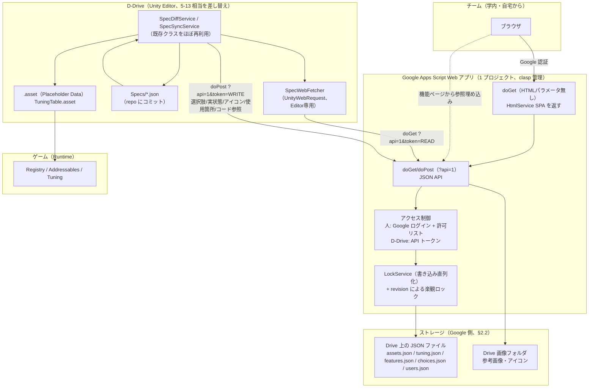

# 32. 仕様書 Web 化（Google Apps Script）詳細設計（ドラフト）

関連: [27_spec_sheet.md](27_spec_sheet.md)（旧方式・置き換え予定） / [10_workflow.md](10_workflow.md) §3 命名・ID 規約 /
[11_tasks.md](11_tasks.md) 5-12〜5-16, 6-9（本書 §8 で新チケットに置き換える） / [17_value_definition.md](17_value_definition.md)
ValueDef / [02_core_framework.md](02_core_framework.md) Registry・Codegen / [13_extensions.md](13_extensions.md) A-1
（発注リスト） / [11_tasks.md](11_tasks.md) 7-2（未実装タブ）

> 2026-09-14 ドラフト。ユーザー決定:「Google スプレッドシートへの入力が大変なので、仕様書を全部 HTML に置き換える
> （ツール向けのアセット一覧・調整値だけでなく、人が読む機能仕様も）。入力するのはチーム（学外・自宅からも）。
> この PC をサーバーにしない → Google Apps Script（GAS）の Web アプリで自作 HTML を動かす」。
> オーケストレーター推奨（ユーザー採用）: **編集の正本はオンライン（GAS 側のストレージ）、D-Drive は同期して
> repo の `Specs/*.json` にスナップショットとしてコミット**する。調整値の MVP 範囲は 2026-09-14 に追加確定
> （§3.2・§8 参照。テーブル型 + コメントは MVP、変更履歴・ロールバックは作らない）。

> **2026-09-14 追記: [§10](#10-アセット発注ツールへの再定義2026-09-14) が最新の目的**。ユーザーが完成像を
> 再確認した結果、このツールの目的は「アセット一覧・調整値の Web 化」ではなく**「アセットの発注」**だと
> 明確になった。**§3（データモデル）・§4（画面）・§8（チケット分割）は §10 の内容で置き換わる部分がある**
> （§10 内で個別に「§3.1 のこの行を置き換える」等を明記する）。§1・§2・§5〜§7・§9 の設計（GAS 構成・認証・
> ストレージ方式・セキュリティ・要判断の決定事項）はそのまま有効。§10 未満のセクションは経緯の記録として残す。

---

## 1. 目的と方針

### 1.1 docs/27 からの変更点

| 項目 | docs/27（旧方式） | 本書（新方式） |
|---|---|---|
| 入力先 | Google スプレッドシート（テンプレート） | GAS Web アプリの自作 HTML（SPA） |
| 対象 | ツール向け（アセット一覧・調整値）のみ。人向け「機能_<名前>」タブは自由記述で D-Drive は読まない | **ツール向け + 人向け機能仕様を 1 つのシステムに統合** |
| 正本 | スプレッドシート（Google 側） | **Web アプリのストレージ（Google 側）が正本のまま**。D-Drive は取得して repo にスナップショットを持つ |
| D-Drive との同期 | 一方向（シート → D-Drive）。取得は gviz CSV | 一方向（Web → D-Drive）は維持しつつ、**D-Drive → Web の送信 API を新設**（選択肢・実状態・アイコン等、§5.2） |
| 調整値 | float/int/bool/string のスカラーのみ、`TuningTable` に取り込み | **テーブル型・enum・ロック・コメントを追加**（§3.2）。カーブ・ベクトル・色・プリセットは v2 以降 |
| オフライン性 | シート未取得でもゲームは動く（.asset 化済みのため） | **同じ原則を維持**。`Specs/*.json` は D-Drive 側の同期の入力にすぎず、ビルド・ゲーム実行時は既存の `.asset`（`TuningTable` / 各 `AssetDataBase`）のみを参照する（§1.3） |

### 1.2 1 つのシステムへの統合と役割分担

- **人が読む機能仕様ページ**（旧: 人向け「機能_<名前>」タブ）と、**ツールが読むアセット一覧・調整値**（旧: 「アセット」「調整値」タブ）を、同じ Web アプリの中の別ページとして統合する。機能仕様ページからアセットカード・調整値を**参照で埋め込む**（値を二重に書かない。docs/27 §2.1 の原則を継承）
- **Web（GAS）が正本**。編集・コメント・状態管理はすべて Web 側で完結する
- **D-Drive は取得専門**（Web → D-Drive の既存原則、docs/27 §1 を継承: 「デザイナーの中身は上書きしない」）。D-Drive → Web は「選択肢」「実状態」など補助情報の送信のみで、企画側が入力した内容を上書きすることはない
- **ゲームは Web に依存しない**。同期で作られた `.asset`（Placeholder Data・`TuningTable`）だけを読む。Web アプリが落ちていても、学校のネットワークが繋がらなくても、直近に同期済みのビルドはそのまま動く

### 1.3 「ゲームは JSON だけを読む」の解釈（要確認、§9-1）

ユーザー決定の文言「ビルド・ゲーム実行時はこの JSON だけを読む」は、**ネットワーク（Web アプリ）に依存しない**という意味に解釈して設計する。具体的には:

- `Specs/*.json` は Web アプリから取得した内容をそのまま git にコミットするスナップショット（**オフラインの起点・履歴の代用**、§1.4）
- ゲームの実行時に JSON を直接パースするコードは**追加しない**。既存どおり `Specs/*.json` → 既存の同期パイプライン（`SpecDiffService`/`SpecSyncService`）→ `AssetDataBase` の `.asset` / `TuningTable.asset` に変換し、Addressables・Registry 経由で読む（CLAUDE.md §0-8「Manager を new するのは Bootstrap だけ」、[02_core_framework.md](02_core_framework.md) の既存資産管理と整合）
- これにより「禁止 API」「Data は読み取り専用」等の既存原則を変えずに済む

### 1.4 履歴・ロールバックを作らない代わりの git 履歴

ユーザー決定:「履歴はいらないがコメントは欲しい」。Web アプリ側に変更履歴・diff・ロールバック UI は**作らない**（§3.2、§8 MVP 範囲外）。その代わり:

- D-Drive が同期のたびに `Specs/assets.json` / `Specs/tuning.json` / `Specs/features.json` を**上書きしてコミット**する
- 「いつ・誰が・どの値をどう変えたか」は **git の commit log と diff で追える**（`git log -p Specs/tuning.json` 等）。Web アプリ自体に履歴機能を持たせる必要がなくなる
- 前提: **D-Drive 側で同期を実行してコミットする頻度**が実質的な履歴の粒度になる（Web 側で 1 日に何度値を変えても、次に D-Drive が同期してコミットするまでは 1 つの diff にまとまる）。頻繁な履歴が必要になった場合は v2 で Web 側に履歴機能を追加する余地を残す（§8 v2 未満の候補、§9-2）

---

## 2. 全体構成図

### 2.1 構成図



### 2.2 ストレージ方式の比較と推奨

| 観点 | A. スプレッドシートを DB として使う | B. Drive 上の JSON ファイル（**推奨**） |
|---|---|---|
| ネストしたデータ（テーブル型調整値の列定義・行、コメント配列） | セル=スカラーが前提。1 テーブル調整値ごとに別シート/別範囲が要り、行列とスキーマの対応がずれやすい | JSON はそのままネストを表現できる。列定義・行・コメントを 1 ドキュメントで一体管理できる |
| 人による誤操作 | シートを直接開けば誰でもセルを編集できてしまう（意味情報だけを人が打つ、という docs/27 の原則が崩れやすい） | アプリの API を通してしか書けない。バリデーション（範囲外・型違い・ロック）を書き込み経路 1 箇所に強制できる |
| 実装コスト | `SpreadsheetApp` は使い慣れているが、行 ID・範囲の管理が煩雑（挿入で行がずれる等） | `DriveApp`/`Utilities.newBlob` で読み書き。スキーマはコード側で完全に管理できる |
| 目視での緊急確認 | Google スプレッドシートを直接開けば一覧できる（アプリが壊れても) | JSON を直接読むのは人には不便。**緊急時用に「現在の JSON をスプレッドシート形式で書き出す」ボタンを Web アプリに用意する**ことで代替（読み取り専用のエクスポート。DB としては使わない） |
| 同時編集 | シート自体には行ロックの概念がなく、`LockService` を自分で挟む点は JSON 方式と同じ | 同じく `LockService` が必要（優劣なし） |
| セル数上限 | 1 スプレッドシートあたり 1000 万セルの上限あり（今回の規模では問題にならないが、テーブル型調整値が増えるとシートを分割する必要が出る） | Drive ファイルサイズ上限（Apps Script が扱えるテキストは数十 MB 単位まで問題ない）に対し、今回のデータ量（数百アセット・数百調整値）は 1 ファイル数百 KB 程度に収まる |

**推奨: B（Drive JSON ファイル）**。理由: (1) テーブル型調整値・コメント配列など今回追加する機能がネスト構造を前提とするため、(2) 「人はアプリの外からデータを直接触れない」という制約を構造的に作れるため（docs/27 §1 の「意味情報だけを人が打つ」の精神を、スプレッドシート以上に徹底できる）。目視確認用には「スプレッドシートへ書き出し」を v2 の任意機能として用意する（§8 v2）。

### 2.3 認証・アクセス制御

- **確定（2026-09-14 ユーザー回答）: GAS 所有者は個人の Gmail アカウント**（Google Workspace の学校ドメインではない）。**個人アカウントの Web アプリ デプロイには「特定のドメインに限定」オプションが存在しない**（Workspace アカウント限定の機能。[Deployments ガイド](https://developers.google.com/apps-script/concepts/deployments)）ため、ドメイン限定は使わず、**アプリのコード側で許可リスト（`users.json`）を持つ**方式で確定する（デプロイの権限設定だけでは実現できないための代替）
- **2 つの独立したデプロイを 1 つのスクリプトに対して作る**（Apps Script は 1 プロジェクトに複数デプロイを持てる。各デプロイは実行者・アクセス権を別々に設定できる）:

  | デプロイ | 実行者 | アクセス権 | 用途 | 認証方法 |
  |---|---|---|---|---|
  | ①人向け SPA | **User accessing the web app**（アクセスした人自身） | Anyone with Google account（ログイン必須。個人アカウントでも選択可） | ブラウザでの編集・閲覧 | `Session.getActiveUser().getEmail()` を取得できる（実行者=アクセスした人のときのみ信頼できる。[Session の既知の制約](https://developers.google.com/apps-script/reference/base/session)）→ **`users.json` の許可リストと照合**し、無ければ「メンバーのみ利用できます」ページを返す |
  | ② D-Drive API | **Me**（スクリプト所有者） | Anyone（ログイン不要。URL を知っていれば到達できるが中身はトークンで保護） | Unity Editor からの取得・送信 | クエリ/ヘッダの **API トークン**で判定（読み取り用・書き込み用を分ける）。Google 認証は使わない（`UnityWebRequest` から対話ログインはできないため） |

- 両デプロイは**同じ `doGet`/`doPost` 関数**を指す（コードは 1 つ）。リクエストに `token` パラメータがあれば② の経路（トークン検証のみ）、無ければ① の経路（Google アカウント許可リスト）に分岐する
- 初回アクセス時、①のデプロイは「実行者=アクセスした人」のため**各メンバーが個別に OAuth 同意**を求められる（学外からのアクセスでも Google アカウントさえあれば同意できる。人数が少ない社内利用のため [新規ユーザーの認可レート制限](https://developers.google.com/apps-script/guides/services/quotas) の対象にはなるが、チーム規模（数名〜十数名）なら問題にならない）
- 許可リスト（`users.json`）の追加・削除は管理者のみ（§3.4 ロール）。**個人情報はメールアドレスと表示名のみ**（§7）

### 2.4 GAS の制限と、設計が収まる根拠

| 制限 | 値 | 出典 | この設計での扱い |
|---|---|---|---|
| スクリプトの実行時間 | 6 分/実行 | [Apps Script quotas](https://developers.google.com/apps-script/guides/services/quotas) | 1 回の `doGet`/`doPost` は JSON 読み込み・パース・書き込みのみ（数百 KB）。数百ミリ秒〜数秒で終わる想定。6 分に到達する余地はない |
| 同時実行数 | 30 / user | 同上 | チーム規模（数名〜十数名）なら 1 人あたり同時に複数タブを開いても上限に達しない |
| URL Fetch 呼び出し | 20,000/日（個人）、100,000/日（Workspace） | 同上 | **GAS コード自身が外部 URL を `UrlFetchApp` で呼ぶ場合の上限**であり、D-Drive → Web アプリの着信リクエスト数には掛からない（着信は「Web アプリの実行」であり URL Fetch ではない）。本設計は `UrlFetchApp` を使わない（画像は `DriveApp` 直接操作のため） |
| トリガーの合計実行時間 | 90 分/日（個人）、6 時間/日（Workspace） | 同上 | v3 の「通知」（§8）で時間主導トリガーを使う場合のみ関係。1 日 1〜2 回の軽いチェックなら十分収まる |
| トリガー数 | 20 / user / script | 同上 | 通知用に 1〜2 個で足りる |
| PropertiesService | 500KB（総量）/ 9KB（1 値） | 同上 | トークン・許可リストの**キャッシュ**用途のみに使う（正データは Drive JSON 側）。9KB 制限に収まる小さな値のみ格納 |
| HtmlService の iframe サンドボックス | トップレベルナビゲーション不可・外部リンクは `target="_top"` 必須・アクティブコンテンツは HTTPS のみ | [HTML Service restrictions](https://developers.google.com/apps-script/guides/html/restrictions) | SPA 内のリンク（画面間の遷移）はすべて `<a>` のクリックを `preventDefault` した上で iframe 内の JS 状態で切り替える。外部リンク（ガント・Markdown 内のリンク）だけ `<a target="_top">`。外部 CDN は使わず、コードはすべてインライン。**2026-09-14 訂正**: 当初「同一オリジンなので `fetch`/`location.hash` が使える」としていたのは誤りだった（下記追補・実装メモ参照）。クライアント→サーバー通信は `google.script.run`、画面遷移の履歴管理は `google.script.history` を使う（[HTML Service: Communicate with Server Functions](https://developers.google.com/apps-script/guides/html/communication)・[Class google.script.history](https://developers.google.com/apps-script/guides/html/reference/history)） |
| 個人アカウントでのアクセス制限 | 「特定のドメイン」オプションは Workspace アカウント限定 | [clasp/deployment 関連スレッド](https://groups.google.com/g/google-apps-script-community/c/owFeX5fTcyo) | §2.3 のとおりコード側の許可リストで代替 |
| doGet/doPost レスポンスの 302 リダイレクト | Content Service のレスポンスは一度 `script.googleusercontent.com` へリダイレクトされる。外部クライアントはリダイレクト追従が必要 | [Content Service ガイド](https://developers.google.com/apps-script/guides/content) / [flow 解説](https://medium.com/google-cloud/understanding-flow-of-request-to-web-apps-created-by-google-apps-script-ac49e80f7c6b) | `UnityWebRequest` は既定でリダイレクトに追従する（`redirectLimit` 既定 32）。**実装時に実機で疑似トークン込みの `doPost` 呼び出しを確認すること**（§9-4、POST → 302 → GET の経路で本文が正しく処理されるかは Google 側フロントエンドで先に処理済みのため通常は問題にならないが、クライアント実装依存の既知の落とし穴として明記） |
| 実行者=アクセスした人での `getActiveUser` | 実行者が「Me」固定のときはアクセスした人のメールが取れない/信頼できない。「User accessing the web app」なら取得できる | [Session クラス](https://developers.google.com/apps-script/reference/base/session) / [getActiveUser が空になる条件の解説](https://bulldo.gs/get-the-active-users-email-in-apps-script/) | §2.3 のデプロイ①でこの制約を踏まえた設計にしている |

**結論**: 想定データ規模（アセット数百・調整値数百・機能ページ数十）とチーム規模（数名〜十数名、同時アクセスも同程度）であれば、上記のどの制限にも近づかない。最も注意すべきは「個人アカウントではドメイン制限が使えない」点と「302 リダイレクト」の 2 点で、いずれも本書の設計（許可リスト・リダイレクト追従の確認）で吸収できる。

### 2.5 ソース管理

- GAS のソースは repo の **`Tools/SpecWeb/`** に置き、[`clasp`](https://github.com/google/clasp) でローカル ⇔ Apps Script プロジェクトを同期する（`clasp push`/`clasp pull`/`clasp deploy`）
- 構成（実装時の目安。本チケットではコードを書かないため確定名ではない）:
  ```
  Tools/SpecWeb/
    appsscript.json        clasp が管理するマニフェスト（タイムゾーン・スコープ）
    Code.gs                doGet/doPost のルーティング（人向け/API 向けの分岐）
    Auth.gs                Google 許可リスト照合 + API トークン検証
    Storage.gs              Drive JSON の読み書き + LockService + 楽観ロック
    Assets.gs / Tuning.gs / Features.gs   各エンティティの CRUD ロジック
    Ui/Index.html           SPA 本体（テンプレート化された 1 ファイル、または include で分割）
    .clasp.json             ローカルのみ（scriptId 等。**git 管理しない**）
    .claspignore
  ```
- `.clasp.json` と API トークンの実値は `.gitignore` 対象。トークンは Web アプリ側で生成し、開発者が個別に `EditorPrefs`（D-Drive 側）や `clasp` の認証情報として個々に保持する（§7）

---

## 3. データモデル

全エンティティ共通のメタ情報:

```jsonc
{
  "id": "string",            // エンティティ内で一意。アセットは「種別::識別子」、調整値はキー、機能ページはスラッグ
  "revision": 3,              // 楽観ロック用。書き込み時にクライアントが最後に読んだ revision を送り、不一致なら 409 相当で拒否
  "updatedBy": "user@example.com",
  "updatedAt": "2026-09-14T09:00:00Z"
}
```

**変更履歴（複数世代の保持）は持たない**（§1.4）。`revision` は「今読んでいる内容が最新か」を判定するための番号であり、過去の値を遡れる機能ではない。

### 3.1 アセット仕様（`assets.json`）

| フィールド | 型 | 説明 |
|---|---|---|
| `assetType` | enum | [10_workflow.md](10_workflow.md) の種別。値は `AssetType` の enum 名（`Se`/`Vfx`/... 既存の対応表は [27_spec_sheet.md](27_spec_sheet.md) §7.2 のものを継承・そのまま使う） |
| `category` | string | D-Drive から送られる選択肢（`choices.json`、§3.3）から選ぶ。自由入力も許可（既存 D-Drive のカテゴリが自由記述のため） |
| `identifier` | string | PascalCase。ファイル名・ID 生成の元（docs/27 §3.1 を継承） |
| `displayName` | string | | 
| `status` | enum | `未着手` / `仮` / `本番` / `保留`（docs/27 §7.2 の語彙を継承） |
| `assignee` | string | 担当者（メンバー一覧 `users.json` から選ぶ） |
| `dueDate` | string(date) | 期限（新規。旧シートには無かった項目） |
| `priority` | enum | `高`/`中`/`低`（新規） |
| `note` | string | 備考 |
| `referenceImages` | array\<driveFileId\> | 参考画像（Drive 上のファイル ID） |
| `relatedFeaturePages` | array\<featurePageId\> | 関連する機能ページへの参照 |
| `comments` | array\<Comment\> | §3.5 |
| **`ddriveState`**（D-Drive → Web、§5.2） | object | `{ created: bool, isPlaceholder: bool, iconAssetId: driveFileId, hasIcon: bool, usageCount: int, lastSyncedAt: string }`(`hasIcon` は 2026-09-14 追補。`iconAssetId` は Drive アップロード未実装のため常に `null`、下記§9参照) |

### 3.2 調整値（大幅に強化、MVP 範囲は §8 参照）

#### 3.2.1 スカラー型調整値（MVP）

```jsonc
{
  "id": "Influence/FanBase",          // <機能>/<名前>。既存の Signal キーと同じ書式(docs/27 §3.2 を継承)
  "kind": "scalar",
  "valueType": "float",                // float | int | bool | string | enum
  "value": 1.0,
  "enumOptions": [],                    // valueType=enum のときのみ。["Easy","Normal","Hard"] 等
  "min": 0, "max": 10, "step": 0.1,     // float/int のみ有効。範囲外は即時検証エラー(§4)
  "unit": "%",
  "description": "ファン1人あたりの影響力の素点",
  "group": "Influence",                 // グルーピング・タグ表示用
  "tags": ["Balance"],
  "locked": false,                      // true = プログラマーだけが変更可(§3.2.4)
  "comments": [ /* Comment[] 、§3.5 */ ]
}
```

#### 3.2.2 テーブル型調整値（**MVP**、2026-09-14 追加確定）

列定義（スキーマ）を持つ 2 次元表。「敵パラメータ一覧」「レベル別経験値」のような、キー 1 つでは表現できない調整値のための形式。

```jsonc
{
  "id": "Enemy/Params",
  "kind": "table",
  "columns": [
    { "key": "Hp",    "valueType": "int",   "min": 1, "max": 9999, "unit": "" },
    { "key": "Speed", "valueType": "float", "min": 0, "max": 20,   "unit": "m/s" },
    { "key": "Type",  "valueType": "enum",  "enumOptions": ["Melee", "Ranged", "Boss"] }
  ],
  "rows": [
    { "rowId": "Slime",   "cells": { "Hp": 10,  "Speed": 1.2, "Type": "Melee" },  "comments": [] },
    { "rowId": "Archer",  "cells": { "Hp": 20,  "Speed": 2.0, "Type": "Ranged" }, "comments": [] }
  ],
  "locked": false,
  "comments": [ /* テーブル全体へのコメント */ ]
}
```

- コメントの粒度は **行単位 + テーブル全体**とする（セル単位のコメントは見送り。§9-5）。
  行の `comments` は §3.6 の `Comment[]` と同じ構造の配列（**2026-09-14 W-6〜W-8 実装で確定**。
  当初のドラフトにあった `"comment": "初期敵"`（単一文字列）は §3.6 の「同じ構造で付けられる」との
  記述と矛盾していたため、行にも他のエンティティと同じ `Comment[]` を持たせる形に統一した）
- 行の追加・削除・列の追加・削除は Web 側の編集グリッドから行う（§4.4）。列を削除すると既存行の該当セルも削除される（確認ダイアログを出す）

#### 3.2.3 v2 以降（本チケットでは設計のみ、実装しない）

| 機能 | 概要 |
|---|---|
| カーブ | `valueType: "curve"`。D-Drive の `ValueDef`（[17_value_definition.md](17_value_definition.md)）と互換のキー列（時間キー×値のペア配列 + 補間種別）を持つ |
| ベクトル・色 | `valueType: "vector3"` / `"color"` |
| プリセット / バリアント | ベース値に対する「上書き差分」だけを持つオブジェクト配列。例: `{ "name": "Hard", "overrides": { "Enemy/Params.Archer.Hp": 40 } }` |
| 派生値（式） | 他の調整値を参照する式（例: `A * B + 1`）。循環参照の検出が要るため v2 でも後回し候補 |

#### 3.2.4 ロックとコード未使用検出・即時検証

- `locked: true` の調整値は、Web アプリの UI 上で**編集フィールドを無効化**し、「プログラマーだけが変更できます」の注記を出す（アプリ側のロールが `programmer` の場合のみ編集可、§3.4）。API 側でも `role` を見て拒否する（UI 制御だけに頼らない）
- **範囲外・型違いの即時検証**: `min`/`max`/`enumOptions` に対して、書き込み API がサーバー側で検証する（クライアント側の入力チェックだけに頼らない。docs/27 §6 の「調整値の値が最小〜最大の範囲外 = Error」を Web 側に前倒しする）
- **コード未使用の検出**: D-Drive が `TUNING` 定数への参照箇所をコード検索し、使われていないキーの一覧を送信する（§5.2）。Web 側は該当キーに「未使用」バッジを表示するのみ（削除は人が判断）

### 3.3 選択肢（`choices.json`）

| フィールド | 説明 |
|---|---|
| `assetTypes` | `AssetType` の enum 名一覧（D-Drive → Web、§5.2 で同期） |
| `categories` | 種別ごとのカテゴリ候補（D-Drive の既存アセットから収集して送信。docs/27 §4.4 の「選択肢をコピー」に相当する自動版） |
| `statuses` | `未着手`/`仮`/`本番`/`保留`（固定） |
| `tags` | 自由入力 + よく使われるタグの候補一覧 |

### 3.4 ユーザー / ロール（`users.json`）

| フィールド | 説明 |
|---|---|
| `email` | Google アカウントのメールアドレス（§2.3 の許可リストに使う） |
| `displayName` | 表示名 |
| `role` | `viewer`（閲覧のみ） / `editor`（アセット・調整値・機能ページを編集可、ロック済み調整値は不可） / `admin`（`locked` 調整値の編集・ユーザー管理・トークン再発行が可能） |

管理者（`admin`）は最低 1 名必須（Web アプリ所有者を既定で `admin` にする）。

### 3.5 機能仕様ページ（`features.json`、人向け）

```jsonc
{
  "id": "feature-influence",
  "title": "ファン影響力システム",
  "status": "検討中",
  "assignee": "よしだ",
  "updatedAt": "...",
  "body": "## 概要\n...(Markdown、§4.5)",
  "images": ["driveFileId1", "driveFileId2"],
  "embeds": [
    { "type": "asset",  "ref": "Se::Slash" },
    { "type": "tuning", "ref": "Influence/FanBase" }
  ],
  "comments": [ /* Comment[] */ ]
}
```

- `embeds` は**参照のみ**を保存する。表示時に最新の状態・値を都度読みにいく（docs/27 §2.1「値そのものは二重に書かない」の原則を継承）
- D-Drive はこのエンティティの本文（`body`/`images`）を一切扱わない。D-Drive 側が必要とするのは `AssetDataBase.SpecUrl` に埋め込む URL（このページの ID から組み立てる）だけ

### 3.6 コメント（`Comment`、共通構造）

```jsonc
{ "id": "c1", "author": "user@example.com", "body": "この値は要調整", "createdAt": "...", "resolved": false }
```

アセット・調整値（スカラー/テーブル行/テーブル全体）・機能ページのいずれにも同じ構造で付けられる。**スレッド機能・返信のネストは持たない**（フラットな配列。過剰設計を避ける）。

---

## 4. 画面と機能

MVP / v2 / v3 の区分は §8 のチケット分割と対応する。

### 4.1 アセット一覧（MVP）

```
┌ アセット一覧 ──────────────────────────────────────────┐
│ 検索[________]  種別[全て▾] 状態[全て▾] 担当[全て▾]  [+新規] │
├──────┬────────┬──────┬────┬──────┬────────┤
│種別   │識別子   │表示名 │状態 │担当  │D-Drive状態      │
├──────┼────────┼──────┼────┼──────┼────────┤
│ Se    │ Slash   │斬撃音 │ 仮 │よしだ│ ✅作成済 (icon)  │
│ Vfx   │ FireBall│火球   │未着手│─    │ ⬜未作成         │
└──────┴────────┴──────┴────┴──────┴────────┘
```

- 並べ替え・列ごとの絞り込み・種別ごとのグループ化
- 行を選ぶと右側にアセット詳細（§4.5）をスライドイン
- v2: 保存できるビュー（絞り込み条件を名前付きで保存）、一括編集（複数選択して状態・担当をまとめて変更）、CSV 入出力（初期データ流し込み・docs/27 の `.xlsx` テンプレートからの移行用）

### 4.2 カンバン（v2）

状態（未着手/仮/本番/保留）を列にしたカード表示。ドラッグで状態変更。フィルタはアセット一覧と共通。

### 4.3 ダッシュボード（v2）

```
┌ ダッシュボード ─────────────────────────────┐
│ 種別 × 状態                 担当別          │
│ Se   [███████░░░] 70%       よしだ: 12件    │
│ Vfx  [███░░░░░░░] 30%       たなか: 8件     │
│                                              │
│ 期限切れ: 3件   未作成(D-Drive): 21件         │
└──────────────────────────────────────────────┘
```

[13_extensions.md](13_extensions.md) A-1（発注リスト）・[11_tasks.md](11_tasks.md) 7-2（未実装タブ）が持つ「未登録 ID の見える化」を、Web 側のダッシュボードとしても提供する（D-Drive から送られる `ddriveState.created` を集計するだけで実現できる。D-Drive 側の該当機能を置き換えるものではなく、企画側が Unity を開かずに把握できる窓口を追加するもの）。

### 4.4 調整値編集（MVP: スカラー一覧 + テーブル編集グリッド。v2: カーブ・プリセット比較・履歴 diff）

```
┌ 調整値: Enemy/Params（テーブル型） ─────────────────────┐
│ [+行] [+列]                              🔒未ロック       │
├─────────┬───────┬────────┬──────────────┤
│ rowId    │ Hp     │ Speed   │ Type          │ コメント     │
├─────────┼───────┼────────┼──────────────┼─────────┤
│ Slime    │ 10     │ 1.2     │ Melee ▾       │ 💬1         │
│ Archer   │ 20     │ 2.0     │ Ranged ▾      │            │
└─────────┴───────┴────────┴──────────────┴─────────┘
  ↑ 範囲外の値はセルを赤く即時表示（min/max 検証）
```

- スカラー一覧はキー・値・範囲・単位・説明を 1 行 1 件で表示。スライダー/数値入力/トグル/enum ドロップダウンは `valueType` に応じて切り替える
- テーブル編集グリッドは行・列の追加削除、セル編集、行コメント
- v2: カーブ編集（ブラウザ上のグラフ、[17_value_definition.md](17_value_definition.md) の `ValueDef` 相当データを HTML5 canvas で編集）、プリセット比較（列に難易度を並べて差分だけ強調表示）、履歴 diff とロールバック（**MVP では作らない方針、§1.4・§9-2**）

### 4.5 アセット詳細（MVP）

一覧から選んだ 1 件の全項目編集 + 関連する機能ページへのリンク一覧 + コメント欄 + D-Drive 実状態（作成済み/アイコン/使用箇所数/最終同期時刻、読み取り専用）。

### 4.6 機能仕様ページ（v2: 編集・閲覧・埋め込み）

- 編集: Markdown エディタ（左に Markdown、右にプレビュー。**簡易 WYSIWYG は採用しない**、理由は §9-6）。`{{asset:Se::Slash}}` / `{{tuning:Influence/FanBase}}` のようなインライン記法でカード・値を埋め込む
- 閲覧: 埋め込みは実データを都度取得して表示（状態・値が自動更新される）
- 一覧（旧「概要」タブに相当): 機能ページの一覧・状態・担当

### 4.7 検索（v2）

アセット・調整値・機能ページ・コメント本文を横断するインクリメンタル検索。

### 4.8 書き出し（v2）

- 静的 HTML 書き出し（印刷・PDF 用。CSS を印刷用に切り替えるだけの素朴な実装でよい）
- 機能ページごとの「アセットリンク一覧」（そのページが参照する `embeds` を一覧化した付録ページ）
- 緊急時用のスプレッドシート書き出し（§2.2 で触れた目視確認用。読み取り専用）

### 4.9 通知（v3）

- D-Drive 未同期（最終同期からの経過時間がしきい値超え）・担当変更を検知し、時間主導トリガーでダイジェストメール（§2.4 のトリガー/メール送信クォータの範囲に収まる）

---

## 5. D-Drive との連携

### 5.1 Web → D-Drive（既存 5-13 パイプラインの差し替え）

既存コード（`Assets/DDrive/Editor/Spec/*`）を実際に読んだ上での置き換え方針:

| 既存クラス | 扱い | 理由 |
|---|---|---|
| `SpecFetcher`（`UnityWebRequest` + gviz CSV URL 組み立て + `Library/DDriveSpec/` キャッシュ） | **置き換え**（新設 `SpecWebFetcher`） | 取得先が CSV → GAS API（JSON）に変わるため。トークン付与・`?since=<revision>` の差分取得もここに実装する。`Library/` キャッシュの仕組みは流用できる |
| `SpecCsv`（gviz URL 組み立て + CSV パーサ） | **廃止** | JSON になるため CSV パースが不要になる |
| `SpecSheetParser`（CSV → `SpecAssetRow`/`SpecTuningRow`、必須列検証） | **置き換え**（新設 `SpecWebParser`）。ただし出力型 `SpecAssetRow`/`SpecTuningRow`（既存）は極力そのまま使う | 検証ロジック（識別子書式・種別・重複キー）は入力形式が変わっても同じ。パース元だけ JSON にする。テーブル型調整値は既存の `SpecTuningRow` では表現できないため、新設 `SpecTuningTableRow`（列定義 + 行データ）を追加する |
| `SpecIdentifierCodec` | **変更なし** | ファイル名からの識別子逆算ロジックは入力形式と無関係 |
| `SpecDiffService` | **変更なし**（入力の生成元が変わるだけ） | 「種別+識別子」キーでの比較ロジックは JSON でも CSV でも同じ |
| `SpecSyncService.ApplyNew` / `ApplyChanged` / `ApplyExtraFields` | **変更なし** | 上書きしてよい項目（表示名・カテゴリ・状態・担当・備考・仕様リンク）は変わらない |
| `SpecSyncService.ApplyTuning`（スカラーのみ） | **拡張**: `TuningValueType.Enum` に対応させ、新設 `ApplyTuningTable`（テーブル型 → `TuningTable.Tables`、§5.3）を追加 | enum・テーブル型は既存にない型のため |
| `TuningCodegen` | **拡張**: テーブルキーも `TUNING` 定数として出力する | 既存はスカラーキーのみ列挙している |
| `SpecCache` / `SpecSyncWindow` / `SpecAutoSync` | **変更なし**（呼び出し先を `SpecWebFetcher`/`SpecWebParser` に差し替えるだけ） | UI・キャッシュ保持の責務は取得方式と独立している |
| `DDriveSpecSettings` | **フィールド変更**: `SpreadsheetUrl`/`AssetSheetName`/`TuningSheetName` → `WebAppUrl` + トークン参照（実値は `EditorPrefs`、§7）。**シリアライズ形式の変更**にあたるため要判断（§9-1） | 接続先の性質が変わるため |
| （新設）`SpecSnapshotWriter` | **新規追加** | 取得した JSON を正規化して `Specs/assets.json` / `Specs/tuning.json` / `Specs/features.json`（ID とタイトルのみ）へ書き出す。既存 5-13 は `SpecCache`（`Library/` 配下、コミットしない）にしか結果を残していないため、**この書き出し + git コミットが今回最大の新規実装**（§1.4 の履歴代用の要） |

### 5.2 D-Drive → Web（Editor 専用、手動 + 同期時。新規）

送信する情報（すべて Web 側の該当項目に**追記/上書きするだけで、企画が入力した項目には触れない**）:

| 送信物 | 内容 | 送信タイミング |
|---|---|---|
| 選択肢 | `AssetType` 一覧・既存アセットから収集したカテゴリ一覧 | 同期時（自動） |
| アセットの実状態 | 作成済みか・Placeholder か・小さい PNG アイコン・使用箇所数（Registry/Validation の被参照カウント）・最終同期時刻 | 同期時（自動） |
| コードのタグ参照 | `TUNING` 定数へのコード内参照箇所数（未使用検出、§3.2.4） | 同期時（自動、ソース走査を伴うためやや重い処理。手動トリガーも用意） |

APIエンドポイント設計: `doPost(?api=1&token=WRITE)` に `{ kind: "choices" | "assetState" | "tuningUsage", payload: [...] }` を送る形とし、1 回の呼び出しで対象種別ごとにまとめて送る（呼び出し回数を抑える。§2.4 の同時実行数・実行時間には十分な余裕がある）。

**書き込みトークンの配布範囲（確定、2026-09-14 ユーザー回答）**: §9-9 の要判断は「チーム全員の D-Drive に配る」で確定した。全員の Editor が同期のたびに §5.2 の送信を行える（同期担当者だけに限定しない）。これに伴い、以下を設計に反映する:

- **送信できる内容をサーバー側で `kind` の許可リストに固定する**: 書き込みトークンで呼べる API は `choices` / `assetState` / `tuningUsage` の 3 `kind` のみ受け付け、それ以外（アセット仕様の本文・調整値の値そのもの・機能仕様ページ・コメント）を書き換えるエンドポイントは書き込みトークンでは実行できないようにコード側で分離する。つまり**書き込みトークンを持つ全員に配っても、企画が Web 側で入力した内容を D-Drive から上書きすることはできない**（§1.2 の役割分担を技術的に強制する）
- **送信 API のレート制限**: 同期は「Unity 起動時 + 手動同期」のたびに 1 回程度の想定のため、1 トークンあたり例えば 1 分に数回程度のレート制限を `PropertiesService`（直近呼び出し時刻の記録）で実装し、誤動作（無限ループ等）による過剰送信を防ぐ。上限に達した呼び出しは 429 相当を返し、D-Drive 側は次回同期まで待つ（例外で止めない。CLAUDE.md §0-4 と同じ考え方をエディタ拡張にも適用する）
- **配り方**: 書き込みトークンは git に入れない。Web アプリの管理画面（`admin` ロール）で発行し、Slack 等の既存の連絡手段でチームに配布 → 各メンバーが `DDriveSpecSettings` 相当の設定画面から Unity の `EditorPrefs`（マシンごと）に貼り付ける。読み取りトークンも同様に配る
- **定期ローテーションの手順**（推奨: 3 か月ごと、または漏洩が疑われた時点で即時）:
  1. 管理者が Web アプリの管理画面で新トークンを発行する（`PropertiesService` に新旧 2 つを一時的に共存させる。旧トークンはこの時点ではまだ有効）
  2. チームに新トークンを配布し、各メンバーが `EditorPrefs` を更新する（配布から反映までの猶予期間を設ける）
  3. 猶予期間終了後、管理者が旧トークンを失効させる（`PropertiesService` から削除）。**漏洩時は 1〜3 をまとめて即時実行し、猶予期間を設けずに旧トークンを即失効させる**

### 5.3 `TuningTable` の拡張（**確認済み: 案 A**、2026-09-14 ユーザー回答。§9-7 参照）

enum とテーブル型を D-Drive のランタイムで読めるようにするための拡張案。**案 A（既存 `TuningEntry`/`TuningTable` へのフィールド追加のみ。削除・型変更なし）で確定**した（§9-7）。CLAUDE.md §0-9 の「シリアライズ形式の変更は着手前に確認」に対する回答が本節にあたる。実装（W-10）はこの形で進めてよい:

```csharp
public enum TuningValueType : byte { Float, Int, Bool, String, Enum }   // Enum を追加

[Serializable]
public struct TuningEntry
{
    // 既存フィールドはそのまま
    public string[] EnumOptions;   // 追加。Type=Enum のときのみ使う（値自体は ValueString に入れる）
}

[Serializable]
public struct TuningTableColumn { public string Key; public TuningValueType Type; public float Min, Max; public string Unit; public string[] EnumOptions; }

[Serializable]
public struct TuningCellValue { public string ColumnKey; public float F; public int I; public bool B; public string S; }

[Serializable]
public struct TuningTableRow { public string RowId; public TuningCellValue[] Cells; }

[Serializable]
public struct TuningTableEntry { public string Key; public TuningTableColumn[] Columns; public TuningTableRow[] Rows; }

public sealed class TuningTable : ScriptableObject
{
    public TuningEntry[] Entries;            // 既存（スカラー）
    public TuningTableEntry[] Tables;         // 追加（テーブル型）
    // ...
}
```

- **コメントは `TuningTable` に一切持たせない**（§1.4「Data は読み取り専用」の運用を守るため、企画同士のやり取りである「コメント」はゲーム資産に混ぜない。閲覧は Web の該当ページ（`SpecUrl`）を開けば足りる）
- `Tuning` 静的ファサードに `Tuning.GetTableFloat(tableKey, rowId, columnKey, defaultValue)` 等を追加する想定（既存の `Tuning.GetFloat` と同じ「未登録は警告 1 回 + 既定値」方式、[12_review.md](12_review.md) §3 の定常経路制約（LINQ・boxing 禁止）を守り、`RebuildIndex` と同様に `Dictionary<string,int>` 索引を `Bind()` 時に構築する)

---

## 6. 移行計画

| 対象 | 扱い |
|---|---|
| 5-12（`.xlsx` テンプレート） | **廃止**。Web アプリの入力フォームに統合されるため、テンプレート配布は不要になる |
| 5-13（gviz CSV 取得・差分・Placeholder 作成・`TuningTable` 取り込み） | **§5.1 のとおり部分的に置き換え**（取得・パース層のみ差し替え、差分・適用層は再利用） |
| 5-14（`AssetDataBase.SpecUrl` + Inspector「仕様書を開く」） | **そのまま活用**。`SpecUrl` の値を「Web アプリのアセット詳細ページの URL」に変える（同期時に自動設定、値の意味が変わるだけでフィールド自体は変更不要）。2026-09-14: `SpecWebParser.BuildSpecLink` を `?page=order&id=<種別::識別子>` 形式（§10.8 の O-13 ディープリンクと同じ）に変更した。旧形式（`#/assets/<id>`）は同期（取得→適用）を1回通せば `SpecSyncService.ApplyExtraFields`/`SpecDiffService` が「仕様リンク変更あり」として検出し、新形式で上書きされる |
| 5-16（新規作成ダイアログ「仕様書から選ぶ」= `SpecCache.GetUncreatedRows`） | **そのまま活用**。`SpecCache` の入力元が Web API に変わるだけで、`NewAssetDialog` 側のロジックは変更不要 |
| `DDriveSpecSettings` / `SpecCache` | **再利用**（§5.1 のとおりフィールドのみ変更） |
| docs/27 本体 | **削除しない。冒頭に「旧方式」の注記を追加**し、実装が新方式へ移行し終えるまでの参照として残す（本 PR で対応、§0） |
| Google スプレッドシートからの初期データ取り込み | Web アプリに「CSV インポート」機能を用意し、既存スプレッドシートの `アセット`/`調整値` タブから 1 回だけ流し込む（v2、§8）。移行期間中は旧シートと Web アプリが並行稼働しないよう、**移行日を決めてシートを凍結**する運用を推奨（§9-8） |

---

## 7. セキュリティ

- **メンバー限定の公開範囲**: §2.3 のとおり、個人アカウントではデプロイ側の「ドメイン限定」が使えないため、**アプリのコードで許可リスト（`users.json`）を照合する**。Web アプリの URL 自体が漏れても、許可リストに無い Google アカウントは「メンバーのみ利用できます」で弾かれる
- **API トークンの扱い（確定、2026-09-14 ユーザー回答。詳細は §5.2）**:
  - 読み取り用・書き込み用を分ける（§2.3）。**書き込みトークンはチーム全員の D-Drive に配る**（同期担当者だけに限定しない、§9-9 決定）。全員に配っても安全なように、書き込みトークンで呼べる API を `choices`/`assetState`/`tuningUsage` の送信のみに絞り、アセット仕様・調整値の値・機能仕様ページ・コメントの書き換えには使えないようサーバー側で分離する（§5.2）
  - 送信 API にはレート制限を設ける（§5.2。誤動作による過剰送信の防止）
  - トークンは git に入れない。D-Drive 側は既存の `DDriveSpecSettings` と同様の SO に URL だけを持ち、トークンの実値は Unity の `EditorPrefs`（マシンごと）に保持する。配布は Web アプリの管理画面（`admin` ロール）で発行 → 既存の連絡手段でチームへ配布 → 各メンバーが `EditorPrefs` に貼り付ける
  - **定期ローテーション**（推奨 3 か月ごと、または漏洩が疑われた時点で即時。手順は §5.2）: 新トークン発行 → 配布・猶予期間 → 旧トークン失効。漏洩時は猶予期間を設けず即時失効させる
- **Drive の共有設定**: 画像フォルダ・JSON ファイルは「特定のユーザー（チームメンバーの Google アカウント）」に共有する。デプロイ①（実行者=アクセスした人）で Drive へアクセスするため、**各メンバー個人にも Drive 上のファイルへの編集権限が必要**（実行者がアクセスした人自身になるため、スクリプト所有者の権限を代理できない。§9-10）
- **個人情報を置かない**: `users.json` にはメールアドレスと表示名のみを持ち、それ以外の個人情報（電話番号・所属等）は置かない

### 追補（2026-09-14）: token を POST 本文へ統一（URL に出さない）

W-9〜W-12 実装時点では、D-Drive → Web の**取得系**（`SpecWebFetcher.FetchGet`、`assets.list`・
`tuningScalarList`・`tuningTableList` 等）だけが `?api=1&name=<api>&token=<token>` の **GET クエリ**で
token を送っていた（送信系 `FetchPost` は元から POST 本文）。GET のクエリ文字列は GAS の実行ログ・
中継プロキシ・Unity 側の例外メッセージ・ブラウザ履歴に残る経路があるため、デプロイ前の必須対応として
次のように変更した:

- **D-Drive 側**（`Assets/DDrive/Editor/Spec/SpecWebFetcher.cs`）: `FetchGet` も `FetchPost` と同じ
  `WWWForm`(POST 本文)で `api`/`name`/`token`/追加フィールドを送るよう統一した。token が URL 文字列に
  一切現れないため、`request.error` 等をログに出しても token が漏れることはない
  （実際にログへ出している箇所も無いことを確認済み）
- **GAS 側**（`Tools/SpecWeb/src/Code.js`）: `handleApiRequest_` に **`token` は GET(`doGet`)のクエリ
  パラメータでは受け付けない**ゲートを追加した(有効な token であっても 400 相当で拒否。有効性の検証
  より前に拒否するため、無効な token を試したログを積む必要も無い)。人向け SPA(①)は token を使わない
  (セッション認証のみ)ため、SPA 自身の `?api=1` の GET 呼び出し(`html/App.html` の
  `SpecWebClient.callApi`)は影響を受けない
- **`doPost` も 302 を経由する経路の確認**: GAS の Content Service は、①元の URL への POST で
  `doPost` を実行し `e.parameter`/`e.postData` から token を含む全パラメータを読んで結果を確定させ、
  ②確定済みの結果を `script.googleusercontent.com` の一意な URL から取得する、という 2 段構成になっている
  （出典: [Content Service](https://developers.google.com/apps-script/guides/content)、
  [Understanding Flow of Request to Web Apps Created by Google Apps Script](https://medium.com/google-cloud/understanding-flow-of-request-to-web-apps-created-by-google-apps-script-ac49e80f7c6b)）。
  一方 `UnityWebRequest`(および大半の HTTP クライアント)は、POST への 302 リダイレクトへ追従する際に
  **メソッドを GET へ切り替え、本文を引き継がない**という標準的な挙動を持つ
  （[MDN: 302 Found](https://developer.mozilla.org/en-US/docs/Web/HTTP/Status/302)）。この 2 つを
  組み合わせると、① の段階で token を使い切っているため ② で本文が失われても問題ない、という結論になる。
  `SpecWebFetcherTests`(`FetchPost_FollowsRedirect_EvenThoughMethodBecomesGet_AndReturnsFinalBody` 等)が
  ローカルの `HttpListener` で「POST → 302 → GET → 本文」を再現して確認した。**ただし実際の GAS
  デプロイでの確認はまだ行っていない**(§9-4 と同様、ユーザーがデプロイ URL を用意してから確認する)
- **ログへの token 出力**: D-Drive 側のコード内を確認した限り、URL・token を `Debug.Log`/例外メッセージへ
  出している箇所は無かった(トークン入力欄も `SpecSyncWindow` で `isPasswordField = true`、保存先も
  `.asset` ではなく `EditorPrefs`)。`SpecWebFetcherTests` に「token が `Debug.Log` に出ない」ことを
  確認するテストを追加した

---

## 8. チケット分割

粒度は [11_tasks.md](11_tasks.md) と同じ（1 チケット = 1〜3 人日）。本チケット表は **docs/32 のみに置く**（[11_tasks.md](11_tasks.md) 自体は本 PR では編集しない。ユーザー承認後にオーケストレーターが転記する）。

### MVP（アセット一覧 + 調整値〔スカラー全型・テーブル型・ロック・検証・コメント〕+ D-Drive 取得同期）

| # | チケット | 依存 | 日数 | AC |
|---|---|---|---|---|
| W-1 | GAS プロジェクト雛形（`Tools/SpecWeb/`、clasp、`appsscript.json`、2 デプロイの構成） | — | 1 | `clasp push`/`pull` が通る。空の `doGet` が 2 つの URL で応答する |
| W-2 | Drive JSON ストレージ層（読み書き + `LockService` + `revision` 楽観ロック） | W-1 | 2 | 同時に 2 リクエストが書き込んでも片方が revision 不一致で拒否される（手動テストで確認） |
| W-3 | 認証（Google 許可リスト `users.json` + API トークン 2 種 + ロール） | W-1, W-2 | 2 | 許可リスト外のアカウントで①にアクセスすると拒否される。トークン無しで②にアクセスすると拒否される |
| W-4 | アセット仕様 CRUD API + 一覧 SPA（検索・絞り込み・並べ替え・新規作成） | W-2, W-3 | 3 | §4.1 の一覧が実データで動く。範囲外入力の検証（§3.2.4 相当）はアセットには無いため対象外 |
| W-5 | アセット詳細画面（全項目編集・コメント・D-Drive 実状態の表示） | W-4 | 2 | §4.5 のとおり編集・コメント投稿ができる |
| W-6 | 調整値 API（スカラー: float/int/bool/string/enum、ロック、範囲/型検証） | W-2, W-3 | 3 | 範囲外・型違いの書き込みが 400 相当で拒否される。`locked` は `editor` ロールから拒否される |
| W-7 | 調整値: テーブル型 API（列定義 CRUD、行 CRUD、セル検証） | W-6 | 3 | 列追加・削除、行追加・削除、セル編集が一貫して保存される。列削除で該当セルも消える |
| W-8 | 調整値編集 SPA（スカラー一覧 + テーブル編集グリッド + コメント） | W-6, W-7 | 4 | §4.4 の画面が実データで動く。範囲外セルが即時に赤表示される |
| W-9 | `SpecWebFetcher` / `SpecWebParser`（D-Drive 側、既存 `SpecFetcher`/`SpecSheetParser` を置き換え） | W-4, W-6, W-7 | 3 | 既存 `SpecDiffService`/`SpecSyncService` のテストが入力元差し替え後も green |
| W-10 | `TuningTable` 拡張（`Enum`・`Tables`）+ `SpecSyncService.ApplyTuningTable` + `TuningCodegen` 拡張 | W-9 | 3 | **確認済み（案 A、§5.3・§9-7、2026-09-14 ユーザー回答）**。テーブル型調整値が `Tuning.GetTableFloat` 等で読める |
| W-11 | `Specs/*.json` 書き出し（`SpecSnapshotWriter`）+ 同期フロー結線 | W-9 | 2 | 同期実行後、`Specs/assets.json`/`Specs/tuning.json` が更新され、通常の git diff で変更内容が読める |
| W-12 | D-Drive → Web 送信 API（選択肢・実状態・アイコン・使用箇所数。書き込みトークンはチーム全員配布、`kind` 許可リスト + レート制限で保護、§5.2・§7） | W-4, W-6 | 2 | 同期実行後、Web の選択肢・アセット実状態バッジが更新される。書き込みトークンで `choices`/`assetState`/`tuningUsage` 以外は書き換えられない |

**MVP 合計: 30 人日**

### v2（テーブル型調整値以外の強化・機能仕様ページ・埋め込み・ダッシュボード・書き出し等）

| # | チケット | 依存 | 日数 | AC |
|---|---|---|---|---|
| W-13 | プリセット / バリアント（スカラー・テーブルへの上書き差分） | W-8 | 3 | Easy/Normal/Hard を切り替えて差分だけが表示・編集できる |
| W-14 | カーブ型調整値（ブラウザ上のグラフ編集、`ValueDef` 互換キー列） | W-8 | 4 | カーブを編集・保存・D-Drive で `ValueDef` に取り込める |
| W-15 | ベクトル・色型調整値 | W-8 | 2 | vector3/color の入力・保存ができる |
| W-16 | 機能仕様ページ CRUD + Markdown エディタ | W-3 | 3 | 見出し・本文・画像を編集・閲覧できる |
| W-17 | 埋め込み（`{{asset:...}}`/`{{tuning:...}}`）の解決・表示 | W-16, W-4, W-6 | 2 | 埋め込みが最新値で表示される |
| W-18 | ダッシュボード（種別×状態、担当別、期限切れ、未作成） | W-4 | 2 | §4.3 の集計が実データで出る |
| W-19 | カンバン（状態別ドラッグ変更） | W-4 | 2 | ドラッグで状態が変わり API に反映される |
| W-20 | 横断検索 | W-4, W-6, W-16 | 2 | アセット・調整値・機能ページ・コメントを 1 つの検索窓で見つけられる |
| W-21 | 一括編集・保存できるビュー・CSV 入出力（旧シートからの初期取り込み含む） | W-4 | 3 | CSV から旧テンプレートの内容を 1 回で流し込める |
| W-22 | 書き出し（静的 HTML/印刷用、機能ページの「アセットリンク一覧」、緊急用スプレッドシート書き出し） | W-16, W-17 | 2 | 印刷 CSS での表示確認、スプレッドシート書き出しが目視できる内容で出る |
| W-23 | 変更履歴機能の再検討（**当面は作らない**、必要になった場合のみ着手） | — | — | チケット化しない。§1.4 の git 履歴運用が不十分と分かった時点で再提案する |

**v2 合計: 30 人日（W-23 除く）**

### v3（ライブ調整・派生値・通知）

| # | チケット | 依存 | 日数 | AC |
|---|---|---|---|---|
| W-24 | ライブ調整（Editor Play Mode / 開発ビルドから読み取り専用トークンで最新値を取得し `Tuning` を差し替え） | W-6, W-9 | 3 | Play Mode 中に Web で値を変えると次の Tick で反映される（[13_extensions.md](13_extensions.md) の Live Tuning 相当） |
| W-25 | 派生値（式評価、循環参照検出） | W-8 | 3 | `A*B+1` 形式の式が評価され、循環参照はエラー表示される |
| W-26 | 通知（D-Drive 未同期・担当変更、時間主導トリガー + メール） | W-3 | 2 | しきい値超えでメールが飛ぶ（§2.4 のクォータ内で動作） |

**v3 合計: 8 人日**

**総合計: 68 人日（MVP 30 / v2 30 / v3 8）**。既存 5-12〜5-16・6-9 の実装コスト（すでに投入済み）とは別枠。

---

## 9. 要判断

2026-09-14 にユーザーが 1・2・3・6・7・9 に回答した（オーケストレーター経由）。決定済みの項目は関連節（§1.3・§1.4・§2.3・§5.2・§5.3・§7・§8）にも反映済み。4・5・8・10 は実装時・運用で決める項目として残す。

### 決定済み（2026-09-14 ユーザー回答）

1. **§1.3「ゲームは JSON だけを読む」の解釈**: 「ネットワーク非依存」の意味と解釈し、ランタイムは `.asset`（既存の `TuningTable`/`AssetDataBase`）のみを読む設計で確定。これまでのユーザー回答（履歴は git で代用、Web が落ちてもゲームは動く前提）と一致する
2. **履歴機能**: MVP では変更履歴・diff・ロールバックを作らない。git commit 単位の履歴（`Specs/*.json`）で代用する運用で確定（§1.4）。より細かい履歴が要る場面が出た場合にのみ v2 以降で再検討する
3. **GAS 所有者アカウントの種別**: **個人の Gmail アカウント**で確定。ドメイン限定オプションは使わず、アプリ側の許可リスト（`users.json`）方式で進める（§2.3）
6. **機能仕様ページのエディタ**: **Markdown + プレビュー**で確定（簡易 WYSIWYG は採用しない）
7. **`TuningTable` の拡張方式**: **案 A（既存 `TuningEntry`/`TuningTable` へのフィールド追加のみ。削除・型変更なし）**で確定（§5.3）。CLAUDE.md §0-9 が求める「シリアライズ形式変更の着手前確認」への回答にあたる。W-10 はこの形で実装してよい
9. **書き込みトークンの配布範囲**: **チーム全員の D-Drive に配る**で確定。同期担当者だけに限定しない。安全性の確保策（`kind` 許可リストで送信内容を制限、レート制限、配布・ローテーション手順）は §5.2・§7 に記載

### 実装時・運用で確認する項目（残り）

4. **302 リダイレクトの実機確認**: **確認済み（2026-09-14、実デプロイでの確認）**。ユーザーが①人向け・
   ② API の 2 デプロイを実際に作成し、② へトークン無しで `POST`（本文 `api=1&name=ping`）した結果、
   302 を 1 回経由して GET → 本文に JSON `{"ok":false,...,"status":401}` が返ることを確認した
   （`doPost` が本文の `e.postData`/`e.parameter` を受け取って実行され、応答が
   `script.googleusercontent.com` 経由で届く。GET `?api=1&name=ping` も同様に 401 の JSON）。
   ① は未ログインで `accounts.google.com` へ 302 することも確認した。**トークン付きの正常系
   （D-Drive からの実同期）はまだ確認していない**（W-9 の `SpecWebFetcher` を実際に実行する回で
   確認予定）。`UnityWebRequest` からの疑似トークン込み `doPost` 呼び出しの再現は
   `SpecWebFetcherTests`（D-Drive 側、ローカル `HttpListener`）で別途確認済み（§7 追補参照）
5. **調整値コメントの粒度**: セル単位のコメントは見送り、行単位 + テーブル全体のみとした（列ごとの意味を跨いだやり取りが多いと想定したため）。セル単位が要る場合は v2 で追加する（実装後の使い勝手で判断）
8. **旧シート凍結のタイミング**: 移行期間中の二重入力を避けるため、Web アプリの MVP がひとまず動いた時点で旧スプレッドシートを「閲覧のみ」に切り替える運用としたい。具体的な切替日は実装スケジュール確定後に運用で決める
10. **Drive 共有の運用**: デプロイ①が「実行者=アクセスした人」であるため、各メンバー個人に Drive 上の JSON ファイル・画像フォルダへの編集権限を配る必要がある。人数が増えたときにメンバー個別共有ではなく Google グループ共有に切り替えるかどうかは、実際の人数が増えた時点で運用で決める。**O-14（2026-09-14）でこの手動共有を Web の管理画面（`users.upsert` の `shareFolder`）から行えるようにした**。詳細は下記「実装メモ（O-14）」参照

15. **O-14: ロックアウト防止のガード条件（実装時に確定）**: 「自分自身の admin 権限の削除・降格は拒否」と「admin が 1 人だけのときはその人の削除・降格を拒否」を別々の独立したガードとして両方実装した（`Api/UserAdmin.js`）。通常運用では admin だけがこの API を呼べるため、後者は前者に包含されるケースが大半だが、将来の拡張（例: admin 権限を持つ別の principal からの操作）に備えて両方を明示的にチェックする防御的な実装にした

### 実装時に判断した項目（2026-09-14、W-9〜W-12。ユーザー確認できないため保守的な既定を選んだ）

11. **`SpecFetcher`/`SpecCsv`/`SpecSheetParser` の物理削除の是非**: §5.1 の表では「置き換え」
    「廃止」としていたが、既存テスト（`SpecCacheTests`/`SpecDiffServiceTests`/
    `SpecSyncServiceTests`/`NewAssetDialogSpecPickerTests`）が CSV パース経由でテストフィクスチャを
    作る使い方をしていたため、**物理削除せず残置**（本番の同期経路からは呼ばれなくする）を選んだ。
    完全削除する場合は、これらのテストを JSON フィクスチャ（`SpecWebParser` 経由）へ移行してから
    行うこと
12. **`DDriveSpecSettings` 旧フィールド（`SpreadsheetUrl`/`AssetSheetName`/`TuningSheetName`）の
    削除の是非**: CLAUDE.md §0-9「シリアライズ形式の変更は着手前に確認」への保守的な既定として
    **削除せず残置**した（既存 `.asset` の値を壊さないため）。実データが入っている `.asset` が
    存在しない、またはユーザーが削除を許可した場合は次のチケットで削除してよい
13. **`choices` の `tags`**: D-Drive 側にタグの統制語彙（TagCatalog 相当）が実装されていないため
    常に空配列を送っている。TagCatalog 実装後に候補を収集して送るよう拡張する
14. **`assetState` の `isPlaceholder`/`iconAssetId`**（**2026-09-14 追補で isPlaceholder は解決、
    iconAssetId は方針を確定**）: `isPlaceholder` は「その Data の必須参照が未設定」を表す専用フラグは
    無いが、既存の各 `IValidator`(種別ごとに実装済み。例: `SeDataValidator` の「Clip が未設定
    (または Missing)です」)がまさに同じ判定を Error として持っていたため、これを再利用した
    (`SpecWebSender.FindAssetPathsWithValidationErrors()` が `CI.RunValidation()`(`Validation > Run All`
    と同じ全 Validator 実行)を呼び、対象アセットに Error が 1 件以上あれば `isPlaceholder = true`。
    Warning は許容)。`iconAssetId`(Drive へのアップロード)は Drive API への書き込みが必要で
    本チケットの範囲外のため、引き続き常に `null` のまま送る方針に決定した。代わりに、
    アップロードなしで得られる情報として `hasIcon: bool`(`AssetDataBase.Icon != null`)を新設した
    (GAS の ContentService/doPost の応答で base64 画像を都度送るのは応答サイズ・実行時間の余裕を
    消費するため避けた。§7 追補にも記載)。将来 Drive アップロードを実装する場合は `iconAssetId`
    をそのアップロード結果の `driveFileId` に置き換える

---

## 実装メモ（2026-09-14、W-1〜W-3）

W-1（GAS プロジェクト雛形）・W-2（Drive JSON ストレージ層）・W-3（認証）を実装した。
ソースは `Tools/SpecWeb/`（README = セットアップ手順、実際のデプロイ・Google ログイン・トークン発行はユーザー本人が行う）。

### ファイル構成

```
Tools/SpecWeb/
  appsscript.json         timeZone=Asia/Tokyo、webapp(既定値。実際のデプロイ①/②は個別に上書きする、後述)、oauthScopes 最小
  .clasp.json.example     scriptId はダミー。実物の .clasp.json は .gitignore 対象
  .claspignore            test/・*.md・.clasp.json 等を push 対象から除外
  README.md               Node/clasp インストール・デプロイ作成・トークン発行の手順（ユーザー向け）
  src/
    Code.js                doGet/doPost の唯一の入口。?api=1 の有無で ①UI / ②API を振り分ける
    Storage.js              Drive JSON コレクションの読み書き + LockService + revision 楽観ロック
    Auth.js                 ① Google 許可リスト照合 + ② API トークン検証 + ロール判定(hasRole)
    adapters/               DriveAdapter / LockAdapter / PropertiesAdapter / SessionAdapter /
                            ContentAdapter / UtilitiesAdapter（GAS ホストグローバルを薄く包む境界）
    Api/
      Registry.js           registerApi(name, handler) 拡張点 + 組み込み ping API
      TokenAdmin.js          issueApiToken/revokeApiToken/rotateApiToken/revokeAllApiTokens/countApiTokens
                            （Web API 経由では呼べない。admin がエディタから手動実行する想定）
      UserAdmin.js           upsertSpecWebUser/removeSpecWebUser/listSpecWebUsers（同上、users.json 許可リスト管理）
  html/
    Index.html              SPA のシェル（<base target="_top">、Styles/App を include）
    Styles.html              共通 CSS
    App.html                 registerScreen(id, render) 拡張点 + ルーター(location.hash) + SpecWebClient.callApi
  test/
    load-gas.js              GAS の複数ファイル連結を Node の vm で再現するローダー。DriveApp 等の
                            ホストグローバルだけをフェイクに差し替え、Storage/Auth/Code は本物のまま検証する
    storage.test.js / auth.test.js / routing.test.js   node:test + node:assert のみ（npm install 不要）
```

### 拡張点の規約（後続チケットが足す場所）

- **サーバー API を増やす（W-4/5 アセット・W-6/7 調整値・W-16 機能ページ 等）**: 自分のファイル
  （例 `src/Assets.js`）を追加し、そのファイルの中で `registerApi('assets', function ({e, params, auth}) {...})`
  のようにトップレベルで呼ぶだけでよい。`Code.js`/`Api/Registry.js` は編集不要。
  ハンドラは `{ ok: true, ... }` 相当のオブジェクトを返すか、revision 不一致では
  `throw new RevisionConflictError(message, currentRevision)`（`Storage.js`）を投げればよい
  （`Code.js` の `handleApiRequest_` が本文の `status` フィールドに変換する）
- **画面を増やす**: `html/Assets.html` のような新しい画面 html を追加し、その中の `<script>` で
  `registerScreen('assets', function (root) {...})` を呼ぶ。`html/Index.html` に
  `<?!= include('html/Assets'); ?>` を追記する（**`html/App.html` の include より後に**書くこと。
  ブラウザは `<script>` をドキュメント順に実行するため、`registerScreen` が未定義だとエラーになる）
- **GAS の複数ファイル連結順序について**: GAS は 1 プロジェクトの全ファイルを 1 つのグローバルスコープに
  連結するが、トップレベルの実行順序はファイル名に依存し保証されない。このため
  `registerApi`/`getApi`（`Api/Registry.js`）は状態を関数オブジェクト自身のプロパティに遅延初期化して持ち、
  トップレベルの `var` には持たない。他ファイルが自分のトップレベルで `registerApi(...)` を呼んでも、
  連結順序に関係なく必ず動作する。**新しい登録式の拡張点を増やす場合もこの形を踏襲すること**
  （`Storage`/`Auth` のような「関数の中でだけ他ファイルの値を読む」オブジェクトは、トップレベルで
  他ファイルから参照されない限り `var` 代入でも問題ない）

### テストの流儀

- Node 組み込みの `node:test`/`node:assert` のみ。**npm install しない・依存ゼロ**
- `test/load-gas.js` が `src/**/*.js` を `vm.createContext` 上の 1 つの共有コンテキストへ読み込み、
  `DriveApp`/`LockService`/`PropertiesService`/`Session`/`ContentService`/`HtmlService`/`Utilities`/`Logger`
  という GAS ホストグローバルだけをインメモリのフェイクに差し替える（`loadGas(options)` の
  `activeUserEmail`/`driveFiles`/`scriptProperties` で初期状態を注入し、`context.__fakes` で実行後も操作できる）。
  アダプタより上の層（`Storage`/`Auth`/`Code`）は本物のコードのまま検証される
- vm コンテキストはテスト実行プロセスとは別の実現域（realm）になるため、`ctx.Storage.listItems(...)` が
  返す `{}` を Node 側の `assert.deepEqual/strict` でオブジェクトリテラルの `{}` と直接比較すると
  prototype 不一致で失敗する。**`Object.keys(...)` の配列同士で比較する**などで避ける
  （`storage.test.js` 参照）
- 実行結果（2026-09-14、`node --test Tools/SpecWeb/test`。Node は PATH には無かったが
  `C:\Program Files\nodejs\node.exe` v24.19.0 が導入済みだったためフルパス指定で実行できた）:
  **29 件全て green**（storage.test.js 7 件・auth.test.js 13 件・routing.test.js 9 件）

### 公式ドキュメントで確認した注意点（推測せず developers.google.com を確認）

- `LockService.getScriptLock()`: `tryLock`/`waitLock` を呼ぶまで実際には取得されない。書き込みの直列化に使う
- `Session.getActiveUser().getEmail()`: デプロイの実行者設定が `USER_ACCESSING`（アクセスした人）のときに
  意味のある値が返る。`USER_DEPLOYING`（Me）や未ログイン・スコープ未許可では空文字列になりうる
  （§2.3 の設計どおり、デプロイ①でのみ許可リスト判定に使う）
- HtmlService の iframe サンドボックスは `allow-same-origin`/`allow-scripts` 等を許可するが、
  トップレベルナビゲーションは不可。外部リンクは `target="_top"`（`html/Index.html` で `<base target="_top">`
  を設定済み）。アクティブコンテンツ（script 等）は HTTPS 必須（デプロイ URL は元から HTTPS）。
  **2026-09-14 訂正（実デプロイで判明）**: `allow-same-origin` は「iframe 自身のオリジンからの
  fetch」を許すだけで、iframe のコンテンツは `*.googleusercontent.com` のサンドボックス URL で
  配信される（Web アプリ自体の `/exec` URL とは別オリジン）。そのため `fetch(window.location.href + ...)`
  で `/exec` の `doGet`/`doPost` を呼ぶことはできない（W-1〜W-12 実装時点の誤り。下記「実装メモ
  （2026-09-14 実デプロイで判明した誤りと修正）」で修正した）。GAS 公式の方法は `google.script.run`
  であり、これは HTTP リクエストではなく Google 側の内部チャネルを使う。同様に `<base target="_top">`
  がある状態で `<a href="#/x">` をクリックすると、iframe の外（script.google.com 側）のハッシュが
  変わるだけで iframe 内の `hashchange` は発火しない。ナビゲーションは iframe 内で完結させ、
  `google.script.history` で履歴・戻る/進むを扱う
- GAS のクォータ（実行時間 6 分/実行、同時実行 30/user、PropertiesService 500KB 総量・9KB/値、
  URL Fetch 上限は個人 20,000/日）は本設計の想定データ量・チーム規模には十分な余裕がある
- Apps Script API の `deployments.create`（`WebAppConfig`）は `access`（`MYSELF`/`DOMAIN`/`ANYONE`/
  `ANYONE_ANONYMOUS`）・`executeAs`（`USER_ACCESSING`/`USER_DEPLOYING`）をマニフェスト（`appsscript.json`
  の `webapp` フィールド）とは**独立して**デプロイごとに持てる。そのため `appsscript.json` には
  デプロイ①相当の値（`access: ANYONE`, `executeAs: USER_ACCESSING`）を既定値として置き、
  デプロイ②（実行者=Me、ログイン不要）は Apps Script エディタの「新しいデプロイ」ダイアログで
  個別に設定する（README §7）。**clasp の CLI 自体がこの個別設定をコマンドラインから直接指定できるかは
  未確認**（今回は確認できなかったため、エディタ UI での作成を手順として案内している。要判断として残す）
- Content Service（`ContentService.createTextOutput`）には HTTP ステータスコードを設定する API が
  存在しない（`setMimeType` に相当する `setStatusCode` の記載が無い）。そのため本実装は
  「40x/50x 相当」を常に本文の `status` フィールドで表現する方式にした（`ContentAdapter.json`）

### 未確認のまま残っている項目（実装時に確認する、既存の要判断に合流）

- §9-4「302 リダイレクトの実機確認」は**2026-09-14 に確認済み**（トークン無しの拒否応答での確認。
  トークン付きの正常系は D-Drive からの実同期で確認予定。上記§9-4参照）
- デプロイ②（実行者=Me）を `clasp` の CLI から直接作成できるか（Apps Script エディタでの手動作成を
  前提に手順化した。上記参照）

---

## 実装メモ（2026-09-14、実デプロイで判明した誤りと修正）

O-1〜O-10（アセット発注ツールへの再定義）の実装中に、ユーザーが実際に①人向け SPA のデプロイを開いて
確認したところ、「D-Drive 仕様書の雛形です。まだ画面は登録されていません。」という W-1 時点の仮画面が
表示され、新規作成等の操作が一切できない状態だった。原因は W-1〜W-12 時点の `html/App.html` の設計に
あった 2 つの誤りで、O チケットの実装より先に修正した。

### 誤り1: `fetch` によるサーバー呼び出しが本番で動かない

`SpecWebClient.callApi` は `fetch(new URL(window.location.href) + '?api=1&name=...')` でサーバーを
呼んでいたが、HtmlService の①デプロイのコンテンツは `*.googleusercontent.com` の**サンドボックス
iframe**（userCodeAppPanel）で配信されるため、`window.location` は Web アプリの `/exec` URL ではなく
サンドボックス側の URL になる。そこへ `/exec` を指定して fetch しても別オリジンになり CORS で失敗する
か、ログインへのリダイレクトになる。§2.4 の「`allow-same-origin` なので同一オリジンへの fetch が
可能」という記述は誤りだった（§2.4 の表・実装メモ既存節を訂正済み）。

**修正**: GAS 公式の方法である `google.script.run`
（[HTML Service: Communicate with Server Functions](https://developers.google.com/apps-script/guides/html/communication)）
に置き換えた。サーバー側に UI 専用の入口 `specWebUiCall(name, params)`（`src/Code.js`）を新設し、
`Session.getActiveUser()` によるセッション認証（`authenticateSession()`、既存の許可リスト・ロール
判定をそのまま再利用）→ `registerApi` のハンドラを呼ぶ、という経路にした。token は使わない
（① は元々 token を使わない設計だったため無関係）。既存の `handleApiRequest_`（② D-Drive API、
token 認証）と共通のディスパッチ処理（`specWebInvokeApi_`）に括り出し、応答の形（
`{ok:true,...}`/`{ok:false,status,error,currentRevision?}`）は変えていないため、`html/App.html` の
`SpecWebClient.callApi(name, params, options)` を呼ぶ側（Assets.html・Tuning.html 等）は無修正で動く
（`options.method` は google.script.run では意味を持たないため単に無視する）。② D-Drive API
（`doGet`/`doPost` + token）はこの変更の影響を受けない。

### 誤り2: ハッシュベースのルーティングが本番で動かない

`location.hash`/`hashchange` でルーティングしていたが、`html/Index.html` の `<base target="_top">`
により `<a href="#/assets">` のクリックは iframe の**外側**（script.google.com 側）の URL のハッシュを
変えるだけで、iframe 内の `hashchange` は発火しない。

**修正**: ナビゲーションを iframe 内で完結させた。各画面（Assets.html・Tuning.html・OrderTree.html・
MyOrders.html・Members.html）がナビゲーションリンクを作る際、クリックを `preventDefault` した上で
`window.SpecWebNavigate('画面id')`（`html/App.html` が公開する関数）を呼ぶ形に統一した。外部リンク
（ガントの URL・Markdown 内のリンク）は従来どおり `target="_top"` + `rel="noopener"` のまま
（iframe 内ルーティングの対象ではないため）。ブラウザの戻る/進む・URL の状態保持には
`google.script.history.push`/`.replace`/`.setChangeHandler`
（[Class google.script.history](https://developers.google.com/apps-script/guides/html/reference/history)）
を使う。

### 誤り3（設計判断）: 最初の画面が仮画面だった

`registerScreen('home', ...)` という W-1 時点の動作確認用の仮画面が既定画面のままだったため修正した。
既定画面は発注ツリー（`#/orders`、O-2）にした（`html/App.html` の `DEFAULT_SCREEN_ID`）。仮の `home`
画面は削除した。

### テスト

`test/app.test.js`（新規）が `google.script.run`/`google.script.history` のフェイクを使って、
「`SpecWebClient.callApi` が `specWebUiCall` を呼ぶ（成功/失敗の両経路）」「`SpecWebNavigate` で
画面が切り替わり `history.push` が呼ばれる」「未登録画面は既定画面へフォールバックする」
「`setChangeHandler`（戻る/進む相当）で画面が切り替わり、履歴を積み直さない」を確認する。
`test/uiCall.test.js`（新規）が `specWebUiCall` 自体（許可リスト外・未ログイン・role 不足・
RevisionConflictError・D-Drive の書き込みトークン kind 許可リストの対象外であること）を確認する。
`grep -rn "window.location\|fetch(" Tools/SpecWeb/html` で `fetch`/`window.location` を使った
サーバー呼び出しが残っていないことを確認済み（コメント中の言及のみ）。

### エラーメッセージの改善（同時対応）

API リクエスト（`api=1`、② D-Drive API 相当）で token が無いとき、`authenticateRequest` が
`authenticateSession()` にフォールバックしていたため、応答が人向けの「ログインが必要です
（Google アカウントでアクセスしてください）」になっていた。拒否自体は正しいが、D-Drive で
トークンを設定し忘れた人に誤解を与えるため、`api=1` 経路（`authenticateRequest` は常に `api=1` 経路
専用。① の画面自体は上記のとおり `google.script.run`/`specWebUiCall` を使うため token を使わない）で
token が無い/間違っている場合は「API トークンがありません／正しくありません（D-Drive の
『仕様書と同期』の設定を確認してください）」を 401 で返すようにした（`src/Auth.js`
`authenticateRequest`）。許可リスト外の Google ログイン（403）はそのまま人向けの文言を返す
（`test/auth.test.js` に確認テストを追加）。

### ユーザー向け: 修正の反映手順

この修正を実機で確認するには、`clasp push` の後、①②両方のデプロイを**同じ URL のまま新しいバージョン**
に更新する必要がある（新しいデプロイを作ると URL が変わってしまう）。

1. Apps Script エディタ右上「デプロイ」→「デプロイを管理」
2. 更新したいデプロイ（① 人向け SPA）の鉛筆（編集）アイコンをクリック
3. 「バージョン」を「新バージョン」に変更 → 「デプロイ」（URL は変わらない）
4. ② D-Drive API のデプロイも同様に更新する（token 検証部分のメッセージ改善が反映されるため）
5. ① のデプロイ URL を再度開き、発注ツリー画面が表示され、新規作成等の操作ができることを確認する

（README.md §7「コードを更新した後の再デプロイ手順」にも同じ手順を記載した）

---

## 実装メモ（2026-09-14、W-4〜W-5）

W-4（アセット仕様 CRUD API + 一覧 SPA）・W-5（アセット詳細画面）を実装した。
W-6〜W-8（調整値）は別ブランチ（`feat/specweb-tuning`）で並行実装中のため、共通ファイル
（`html/App.html`・`src/Code.js`・`src/Api/Registry.js`）への変更は最小限にとどめた（詳細は下記）。
両ブランチが独立に `src/Code.js`（エラーハンドリングの一般化）と `test/load-html-script.js`
（クライアント側 html の純粋関数ローダー）に同じ動機で似た変更を加えたため、`main` へのマージ時に
両方を活かす形で統合した（詳細は本メモの後にある「マージ時のメモ」）。

### 追加したファイル

```
Tools/SpecWeb/
  src/
    Assets.js               アセット CRUD・削除（論理削除）・コメント・whoami の API（registerApi）
  html/
    AssetsLogic.html         DOM に依存しない純粋関数（絞り込み・並べ替え・グルーピング・
                             即時検証・D-Drive状態バッジ・コメント整列・ロール判定）。window.AssetsLogic
    Assets.html              一覧テーブル + 詳細スライドインパネル（registerScreen('assets', ...)）。
                             DOM 組み立て本体はこちらに置き、AssetsLogic の純粋関数を呼ぶだけにした
  test/
    load-html-script.js      html/*.html の <script> だけを取り出して vm で評価するローダー
                             （test/load-gas.js のクライアント側版。W-6〜W-8 も同じ役割のファイルを
                             追加していたため、マージ時に両方の使い方を満たす形へ統合した）
    dom-stub.js              Assets.html を動かすための最小限のフェイク DOM（jsdom 不使用）
    assets.api.test.js       Assets.js の API テスト（loadGas 経由）
    assets-logic.test.js     AssetsLogic.html の純粋関数テスト
    assets-screen.smoke.test.js  Assets.html のスモークテスト（フェイク DOM + フェイク SpecWebClient）
```

---

## 実装メモ（2026-09-14、W-6〜W-8）

W-6（調整値: スカラー API）・W-7（調整値: テーブル型 API）・W-8（調整値編集 SPA + コメント）を実装した。
W-4/W-5（アセット仕様、`feat/specweb-assets`）と並行実装のため、共通ファイル
（`html/App.html`・`src/Code.js`・`src/Api/Registry.js`）は極力触らず、自分のファイルを
追加する形にした（唯一 `src/Code.js` の汎用化と `html/Index.html` への 2 行追加は必要だったため、
下記「共通ファイルへの変更」に理由を書く）。

### ファイル構成（追加分）

```
Tools/SpecWeb/
  src/
    TuningCommon.js     エラー型（400/403/404 相当）・スカラー値検証・ロールチェック・
                        コメント原子的追記（specWebMutateItemAtomic_）等の共通ヘルパー
    Tuning.js            スカラー調整値 CRUD（collection="tuning"、W-6）
    TuningTable.js       テーブル型調整値 CRUD（collection="tuningTables"、W-7）
    TuningComments.js    コメント投稿・一覧（スカラー/テーブル全体/テーブル行 共通）
  html/
    TuningGrid.html      グリッドの純粋関数（貼り付け解析・セル移動・型変換・即時検証）。
                        DOM に一切触らないため Node の vm でそのまま単体テストできる
    Tuning.html          調整値編集画面本体（`registerScreen('tuning', ...)`）
  test/
    tuningScalar.test.js / tuningTable.test.js / tuningComments.test.js
                        node:test + node:assert のみ。ctx.getApi(name)(...) で
                        ハンドラを直接呼ぶ形を中心に、doGet 経由の統合テストも数件持つ
    tuningGrid.test.js   TuningGrid.html の純粋関数のテスト
    load-html-script.js  html/*.html の <script> 本体だけを vm で実行する小さなローダー
                        （load-gas.js のクライアント側版。W-4/W-5 も同じ役割のファイルを
                        追加していたため、マージ時に両方の使い方を満たす形へ統合した。
                        「マージ時のメモ」参照）
```

### API 一覧

| API 名 | 権限 | 概要 |
|---|---|---|
| `tuningScalarList` / `tuningScalarGet` | viewer 以上 | スカラー調整値の一覧・取得 |
| `tuningScalarCreate` | editor 以上（`locked:true` は admin） | 作成。キー書式・重複・型/範囲/enum を検証 |
| `tuningScalarUpdate` | editor 以上（対象が `locked` または `locked` 自体を変更する場合は admin） | revision 楽観ロック必須 |
| `tuningScalarDelete` | editor 以上（`locked` は admin） | revision 楽観ロック必須 |
| `tuningTableList` / `tuningTableGet` | viewer 以上 | テーブル型調整値の一覧・取得 |
| `tuningTableCreate` | editor 以上（`locked:true` は admin） | 列定義・初期行を検証して作成 |
| `tuningTableDelete` | editor 以上（`locked` は admin） | |
| `tuningTableSetLocked` | **常に admin** | `locked` フラグそのものの変更専用エンドポイント |
| `tuningTableAddColumn` / `tuningTableRemoveColumn` / `tuningTableUpdateColumn` | editor 以上（`locked` は admin） | 列削除で該当セルも全行から削除。型変更・範囲変更時の既存セルの扱いは下記 |
| `tuningTableAddRow` / `tuningTableRemoveRow` / `tuningTableReorderRows` | editor 以上（`locked` は admin） | |
| `tuningTableUpdateCell` / `tuningTableUpdateCells` | editor 以上（`locked` は admin） | 後者は貼り付け相当の一括更新。**all-or-nothing**（1 件でも検証に落ちれば何も保存しない） |
| `tuningCommentAdd` | editor 以上 | `targetKind: "scalar"\|"table"\|"tableRow"` + `key`（+ `tableRow` のみ `rowId`） |
| `tuningCommentList` | viewer 以上 | 同上のターゲット指定で一覧を返す |

書き込み系（create/update/delete 系すべて）は `params.payload` に JSON 文字列で本体を渡す規約にした
（`html/App.html` の `SpecWebClient.callApi` は GET のみでクエリパラメータしか送れないため、
複雑な構造はこの 1 パラメータに詰める。共通ファイルは変更していない）。

### 確定した JSON スキーマ（`Specs/tuning.json` にそのまま書き出せる形、W-9/W-10 向け）

サーバー側の実データ形状（`Storage` の `tuning`/`tuningTables` コレクション）をそのまま
`Specs/tuning.json`（W-11）の入力として使えることを確認した。W-9/W-10 が読む最終形:

```jsonc
// スカラー（tuning コレクションの 1 アイテム）
{
  "id": "Influence/FanBase",       // <機能>/<名前>。TUNING_KEY_PATTERN = /^[A-Za-z][A-Za-z0-9]*\/[A-Za-z][A-Za-z0-9]*$/
  "kind": "scalar",
  "valueType": "float",             // float | int | bool | string | enum
  "value": 1.0,
  "enumOptions": [],                 // enum 以外は常に []
  "min": 0, "max": 10, "step": 0.1,  // 対象外の型は null
  "unit": "%",
  "description": "...",
  "group": "Influence",
  "tags": ["Balance"],
  "locked": false,
  "comments": [ { "id": "...", "author": "...", "body": "...", "createdAt": "...", "resolved": false } ],
  "revision": 3, "updatedBy": "user@example.com", "updatedAt": "2026-09-14T09:00:00Z"
}

// テーブル型（tuningTables コレクションの 1 アイテム）
{
  "id": "Enemy/Params",
  "kind": "table",
  "columns": [
    { "key": "Hp", "valueType": "int", "min": 1, "max": 9999, "unit": "", "enumOptions": [] },
    { "key": "Type", "valueType": "enum", "min": null, "max": null, "unit": "", "enumOptions": ["Melee","Ranged","Boss"] }
  ],
  "rows": [
    { "rowId": "Slime", "cells": { "Hp": 10, "Type": "Melee" }, "comments": [] }
  ],
  "locked": false,
  "comments": [],
  "revision": 1, "updatedBy": "...", "updatedAt": "..."
}
```

W-10（`TuningTable` 拡張、案 A）へのマッピング補足: `columns[].min/max` は D-Drive 側の
`TuningTableColumn.Min/Max`（`float`）に対応するため、`valueType` が `bool`/`string`/`enum` の列は
Web 側で `min`/`max` を `null` のまま送る（D-Drive 側で未使用の値として無視される想定。W-10 側で
「int/float 以外は Min/Max を読まない」ことを確認する必要がある。要判断として引き継ぐ）。

### 実装上の決定（要判断への回答）

- **列の型変更で既存セルが検証に通らない場合の扱い**（依頼文にあった要判断）:
  **型そのものが変わる場合は、その列の全セルを新しい型の既定値へ完全リセットする**
  （`TuningCommon.js` の `specWebCoerceCellForColumn_`。型が変わると値の意味を保証できないため、
  中途半端な変換をするより、全部リセットして「後で入れ直してもらう」方を選んだ）。
  **型は変えず min/max/enumOptions だけが変わる場合は、数値は新しい範囲にクランプ、enum は
  選択肢から外れたら先頭の選択肢へ自動修復する**（例外にして作業を止めない、CLAUDE.md §0-4 と同じ方針）。
  いずれの場合も列削除と同じ確認ダイアログ（クライアント側）を推奨するが、サーバー側は無条件で実行する
  （デザイナーの作業を止めない。取り消しは git 履歴でしか追えない点は §1.4 のとおり）
- **行/テーブルのコメント構造**: §3.2.2 のドラフトにあった行の `"comment": "初期敵"`（単一文字列）は
  §3.6 の「同じ構造で付けられる」という記述と矛盾していたため、行にも `comments: Comment[]` を
  持たせる形に統一した（上記スキーマ参照）
- **コメント投稿は revision を要求しない**: 値の編集（revision 楽観ロック必須）とは別に、コメント追記は
  `TuningCommon.js` の `specWebMutateItemAtomic_`（`Storage.js` の内部関数 `withStorageLock_` 等を
  そのまま使い、ロックの中で読み直してから追記する）で「他の人の値の編集と競合しない」ようにした。
  これにより、値を編集中の人がいてもコメントは即座に投稿できる
- **貼り付け（複数セル入力）**: `tuningTableUpdateCells` で all-or-nothing の一括更新 API を用意し、
  クライアント側（`TuningGrid.html`）でタブ区切りテキストを解析して updates 配列を作る形にした
  （1 件でも解釈できない/検証に落ちるセルがあれば、クライアント側で送信前に警告して止める設計）

### 既知の未対応・引き継ぎ事項

- **D-Drive 書き込みトークンの `kind` 許可リスト（W-12 予定）が未実装のため、現状は write トークンでも
  `tuningScalar*`/`tuningTable*` を呼べてしまう**。`src/Auth.js`（W-3 実装済み）のコメントに
  「D-Drive → Web の書き込みトークンで呼べる内容自体は…ハンドラ側で choices/assetState/tuningUsage の
  kind 許可リストに固定する（実装は W-12）」とあり、この分離は W-12 のスコープとして明示的に残っている
  ものであり、本チケット（W-6〜W-8）で対応する範囲ではない。**W-12 実装時に、`tuningScalar*`/`tuningTable*`
  等の値書き換え系 API を write トークン（`principal` が `ddrive:write`）から呼べないようにする
  ゲートを追加すること**（docs/32 §5.2・§7 のセキュリティ設計を実際に満たすための必須対応）
- §9-4「302 リダイレクトの実機確認」は本チケットでも未確認（Node テストのみのため。W-9 着手時に確認）

### 共通ファイルへの変更

- `src/Code.js`（+3/-6 行）: `handleApiRequest_` のエラー処理を、`RevisionConflictError` 専用の
  名前チェックから `err.status` を汎用的に見る形に一般化した。W-6〜W-8 で追加した
  `SpecWebValidationError`（400）・`SpecWebNotFoundError`（404）・`SpecWebForbiddenError`（403）を
  既存の `RevisionConflictError`（409）と同じ仕組みで返せるようにするための必須の一般化で、
  既存の動作（`RevisionConflictError` → 409 + `currentRevision`）は変えていない
  （`routing.test.js` の既存テストは無変更で green）
- `html/Index.html`（+2 行）: `window.SpecWebCurrentUser`（Auth.js の認証結果）をクライアント JS に
  渡す `<script>` を 1 行追加、`html/App.html` の後に `TuningGrid`/`Tuning` の include を 2 行追加。
  いずれも既存の `template.currentUser`（元々テンプレートに束縛済みだったが未使用だった変数）を
  使うだけで、既存の構造は変えていない

### テスト結果

`"/c/Program Files/nodejs/node.exe" --test Tools/SpecWeb/test/*.test.js`（この環境では `node --test <dir>`
がディレクトリを直接引数にすると `MODULE_NOT_FOUND` になったため、README §8 に既にある glob 形式
`Tools/SpecWeb/test/*.test.js` で実行した）で **85 件全て green**
（既存 29 件（W-1〜W-3・PR #39 マージ時点） + 本チケット追加 56 件（API: scalar 18・table 20・
comments 7・grid 11）。

---

## マージ時のメモ（2026-09-14、W-4〜W-5 と W-6〜W-8 の統合）

`feat/specweb-assets`（W-4〜W-5、本ページの前半の実装メモ）と `feat/specweb-tuning`（W-6〜W-8、
このすぐ上の実装メモ）は同じ日に並行実装され、`feat/specweb-tuning` 側（PR #40）が先に `main` へ
マージされた。本チケット（W-4〜W-5、PR #41）は `main` へのマージ前に `git rebase origin/main` で
両方の変更を統合する必要があった。共通ファイルでの衝突と解決方針は次のとおり:

- **`src/Code.js`**: 両ブランチが独立に「`RevisionConflictError` 専用のエラー処理を `err.status`
  汎用に一般化する」という**全く同じ内容の変更**を行っていた（動機・実装がほぼ同一）。
  片方をそのまま採用し、コメントで両チケットの事情（W-4/W-5 の入力検証エラー・W-6/W-7 の
  `SpecWebValidationError` 等）を両方書き足した
- **`html/Index.html`**: 両ブランチが `<?!= include('html/App'); ?>` の後に自分の画面の include を
  追加していた。衝突を解決して**両方の include（`AssetsLogic`→`Assets`、`TuningGrid`→`Tuning`）を
  残した**（順序はどちらが先でも問題ない設計のため、アセット側を先に置いた）
- **`test/load-html-script.js`**: 両ブランチが「html の `<script>` だけを vm で評価する」という
  同じ役割のファイルを**別々の実装で追加**していた（add/add 衝突）。W-6〜W-8 側は単一ファイル・
  トップレベル変数の公開のみに対応する版、W-4/W-5 側は複数ファイルを同じコンテキストへ順番に
  読み込む `loadHtmlScripts` と `window` 経由の公開にも対応する版だった。**W-4/W-5 側（後方互換の
  superset）を採用**した。`TuningGrid.html` はトップレベル変数と `window.SpecWebTuningGrid` の
  両方に公開する防御的な書き方（`typeof window !== 'undefined'` チェック）をしていたため、
  この統合で `tuningGrid.test.js` の既存の呼び方（`loadHtmlScript('TuningGrid').SpecWebTuningGrid`）
  も無変更で動くことを確認した
- **`docs/11_tasks.md` / `docs/32_spec_web.md`**: 表の行・実装メモの節が競合したため、
  両方の内容を残す形で手動マージした（このメモもその一部）

統合後、`"C:\Program Files\nodejs\node.exe" --test "Tools/SpecWeb/test/*.test.js"` で
**123 件全て green**（既存 29 + W-4/W-5 追加 38 + W-6〜W-8 追加 56）。

---

## 実装メモ（2026-09-14、W-9〜W-12）

D-Drive 側の取得・取り込み・送信（W-9〜W-12）を実装した。§5（D-Drive との連携）の設計どおりに
進めたが、実装時に決めた事項・引き継ぐ要判断があるため本節に記録する。

### 置き換えたクラス・置き換えなかったクラス

§5.1 の表で「置き換え」「廃止」としていた `SpecFetcher`/`SpecCsv`/`SpecSheetParser` について、
**物理削除はせず残置し、本番の同期経路（`SpecAutoSync`/`SpecSyncWindow`）からだけ呼ばれなくする**
方針に変更した（実装時の判断、要判断として下記§9に追記）。理由:

- `SpecCacheTests`/`SpecDiffServiceTests`/`SpecSyncServiceTests`/`NewAssetDialogSpecPickerTests` の
  複数のテストが、CSV 文字列を `SpecSheetParser.ParseAssetSheet`/`ParseTuningSheet` に通して
  `SpecAssetRow`/`SpecTuningRow` のテストフィクスチャを作る、という使い方をしていた
  （`SpecDiffService`/`SpecSyncService`/`SpecCache` はどちらの取得方式でも同じ `SpecAssetRow`/
  `SpecTuningRow` を受け取るだけの入力形式に依存しないロジックのため、CSV 経由で作ったフィクスチャ
  でも検証として問題ない）
- これらのテストを JSON フィクスチャへ移行する作業は、今回のチケットの本質（取得元の差し替え）
  とは別の作業量になるため、影響範囲を最小にする目的で見送った

新設したのは `SpecWebFetcher`（取得、GET/POST）・`SpecWebParser`（パース）・
新規追加した `SpecTuningTableRow`（`SpecSheetRow.cs`。テーブル型調整値の生 JSON を運ぶ型。
列・行の実際の変換は `SpecSyncService.ApplyTuningTable` の 1 箇所に閉じ込めた）。
`SpecIdentifierCodec`（ファイル名からの識別子逆算）は §5.1 の表のとおり変更していない。

### 設定・トークンの置き場所

`DDriveSpecSettings` に `WebAppUrl`（デプロイ②、`?api=1` エンドポイント）・`HumanAppUrl`
（デプロイ①、`AssetDataBase.SpecUrl` の組み立て元）を追加した。旧フィールド
（`SpreadsheetUrl`/`AssetSheetName`/`TuningSheetName`）は CLAUDE.md §0-9「シリアライズ形式の変更は
着手前に確認」への保守的な既定として **削除せず残した**（実データが入っている既存 `.asset` が
壊れないようにするため。使われなくなった旨をコメントに明記した。要判断として下記§9に追記）。

API トークン（読み取り用・書き込み用）は `.asset`（git 管理）には一切書かず、
`DDriveSpecSettings.ReadToken`/`WriteToken`（静的プロパティ）経由で `EditorPrefs` に保存する。
キーは `"DDrive.SpecWeb.ReadToken:" + Application.dataPath` のようにプロジェクトの絶対パスで
スコープしている（同じマシンに複数の Unity プロジェクトがあっても衝突しないため）。
設定 UI は `SpecSyncWindow` に伏せ字（`TextField.isPasswordField`）の入力欄として追加した。

### `Specs/*.json` の形式（W-11）

`SpecSnapshotWriter.Write(assetsJson, tuningScalarJson, tuningTableJson, repoRoot)` が
Web の生応答（`items` 配列 or マップ）を取り、

- **`Specs/assets.json`**: `{ "items": [ ...id でソート済み... ] }`。各要素は Web の
  `assets.json` の 1 件そのまま（`ddriveState`/`comments`/`revision` 等も含むフルフィデリティな
  スナップショット。既存の `SpecAssetRow` は同期に必要な項目しか持たないため、スナップショットには
  生 JSON を使う）
- **`Specs/tuning.json`**: `{ "scalars": [ ...キーでソート済み... ], "tables": [ ...同... ] }`

いずれも **オブジェクトのキーを再帰的にアルファベット順へ並べ替えてから** `Formatting.Indented`
で整形して書き出す。理由: Web(GAS)側の `Object.keys()` の順序は保証されない（Storage.js の
`Object.assign` の挙動に依存する）ため、並べ替えないと「値は変わっていないのに JSON のキー順だけ
違う」という実質的な変更が無い diff が同期のたびに発生してしまう。並べ替えることで、
**同じ内容の同期なら常に同じバイト列になり、git diff が実際の変更だけを示す**（§1.4 の「git 履歴で
変更履歴を代用する」という設計の前提を成立させるための実装）。

失敗（`ok:false` の応答）した部分は書き込まず警告を返す（同期全体を止めない。CLAUDE.md §0-4）。

### 送信 payload（W-12）と write トークンの許可表

`SpecWebSender` が組み立てる 3 種類の payload（GAS 側の `src/DDriveSync.js` が受け取る）:

| kind | 内容 | 備考 |
|---|---|---|
| `choices` | `{ assetTypes: string[], categories: string[], tags: string[] }` | `assetTypes` は `AssetType` enum、`categories` は既存アセットから収集。`tags` は D-Drive 側に統制語彙（TagCatalog 相当）が無いため常に空配列（下記§9に要判断として追記） |
| `assetState` | `{ items: [{ id, created, isPlaceholder, iconAssetId, hasIcon, usageCount, lastSyncedAt }] }` | `usageCount` は既存 `DependencyGraphService.FindUsages` を再利用。**2026-09-14 追補**: `isPlaceholder` は既存の各 `IValidator`（`CI.RunValidation()`）の Error 有無を再利用した実値、`hasIcon` は `AssetDataBase.Icon != null` の実値。`iconAssetId` は Drive アップロード未実装のため常に `null`（下記§9に記載） |
| `tuningUsage` | `{ unusedKeys: string[] }` | `TUNING.<定数名>` という文字列パターンを `Assets/DDrive`・`Assets/Generated`（`Tuning.g.cs` 自身は除外）の `.cs` から grep して判定 |

書き込みトークンで呼べる API の許可表（`Tools/SpecWeb/src/Code.js` の
`DDRIVE_WRITE_TOKEN_ALLOWED_APIS`）:

| principal | 呼べる API | それ以外 |
|---|---|---|
| `ddrive:write`（書き込みトークン） | `ping` / `whoami` / `choices` / `assetState` / `tuningUsage` | 403 で拒否（`tuningScalarUpdate`/`assets.update`/`tuningTableUpdateCell` 等も含む） |
| `ddrive:read`（読み取りトークン） | 上記 5 kind を含む、`role=viewer` で読める全 API | `role=viewer` では書き込み系 API 自体が 403（既存の `hasRole` チェックで拒否される） |
| Google ログイン（① 相当） | `role` に応じた全 API | 許可リストの対象外（トークンを使わないため） |

`assetState`/`choices`/`tuningUsage` の書き込みは `revision` 楽観ロックを使わない
（`Storage.putItem` は呼び出し時点の最新状態から `revision` を進めるため lost update にはならず、
これらは「D-Drive 側が把握している最新の補助情報」を都度上書きするだけの用途のため、他の人の
同期と競合しても問題にならない）。レート制限は principal + API 名の組で直近 60 秒に 10 回まで
（`PropertiesService` に呼び出し時刻の配列を保存、超過は 429 相当）。

### 302 リダイレクトの扱い（§9-4）

`UnityWebRequest` は既定で 302 リダイレクトに追従する（`redirectLimit` 既定 32）ため、
`SpecWebFetcher` 側に追加のコードは書いていない。この既定動作が実際に機能することは
`SpecWebFetcherTests`（ローカルの `System.Net.HttpListener` で「302 → 本文」を再現するテスト）で
確認した。**実デプロイ（`script.googleusercontent.com` への実際の 302）での確認はしていない**
（デプロイ URL の用意はユーザー作業のため。§9-4 は未確認のまま引き継ぐ）。

### テスト結果（2026-09-14）

- D-Drive 側（Unity）: **EditMode 588 件 / PlayMode 620 件、全て green**（着手前の基準は
  EditMode 556 / PlayMode 610 だったため、EditMode +32・PlayMode +10）
- GAS 側（Node）: `"C:\Program Files\nodejs\node.exe" --test "Tools/SpecWeb/test/*.test.js"` で
  **138 件全て green**（既存 123 + 本チケット追加 15）
- テスト前後で `git status --porcelain` の差分・`Assets/AddressableAssetsData/AssetGroups/*.asset`
  の `git diff` に増加が無いことを確認した（テストは一時フォルダ・`Library/DDriveSpec/` にのみ
  書き込み、実プロジェクトの `Assets/GameData`・実カタログ・repo の `Specs/` には書き込まない）

---

## 10. アセット発注ツールへの再定義（2026-09-14）

2026-09-14、ユーザーが完成像を再確認した結果、本ツールの目的は「仕様書（アセット一覧・調整値・機能仕様）の
Web 化」ではなく **「アセットの発注」** だと明確になった。W-1〜W-12（MVP のうち GAS 基盤・認証・アセット
CRUD・調整値・D-Drive 連携）は実装済みで土台として使うが、**「アセット仕様」エンティティの意味と画面構成を
発注の授受（発注者→受注者、発注済→納品済→インポート済）に合わせて作り直す**。本節は §3・§4・§8 の該当部分
を置き換える改訂であり、§1・§2・§5〜§7・§9（GAS 構成・ストレージ・認証・セキュリティ・決定済み要判断）は
そのまま有効。

コード調査に基づく前提（本節の設計はこれらの実際のコードを踏まえている。すべて絶対パスで示す）:

- `AssetType`（`Assets/DDrive/Foundation/Identity/AssetType.cs`）の全メンバー: `None, Se, Bgm, Vfx, Anim,
  Anim2D, Material, Texture, Canvas, Prefab, Presentation, Shake, Haptics, UiTween, Model, Anchor,
  AnchorGroup, ControlSkin`（`None` を除く 16 種。`ControlSkin` のみ具象 Data 型が
  `ButtonSkinData`/`SliderSkinData` の 2 つに分かれる、docs/27 §7.2 で既知）
- `AssetDataBase`（`Assets/DDrive/Foundation/Data/AssetDataBase.cs`）の共通フィールド:
  `Id`・`DisplayName`・`Description`・`Category`・`Tags[]`・`Icon`・`Assignee`・`SpecUrl`・`Version`・
  `Author`・`UpdatedAt`・`ChangeNote`・`Flags`・`Events[]`・`ImportSourceGuid`（`[HideInInspector]`）。
  **汎用の「Placeholder かどうか」フィールドは存在しない**
- Placeholder（未設定）判定は **`IValidator.Validate` 内で種別ごとに個別ハードコードされた null チェック**
  のみで、汎用パターンは無い（例: `SeDataValidator.cs` は `Clips` が null/空/Missing 要素を含むと Error
  「Clip が未設定(または Missing)です」、`VfxDataValidator.cs` は `Prefab==null` で同様の Error）。
  §9-14 が「D-Drive 側に Placeholder かどうかを表す専用フラグが無い」と書いていた根拠はここにある
- `TagCatalog`（タグ辞書 SO）は docs/10_workflow.md §3 の表に設計として書かれているが**未実装**
  （実装されているのは `ArchiveTagService`＝予約タグ `Archived` のみと `SpecStatusTag`）
- 現行の GAS 側スキーマ（`Tools/SpecWeb/src/Assets.js`）: 書き込み可能フィールドは
  `assetType, category, identifier, displayName, status, assignee, dueDate, priority, note,
  referenceImages, relatedFeaturePages`。管理用に `comments`・`archived`・`revision`・`ddriveState`
  （`{created, isPlaceholder, iconAssetId, usageCount, lastSyncedAt}`）を持つ。ID は `assetType::identifier`。
  `status` の選択肢は `未着手/仮/本番/保留`
- 書き込みトークンの許可 API（`Tools/SpecWeb/src/Code.js` の `DDRIVE_WRITE_TOKEN_ALLOWED_APIS`、48行目）は
  現在 `['ping', 'whoami', 'choices', 'assetState', 'tuningUsage']` の 5 つのみ

### 10.1 目的と差別化

**目的**: 「誰が・何を・いつまでに作るか」の授受だけに絞る。進行管理・スケジューリングはユーザーが運用中の
Google スプレッドシート製ガントチャート（WBS1〜3・タスク・担当・先行・開始・終了・日数・進捗・状態、週
カレンダー、個人別タスク一覧、プロジェクトダッシュボード、担当者マスタ 10 名、祝日・営業日計算）が担う。
両者は「つなぎ」の 2 点（§10.5）だけで連携し、役割は重ねない。

| 観点 | ガント（既存の運用中スプレッドシート） | 発注ツール（本ツール、§10 再定義後） |
|---|---|---|
| 役割 | プロジェクト全体の進行管理。タスクの種別を問わない（会議・実装・アセット・ドキュメント等すべて） | **アセットの発注**だけに特化した授受管理 |
| 単位 | WBS1〜3 のタスク1行 | アセット発注1件（Presentation 発注グループの子、または単体） |
| 状態 | 状態列（自由記述）+ 進捗 %（人が更新） | **発注済→納品済→インポート済の3段階固定**。インポート済のみ D-Drive からの自動判定（§10.4） |
| 日付 | 開始・終了・日数・先行タスク（依存関係）・営業日計算・週カレンダー・ガントバー・マイルストーン | **発注日・納品期限・納品日のみ**。先行タスク・進捗%・営業日計算・カレンダー/ガントバー・マイルストーンは**やらない**（差別化の核） |
| 内容 | WBS1〜3・タスク名・進捗%（何を、どこまで進んだか） | 種類・インポート名（カテゴリ+識別子）・パラメータ一覧（読み取り専用、D-Drive から。§10.4）・リファレンス（Markdown） |
| 人 | 担当者 1 名（進捗ドライバ） | **発注者（依頼側）・受注者（制作側）の 2 ロール** |
| 集計・表示 | 週カレンダー・担当者別進捗・プロジェクトダッシュボード（状態内訳・遅延・今週のタスク） | 発注ツリー（Presentation 単位の集計）・一覧・私が発注/私が受けた（個人ビュー）。**種類×状態のような進行ダッシュボードは持たない**（ガント側と重複するため。§10.6 W-18 の扱い参照） |

### 10.2 データモデルの変更（§3.1 を置き換え）

#### 10.2.1 アセット発注（`assets.json` の1件。§3.1 の置き換え）

| フィールド | 型 | 変更内容 |
|---|---|---|
| `assetType` | enum | 変更なし（`AssetType` の enum 名。前提のとおり全 16 種） |
| `category` + `identifier` | string | 変更なし。**ユーザー要件 1「ゲーム内にインポートする時の名前」に当たる**（PascalCase 識別子。D-Drive のファイル名・ID の元。既存の「同期のキー」の役割も継続） |
| `displayName` | string | 変更なし |
| `orderer`（発注者） | string（`users.json` のメンバー識別子、§10.5） | **新規**。旧 `assignee` を発注者・受注者へ分割した片方 |
| `contractor`（受注者） | string（同上） | **新規**。旧 `assignee` の意味を継承（実際に作る人） |
| `orderDate`（発注日） | date | **新規** |
| `dueDate`（納品期限） | date | 意味を「期限」から「**納品期限**」に明確化（既存フィールドをそのまま使う） |
| `deliveredDate`（納品日） | date、null 可 | **新規**。受注者が「納品済」に進めた時に記録 |
| `status` | enum | **`未着手/仮/本番/保留`（4値） → `発注済/納品済/インポート済`（3値）に置き換え**。ユーザー要件 5「状態は単純な3段階」。**「インポート済」は手で選べない**（UI 上は選択肢に出すが disabled。D-Drive からの `assetState` 同期でのみ進む。§10.4） |
| `imported`（インポート済フラグ的な位置） | — | 別フィールドを増やさず `status==="インポート済"` で表現する（3値の enum 自体が状態を表すため冗長な bool は持たない） |
| `referenceMd`（旧 `note`） | string（Markdown） | **`note` を Markdown 対応に変更・改称**。ユーザー要件 1「リファレンスなどのメモや任意のリンク（Markdown形式）」。任意のリンクはそのまま Markdown のリンク記法 `[文言](URL)` で書く |
| `referenceImages` | array<driveFileId> | 変更なし（添付ストレージとして継続）。**運用**: `referenceMd` 側から `` で参照できるよう、詳細画面に「画像を貼る」ボタンを置き、Drive アップロード後に Markdown 記法を自動挿入する（実装時の決定事項として §10.7 に残す） |
| `parentId`（Presentation 発注グループの ID） | string、null 可 | **新規**。ユーザー要件 2「ルートは Presentation」。null の発注は一覧上「単体」グループにまとめる（保存上は null のまま、表示側のグルーピングだけで「単体」を作る。単体という値を書き込むわけではない） |
| `priority` | enum | 変更なし（ユーザー要件に明記が無いため既存のまま残す。優先度は発注ツールでも便利なため削除しない） |
| `relatedFeaturePages` | array | 変更なし（W-16/17 機能仕様ページは §10.6 のとおり当面保留だが、フィールド自体は残しておいて損はない） |
| `comments` | array\<Comment\> | 変更なし |
| **`ddriveState`** | object | 構造は変更なし（`{created, isPlaceholder, iconAssetId, usageCount, lastSyncedAt}`）だが、**`isPlaceholder` を実際に計算する**（§10.4。現状は常に `false` の既定値送信、§9-14 の引き継ぎ事項） |
| **`params`**（アセット種別のパラメータ、D-Drive → Web） | object | **新規**（ユーザー要件 6）。`{ schema: [...], currentValues: {...} | null }`。詳細は §10.4 |
| **`fileFormat`**（ファイル形式、2026-09-14 追記・O-12） | string | **新規**。自由入力の拡張子。先頭ドット付きで正規化する（`png` と入力されても `.png` に揃える。`specWebNormalizeFileFormat_`/`AssetsLogic.normalizeFileFormat`）。種別ごとの候補は `SPEC_WEB_FILE_FORMAT_CHOICES_BY_TYPE`（`Assets.js`、1 か所の定数。datalist で提示、候補外も自由入力可）。必須にはしない（空文字許容） |
| **`fileName`**（納品ファイル名、2026-09-14 追記・O-12） | string | **新規**。自由入力。空欄時は種別・カテゴリ・識別子・`fileFormat` から [10_workflow.md](10_workflow.md) の命名規約（`AssetNamingService.BuildFileName` と同じ組み立て）に沿った推奨名（例 `SE_Slash.wav`）を画面側で表示し、ボタンで入力欄へコピーできる（`AssetsLogic.suggestFileName`）。必須にはしない |

**O-12 の検証方針**: 長さ上限（`fileFormat` 20 文字・`fileName` 255 文字）のみ他の文字列フィールドと同じ「`errors` に追記して 400 で拒否する」流儀でブロックする（既存フィールドに長さ上限の先例は無かったため今回新設）。**ファイル名に使えない文字**（`\ / : * ? " < > |`）**・`fileName` の拡張子と `fileFormat` の食い違いはブロックしない**（CLAUDE.md §0-4「例外で止めない」と同じ考え方。`assets.create`/`assets.update`/`assets.get` の応答に `warnings`（文字列配列、保存はされない都度計算値）として返し、画面側は非ブロッキングな注意表示にとどめる）。

**旧 `assets.json` フィールドの削除**: `assignee` は物理的に削除せず**残置**し `contractor` の別名として同じ意味で読める間だけ残す案と、`orderer`/`contractor` 追加時に `assignee` を廃止して移行スクリプトで置き換える案があるが、**§10.7 の要判断 1 として実装時に決める**（このプロジェクトの CLAUDE.md §0-9・docs/32 §9-11/12 と同じ「シリアライズ形式変更は保守的に」の方針を Web 側の JSON にも適用するかどうかの判断）。

#### 10.2.2 既存データの移行方法（O-1 で実施）

MVP（W-4〜W-12）はすでに実装・マージ済みだが、実データ投入（本番運用開始）はまだのため、移行の要否自体を
含めて §10.7 要判断 8 とする。投入済みの場合の移行規則:

| 旧値 | 新値 | 補足 |
|---|---|---|
| `assignee` | `contractor` にコピー。`orderer` は空（要判断 2） | 「誰が作るか」は既存の assignee がそのまま該当 |
| `note`（プレーンテキスト） | `referenceMd` にそのままコピー | Markdown はプレーンテキストの上位互換のため変換不要 |
| `status: 未着手` | `発注済` | |
| `status: 仮` | `納品済` | 仮の実体がある = 受注者から何かが渡っている状態と解釈 |
| `status: 本番` | `インポート済` | 移行時点の近似値。次回同期で `ddriveState` により正しい値に補正される（§10.4） |
| `status: 保留` | `発注済` + コメント「(旧: 保留)」を自動追記 | 新モデルに「保留」状態は無い（ユーザー要件 5 の3段階固定）。理由の追跡はコメントに退避。**§10.7 要判断 1** |
| `parentId` | 常に `null`（単体） | Presentation への紐付けは自動推定しない。人が発注ツリー画面で後から子として付け替える |

#### 10.2.3 Presentation 発注グループ（新規エンティティ、`orderGroups.json`）

ユーザー要件 2「ルートは Presentation」を表すための新しいトップレベルのコレクション。

```jsonc
{
  "id": "og_skillslash",
  "name": "スキル: 斬撃",
  "presentationIdentifier": "SkillSlash",   // 将来の PresentationData の識別子(§10.4 の任意連携先)。
                                              // まだ D-Drive に無くても自由入力で先に発注グループだけ作れる
  "wbsNo": "3.2.1",                          // ガントの WBS 番号（自由入力の文字列。§10.5・§10.7 要判断 9）
  "orderer": "yoshida@example.com",          // グループ全体の既定発注者（子で上書き可）
  "dueDate": "2026-10-01",                   // グループ全体の目安期限（子の個別期限が優先）
  "referenceMd": "## 概要\n...",
  "comments": [ /* Comment[] */ ],
  "revision": 1, "updatedBy": "...", "updatedAt": "..."
}
```

- 子（§10.2.1 の発注）は `parentId` にこの `id` を持つ。**集計（件数・納品済数・インポート済数）は保存せず、
  一覧・ツリー画面が子を都度集計して表示する**（docs/27 §2.1「値そのものは二重に書かない」の原則を継承）
- 「単体発注」は専用のレコードを作らない。`parentId == null` の発注をまとめて表示する UI 上のグルーピング

#### 10.2.4 種類ごとのパラメータ一覧・現在値（`params`、ユーザー要件 6）

§10.4 で詳細（D-Drive 側の自動生成方式）を扱う。データとしての形は次のとおり（D-Drive → Web の送信 payload、
かつ Web 側が発注1件の `params` フィールドとして保持する形）:

```jsonc
// choices.json に近い「静的な選択肢」として、種別ごとに1回だけ送る（アセットの数だけ重複させない）
// 新設: paramSchemas.json
{
  "assetType": "Se",
  "concreteType": "SeData",              // ControlSkin のみ 1 つの assetType に対し複数行になる
  "fields": [
    { "name": "Clips", "type": "AudioClip[]", "tooltip": "再生するクリップ" },
    { "name": "Volume", "type": "float", "tooltip": "再生音量", "min": 0, "max": 1 },
    { "name": "Mixer", "type": "AudioMixerGroup", "tooltip": "" }
  ]
}

// アセットごとの現在値は assets.json の 1 件に持たせる（インポート済のときのみ意味を持つ）
"params": {
  "concreteType": "SeData",
  "currentValues": { "Volume": 0.8, "Mixer": "SE_Main", "Clips": "2 件" }   // object 参照は表示名のみ
}
```

### 10.3 画面（ワイヤーフレーム、§4 の一部を置き換え）

#### 10.3.1 発注ツリー（新規。Presentation → 子。§4.1 一覧の前段に追加）

```
┌ 発注ツリー ────────────────────────────────────────────┐
│ 絞り込み: 種類[全て▾] 受注者[全て▾] 発注者[全て▾]              │
├────────────────────────────────────────────────────┤
│ ▾ Presentation: SkillSlash（WBS 3.2.1↗） 発注:よしだ 期限:9/30 │
│    ├ Se   :SkillSlash_Hit    受注:たなか [発注済]             │
│    ├ Vfx  :SkillSlash_Trail  受注:たなか [納品済]             │
│    └ Shake:SkillSlash_Camera 受注:さとう [インポート済]        │
│      (3件中 納品済2・インポート済1)                             │
│ ▾ 単体                                                         │
│    ├ Se :UI_Click       受注:たなか [発注済]                   │
│    └ Vfx:Explosion_Big  受注:さとう [納品済]                    │
└────────────────────────────────────────────────────┘
  WBS 番号の「↗」= ガントを新規タブで開く（§10.5。リンク先は設定値、本書には書かない）
```

#### 10.3.2 一覧（§4.1 を置き換え。並べ替え・絞り込み軸を変更）

```
┌ 一覧 ──────────────────────────────────────────────────┐
│ 検索[________] 種類[全て▾] 受注者[全て▾] 発注者[全て▾] Presentation[全て▾]│
│ 並べ替え: 発注日▾ / 納品期限 / 種類 / 受注者                       │
├──────┬────────────┬─────┬─────┬────┬────┬─────────┤
│種類   │インポート名     │発注者 │受注者 │発注日│期限  │状態          │
├──────┼────────────┼─────┼─────┼────┼────┼─────────┤
│ Se    │SkillSlash_Hit   │よしだ │たなか │9/1 │9/30│発注済         │
│ Vfx   │Explosion_Big    │佐々木 │さとう │9/3 │9/20│納品済         │
└──────┴────────────┴─────┴─────┴────┴────┴─────────┘
```

旧「状態」列の選択肢（未着手/仮/本番/保留）・「担当」列（単一）はここで終わり、上記の3段階状態・発注者/受注者の
2列に統一する。

#### 10.3.3 私が発注 / 私が受けた（新規、ユーザー要件 4）

```
┌ 私が発注したもの ──────────────────────┐      ┌ 私が受けたもの（期限順） ──────────────┐
│ [未納品] SkillSlash_Hit 受注:たなか 期限:9/30 │      │ Explosion_Big  発注:佐々木 期限:9/10(-4日)[期限切れ]│
│ [期限切れ] Explosion_Big 受注:さとう 期限:9/10 │      │ SkillSlash_Hit 発注:よしだ  期限:9/30              │
└──────────────────────────────┘      └────────────────────────────┘
```

ログイン中のユーザー（`Session.getActiveUser().getEmail()`、§2.3）を `orderer`/`contractor` と照合して絞り込むだけの、
一覧（§10.3.2）に対する固定フィルタ2種として実装する（新しい集計ロジックは持たない）。

#### 10.3.4 発注の詳細（§4.5 を置き換え）

```
┌ 発注の詳細: Se::SkillSlash_Hit ─────────────────────────┐
│ 種類:Se   Presentation:SkillSlash（WBS 3.2.1↗）              │
│ 発注者:よしだ(PLN)  受注者:たなか(DZN)                          │
│ 発注日:9/1  納品期限:9/30  納品日:—                            │
│ 状態: ● 発注済 ─ 納品済 ─ インポート済（右2つは自動/受注者操作） │
├ リファレンス（Markdown プレビュー）──────────────────────┤
│ ## 参考                                                       │
│ [参考動画](https://...)                                        │
│                     [Markdown を編集]     │
├ パラメータ一覧（読み取り専用、SeData。§10.4）──────────────┤
│ Clips   AudioClip[]        再生するクリップ                     │
│ Volume  float (0-1)        再生音量          現在値: 0.8 ※インポート済のみ│
│ Mixer   AudioMixerGroup                       現在値: SE_Main   │
├ D-Drive 実状態 ───────────────────────────────────────┤
│ 作成済み:いいえ  Placeholder:—  使用箇所:0  最終同期:—           │
└────────────────────────────────────────────────────┘
```

「納品済」への進行は**受注者が手動でボタンを押す**（納品日が自動記録される）。「インポート済」への進行は
**ボタンが無く**、D-Drive の同期結果でのみ進む（§10.4）。

#### 10.3.5 調整値タブ（§4.4、変更なし。ユーザー要件 7）

W-6〜W-8 で実装済みのスカラー一覧・テーブル編集グリッド・コメントは**そのまま別タブとして残す**。発注ツリー・
一覧・詳細の再定義とは独立したナビゲーション項目のままでよい（配線の確認のみ、§10.6 O-8）。

#### 10.3.6 メンバー（新規、ユーザー要件「つなぎ」①）

```
┌ メンバー ──────────────────────────────────┐
│ [ガントの担当者マスタを貼り付けて取り込み]                    │
├─────────────┬────────┬──────────────┤
│ 表記（名前(職種)）│ 出典     │ 発注者/受注者の選択肢に使う   │
├─────────────┼────────┼──────────────┤
│ 吉田(PLN)         │ ガント   │ ✓                          │
│ 山口(PRG)         │ ガント   │ ✓                          │
│ ゲスト外注(社外)   │ 手動追加 │ ✓                          │
└─────────────┴────────┴──────────────┘
```

### 10.4 D-Drive 連携の変更（§5 の拡張。書き込みトークンの許可表に `assetParams` を追加）

#### 10.4.1「インポート済」の自動判定規則

ユーザー要件 5「インポート済は D-Drive がインポート（Data が作られ Placeholder でない）を確認した時点で自動的に
切り替わる」を実現するため、**§9-14 で `false` 固定だった `assetState.isPlaceholder` を実値化する**。

前提調査のとおり、Placeholder 判定は種別ごとに `IValidator.Validate` へ個別にハードコードされている
（例: `SeDataValidator` の `Clips` null/空チェック）。**新しい `IsPlaceholder` プロパティを16種類の Data すべてに
追加するのではなく、既存の Validator 実行結果を再利用する**方式を推奨する（CLAUDE.md §3-1「grep してから書く。
似たクラスの重複が最大の事故要因」に合致し、Validator と判定基準が将来ズレることも防げる）:

- `assetState` 送信時、対象の Data に対して `Validation`（既存基盤、`IValidator` 登録制）を実行し、
  **Error レベルの結果が 1 件でもあれば `isPlaceholder = true`**、無ければ `false` とする
  （Warning のみは Placeholder とはみなさない。例: `SeDataValidator` の `Mixer==null` は Warning であり、
  それだけでは未インポートとは判定しない）
- Web 側は `created && !isPlaceholder` を「インポート済」の必要条件とし、これを `status` へ反映する
  （`assetState` 受信時に対応する発注の `status` を `納品済 → インポート済` へ進める。逆方向（インポート済から
  戻す）は同期では行わない。**Placeholder に戻った場合の扱いは §10.7 要判断 4 として残す**）
- `created` は既存どおり Data の有無（`AssetDataBase` が存在するか）で判定（変更なし）

#### 10.4.2 パラメータのスキーマ・現在値の送信（ユーザー要件 6）

新設の送信 kind `assetParams` を書き込みトークンの許可表（`DDRIVE_WRITE_TOKEN_ALLOWED_APIS`、現在
`['ping','whoami','choices','assetState','tuningUsage']`）に追加する。

- **スキーマ生成**: 各 `AssetType` に対応する具象 Data 型（`ControlSkin` のみ `ButtonSkinData`/
  `SliderSkinData` の2つ、docs/27 §7.2 の対応表を再利用）を `SerializedObject` で開き、
  `SerializedProperty.NextVisible` で公開フィールドを列挙、対応する `FieldInfo` から
  `TooltipAttribute`（説明）・`RangeAttribute`/`MinAttribute`（範囲）を読む。**各 Data クラスへの手入れは不要**
  （ユーザー要件どおり）。1回の同期で16種類分（`ControlSkin` は2型）を `paramSchemas.json` として送る
  （§10.2.4）。**既知の制限**: docs/10_workflow.md §3.5 の「なるべく `[Tooltip]` を付ける」は徹底ではないため、
  `Tooltip` が無いフィールドは説明が空になる（順次追記していく運用。§10.7 要判断 5）
- **現在値の送信**: `isPlaceholder=false`（インポート済相当）の対象だけ、同じ `SerializedObject` から値を読み
  `currentValues` として送る。`ObjectReference` 型（`AudioClip`/`Prefab` 等）は**参照そのものではなく
  表示名のみ**を送る（値の実体を公開しない。docs/27・docs/32 の一貫方針「企画が Web 側で値を書き換える経路は
  作らない」を維持するため、送るのは常に読み取り専用の文字列表現）
- **企画が値を書き換える経路は作らない**（ユーザー要件どおり）。`assetParams` は書き込みトークンの許可表に
  あっても**一方向（D-Drive → Web）専用**であり、対応する Web 側の書き込み API（`assets.updateParams` 的な
  もの）は**作らない**

#### 10.4.3 Presentation 発注グループから `PresentationData` を Placeholder で作る案（任意、要判断）

Presentation 発注グループの `presentationIdentifier`（§10.2.3）を種別 `Presentation`・識別子として、D-Drive
側の同期時に `AssetCreationService.Create`（既存、5-16 で使われているものと同じ経路）を呼び、まだ無ければ
Placeholder の `PresentationData` を先に作る、という連携。**メリット**: 発注グループを作った時点でプログラマー
側が `PRESID.SkillSlash` を仮 ID として使い始められる（docs/10_workflow.md §2 の「② デザイナー: ID の中身を
作る」より前に ID を確保できる）。**デメリット/リスク**: Web 側の入力（発注グループ作成）がトリガーで Unity
側にアセットが増える一方向の書き込みになり、§1.2「D-Drive → Web は補助情報の送信のみ」の原則の**逆方向**の
初めての例になる。誤字・仮の名前で作った発注グループがそのまま Placeholder アセットとして残り続ける懸念もある。
**§10.7 要判断 6 として残し、MVP（O-1〜O-10）には含めない**（O-11 として任意チケット化）。

### 10.5 ガント連携（ユーザー要件「つなぎ」①②）

- **①メンバー取り込み**: ガントの担当者マスタ（吉田(PLN)・佐々木(PLN)・押谷(PLN)・山口(PRG)・安藤(PRG)・
  有馬(PRG)・吉田(DZN)・武田(DZN)・李(DZN)・岸本(DZN)）を発注者・受注者の選択肢に使う。**表記はガント側の
  「名前(職種)」のまま**（表記を独自に変えない）。取り込み方式は次の2案（§10.7 要判断 7）:
  - **A（推奨・MVP）**: `users.json` の管理画面に「貼り付けて取り込み」欄を追加し、人がガントの担当者マスタ
    範囲をコピー&ペーストする。**ガントのスプレッドシートへは一切アクセスしない**ため、共有範囲・権限の
    懸念が発生しない
  - **B（v2 候補）**: GAS が `SpreadsheetApp.openByUrl`（**読み取り専用**、`UrlFetchApp` は使わない）でガントの
    担当者マスタシートを直接読む。ユーザー要件どおり「別の人と共有中の可能性があるため読み取りのみ、書き込み
    はしない」を徹底できれば自動化できるが、**ガントのスプレッドシート ID・URL は本書に書かない**設定値
    （§2.5 の API トークンと同じ扱いで、GAS の `PropertiesService` に保存する）とする。共有設定（ガント側で
    このスクリプトの実行アカウントに閲覧権限があるか）の確認が別途必要
- **②WBS 番号によるガントへのリンク**: Presentation 発注グループに `wbsNo`（自由入力の文字列、§10.2.3）を持ち、
  詳細画面・発注ツリー画面から**ガントの URL + `#gid=...&range=...` 相当のアンカー、または単純にガントの
  URL を新規タブで開くだけ**（WBS 番号でシート内を自動スクロールするかは実装コストと相談。最低限「ガントを
  開く」だけでも要件を満たす）。**ガントの URL・スプレッドシート ID は本書には書かない**。§2.5 の
  API トークンと同様、GAS の管理画面（`admin` ロール）から設定し `PropertiesService` に保存する運用とする

### 10.6 チケット分割（O-1〜。既存 W チケットの置き換え・再利用を明記）

粒度は既存チケットと同じ（1チケット=1〜3人日）。**MVP（W-1〜W-12）はすでに実装済みのため、O チケットは
「作り直し」ではなく「拡張・再定義」**（W-4/W-5/W-9〜W-12 のコードの多くは O-1〜O-7 でそのまま再利用できる
見込み。実装時に確認）。

| # | チケット | 依存 | 日数 | AC |
|---|---|---|---|---|
| O-1 | データモデル移行: §10.2.1 のフィールド追加・改称（`orderer`/`contractor`/`orderDate`/`deliveredDate`/`referenceMd`/`parentId`、`status` を3値化）+ `Storage.js` のコレクション定義更新 + 既存データ移行スクリプト（§10.2.2） | W-4（既存） | 3 | 新規作成で新フィールドが入力できる。移行スクリプト実行後、旧 `assignee`/`note`/4値`status` が新フィールドに変換されている（実データが無い場合は移行スクリプト自体を要判断8で見送ってよい） |
| O-2 | Presentation 発注グループ（`orderGroups.json`）CRUD API + 発注ツリー画面（§10.2.3・§10.3.1） | O-1 | 4 | 発注ツリーで子の件数・納品済/インポート済集計が表示される。「単体」グループに親なし発注がまとまる |
| O-3 | 一覧画面の並べ替え・絞り込み軸を発注者/受注者/発注日/納品期限/Presentation に更新（§10.3.2） | O-1, O-2 | 2 | §10.3.2 のとおり並べ替え・絞り込みができる |
| O-4 | 「私が発注」「私が受けた」個人ビュー（§10.3.3） | O-3 | 2 | 未納品・期限切れ・期限順の絞り込みが実データで動く |
| O-5 | 発注の詳細画面の再定義: Markdown プレビュー・状態進行ボタン（発注済→納品済のみ手動）・パラメータ一覧表示欄の受け皿（§10.3.4） | O-1 | 3 | §10.3.4 の画面が実データで動く（パラメータの値自体は O-6 待ち） |
| O-6 | D-Drive → Web: パラメータスキーマ + 現在値送信（`assetParams` kind 新設、`SerializedObject`+`Tooltip` 反射、§10.4.2） | O-1, O-2（既存 W-12 送信基盤を拡張） | 4 | 同期後、詳細画面にパラメータ一覧（名前・型・説明・単位/範囲）と、インポート済アセットの現在値が表示される |
| O-7 | 「インポート済」自動判定: 既存 `IValidator` 実行結果の再利用で `isPlaceholder` を実値化 + `assetState` 判定ロジック（§10.4.1） | O-1（既存 W-12 を拡張） | 3 | Placeholder のままの Data は「インポート済」にならず、Error が解消され同期すると自動でインポート済に切り替わる |
| O-8 | 調整値タブの配線確認: ナビゲーションの再定義後も既存の調整値タブ（W-6〜W-8）が独立タブとして残ることを確認・調整（§10.3.5） | O-2 | 1 | 既存の調整値タブが新しいナビゲーションからも変わらず開ける |
| O-9 | メンバー管理: ガント担当者マスタの貼り付け取り込み（§10.5 案A）+ 発注者/受注者選択肢への反映（§10.3.6） | O-1 | 2 | 貼り付けたメンバーが発注者/受注者のドロップダウンに表記どおり出る |
| O-10 | Presentation 発注グループへの WBS 番号欄 + ガントを開くリンク（URL は設定値、§10.5②） | O-2, O-9（設定保存の仕組みを共用） | 1 | WBS 番号を入れたグループからガントの URL が新規タブで開く |
| O-11（任意・要判断） | Presentation 発注グループから `PresentationData` を Placeholder で作る連携（§10.4.3） | O-1, O-6 | 3 | 発注グループ作成後の同期で対応する `PresentationData` が（無ければ）Placeholder として作られる |
| O-14 | admin が Web 画面からログイン許可（`users.json`）を管理できるようにする（一覧・追加・ロール変更・削除 + Drive フォルダ共有の同時操作） | W-3（既存の認証基盤） | 2 | admin 専用の管理 UI から追加・削除ができ、editor/viewer/API トークンからは呼べない。自分自身・最後の admin の削除・降格は拒否される |
| O-12（2026-09-14 追加） | `fileFormat`（ファイル形式）・`fileName`（納品ファイル名）の追加（§10.2.1 追記）。種別ごとの候補・命名規約に沿った推奨名・長さ上限検証・不正文字/拡張子食い違いの警告（ブロックしない） | O-1 | 2 | 新規作成・編集・一覧（列 + 絞り込み/並べ替え）で入出力できる。既存データは空文字で非破壊に読める |
| O-13（2026-09-14 追加） | 発注リンクのコピー（一覧の行・詳細・Presentation 発注グループのヘッダーに「リンクをコピー」。URL のみ/名前付き/Markdown。クリップボード API 失敗時のフォールバック付き）。§10.8 参照 | O-1, O-2 | 2 | 一覧・詳細・発注グループの各ボタンでコピーでき、コピーした URL を別タブで開くと該当の発注/発注グループが開く |

**MVP（O-1〜O-10）合計: 25 人日**。O-11 を含める場合 **28 人日**。O-14 は MVP 後の追加チケット（別枠）。
O-12〜O-13 も MVP 後の追加要望（合計 4 人日、別枠）。既存 W-1〜W-12（すでに実装済み）の
コストとは別枠（拡張元として再利用する）。

#### 置き換わる・不要になる v2 チケット（W-13〜W-22 の再確認）

| チケット | 扱い |
|---|---|
| W-13 プリセット/バリアント、W-14 カーブ型調整値、W-15 ベクトル・色型調整値 | **変更なし**。調整値タブ（§10.3.5）の中の機能であり、発注ツール再定義とは無関係 |
| W-16 機能仕様ページ CRUD + Markdown エディタ | **当面不要（要判断6）**。発注1件あたりの `referenceMd`（O-1・O-5）で「メモ・リンクを Markdown で書く」ニーズは足りるため、独立した機能仕様ページ CMS を今は作らない。将来、発注に紐付かない自由記述のドキュメントが必要になった時点で v3 として再提案する |
| W-17 埋め込み（`{{asset:...}}`/`{{tuning:...}}`） | W-16 に依存するため**同時に不要**。W-16 を復活させる場合のみ復活を検討 |
| W-18 ダッシュボード（種別×状態、担当別、期限切れ、未作成） | **→ 縮小・O-3/O-4 の一部で代替**。ガント側にほぼ同じ内容の「プロジェクトダッシュボード（状態内訳・担当者別件数と進捗・遅延タスク・今週のタスク）」が既にあり重複するため（§10.1 差別化）。発注ツール側は「未作成（`ddriveState.created==false`）件数」のような D-Drive 固有の集計だけを一覧の絞り込み条件（既存）で足りる範囲に留め、独立したダッシュボード画面は作らない |
| W-19 カンバン（状態別ドラッグ変更） | **→ 不要**。新しい状態は「発注済→納品済」の1段階しか手動遷移がなく（インポート済は自動、§10.4.1）、ドラッグ&ドロップで得られる価値が薄い。一覧の状態フィルタ（既存）で足りる |
| W-20 横断検索 | **変更なし**。W-16 が無くなっても、アセット・調整値・コメントを横断する検索自体は依然有用 |
| W-21 一括編集・保存できるビュー・CSV入出力 | **変更なし**（旧シートからの初期取り込みは今回の再定義でも必要） |
| W-22 書き出し（静的HTML/印刷、機能ページのアセットリンク一覧、緊急用スプレッドシート書き出し） | **一部不要**。「機能ページのアセットリンク一覧」は W-16/17 が無くなるため不要。「静的HTML/印刷」「緊急用スプレッドシート書き出し」は発注一覧にも有用なため残す |
| W-23 変更履歴機能 | **変更なし**（作らない方針は継続） |

### 10.7 要判断

すべて 2026-09-14 にオーケストレーターが決定した（O-1〜O-10 実装と同じ回で判断済み）。

| # | 論点 | 選択肢 | 推奨 | 決定 |
|---|---|---|---|---|
| 1 | 旧 `status:保留` の情報の残し方 | (a) コメントに退避（本節の既定案） (b) 新モデルにも「保留」に相当する4番目の状態を残す | **(a)**。ユーザー要件5「単純な3段階」を素直に守る。保留の理由はコメントで追跡できれば十分 | **決定（(a) を採用）**。`Migration.js`（`migrateLegacyOrdersToNewSchema`）が旧「保留」を「発注済」+ コメント「(旧: 保留)」に変換する |
| 2 | 移行時の `orderer` 既定値 | (a) 空にして人に後から入れてもらう (b) 何らかの既定（例: admin）を入れる | **(a)**。誤った発注者を自動で入れるより、空欄で気付いてもらう方が安全 | **決定（(a) を採用）**。`Migration.js`/`specWebNormalizeLegacyOrderItem_` は `orderer` を空文字のまま返す |
| 3 | 旧 `assignee` フィールドの物理削除の是非 | (a) 削除せず残置（`contractor` と重複するが安全） (b) 削除して `contractor` に統一 | **(a)**（実装時に確認。docs/32 §9-11/12 の既存判断と同じ保守的姿勢） | **決定（(a) を採用）**。`assets.json` の既存項目に `assignee`/`note` が残っていても物理削除しない（読み込み時に `contractor`/`referenceMd` へ変換するだけ、§10.2.2） |
| 4 | インポート済 → Placeholder に戻った場合の扱い | (a) 状態を戻さず「インポート済のまま」（履歴的な扱い） (b) 「納品済」へ戻す (c) 別の警告状態を作る | 現状は **(a)** を既定にするが、実運用で頻発するなら (b) を検討（3段階固定の原則を崩さない範囲で） | **決定（推奨(a)から変更し(b)を採用）**。オーケストレーターの判断により「Placeholder に戻ったら納品済へ戻す（コメントで履歴を残す）」に決定した（インポート済のまま残すと D-Drive 側で Placeholder に戻った事実が発注ツール側から見えなくなり、受注者に再対応を促せなくなるため）。`DDriveSync.js` の `specWebComputeOrderStatusPatchForAssetState_` が実装（§10.4.1、O-7） |
| 5 | `Tooltip` が無いフィールドの扱い（パラメータ一覧の説明欄） | (a) 空欄のまま許容 (b) O-6 着手時にコード側の `[Tooltip]` 未設定箇所を洗い出して先に埋める | **(a)** で MVP は進め、著しく分かりにくい型だけ (b) を個別対応 | **決定（(a) を採用）**。`AssetParams.js`（Web 側の受け皿）は `tooltip` が空文字でもそのまま表示する。D-Drive 側の反射実装（O-6 の別チケット）が送る値をそのまま使う |
| 6 | Presentation 発注グループから `PresentationData` を自動作成する連携（O-11） | (a) 実装する (b) 当面見送り、発注グループはあくまで Web 側だけの整理単位に留める | **(b)**（§10.4.3 のリスクのため）。ユーザーが必要と判断した時点で O-11 に着手 | **決定（(b) を採用）**。O-11 は今回実装しない。`orderGroups.create` は D-Drive への書き込みを一切行わない |
| 7 | メンバー取り込み方式 | (a) 貼り付け（案A、O-9） (b) ガントを直接読む（案B、v2） | **(a)** を MVP。共有設定の懸念が無く実装コストも低い | **決定（(a) を採用）**。`Members.js` の `members.importPaste` を実装。ガントのスプレッドシートへは一切アクセスしない |
| 8 | 既存データへの移行スクリプト（O-1 の一部）の必要性 | (a) 必要（実データがすでに投入されている） (b) 不要（まだ実データが無いため新スキーマで作り直せば済む） | 実装時にユーザー/運用担当に確認（**本書では判断できない**。W-1〜W-12 は実装済みだが実運用開始の有無は未確認） | **決定（最小限の(a)を採用）**。実運用データはまだ無いという前提のもと、移行スクリプトは最小限にした: 旧 `assignee`→`contractor`、旧 `status`（未着手/仮/本番→発注済/納品済/インポート済、保留→発注済+コメント退避）を読み込み時に変換する `specWebNormalizeLegacyOrderItem_`（副作用なし）+ 一度だけ実データを物理変換する `migrateLegacyOrdersToNewSchema`（`Migration.js`、admin のみ、冪等）を実装した。旧フィールドは書き込み時には一切使わない |
| 9 | `wbsNo` の入力形式 | (a) 自由文字列（本節の既定案） (b) ガント側の実際の書式（`3.2.1` のような階層番号）に対する検証を追加 | **(a)** で MVP。ガント側の書式が変わっても発注ツール側の変更が要らない | **決定（(a) を採用）**。`orderGroups.js` の `wbsNo` は自由入力の文字列のまま検証を加えない。ガントの URL は `Settings.js`（`settings.setGanttUrl`、admin のみ）で設定し、WBS 番号でシート内を自動スクロールする機能は実装しない（最低限「ガントを開く」だけで要件を満たす、§10.5②の記載どおり） |

---

## 実装メモ（2026-09-14、O-1〜O-5・O-7〜O-10 + O-6 の Web 側の受け皿）

O-1〜O-5・O-7〜O-10（GAS 側）と O-6 の Web 側の受け皿（D-Drive からの実送信は別チケット）を実装した。
既存 W-1〜W-12 のコード（`Assets.js`・`DDriveSync.js`・`Code.js`・`Auth.js` 等）を拡張元として再利用し、
「アセット仕様」を「アセットの発注」へ作り直した（§10 の設計どおり）。実デプロイで発覚した ①人向け SPA
の基盤バグ（`google.script.run`/`google.script.history` への置き換え）の修正は本節の直前の
「実装メモ（2026-09-14、実デプロイで判明した誤りと修正）」に記載した。

### 新しいデータの形

- **`assets`**（既存コレクション。O-1 でフィールド追加・改称、コレクション自体は変えない）:
  `orderer`/`contractor`/`orderDate`/`deliveredDate`/`referenceMd`/`parentId` を追加。`status` は
  `発注済`/`納品済`/`インポート済` の3値（旧 `未着手`/`仮`/`本番`/`保留` は廃止、旧フィールド
  `assignee`/`note` は残置し読み込み時にのみ変換）。`params`（`{concreteType, currentValues}` または
  `null`。O-6 の受け皿）を追加
- **`orderGroups`**（新規コレクション、O-2）: `{id, name, presentationIdentifier?, wbsNo?, orderer?,
  dueDate?, referenceMd?, comments[], revision, updatedBy, updatedAt}`。子（`assets` の `parentId`）の
  集計は保存しない（都度計算、`html/OrderTreeLogic.html`）
- **`members`**（新規コレクション、O-9）: `{label, source: 'gantt'|'manual', email}`。doc id は `label`
  そのもの（例: `"吉田(PLN)"`）。`users.json`（ログイン許可リスト）とは別
- **`paramSchemas`**（新規コレクション、O-6 の受け皿）: `{assetType, concreteType, fields[]}`。doc id は
  `concreteType`（`ControlSkin` のみ `ButtonSkinData`/`SliderSkinData` の2件）
- スクリプトプロパティ `SPEC_WEB_SETTINGS_GANTT_URL`（O-10）: ガントの URL（実値はコード・docs・テストに
  一切書かない。ダミー `https://example.com/...` をテストで使用）

### 状態遷移の規則（O-1・O-7）

- 新規作成の既定値は `発注済`。`インポート済` への直接設定は API で 400 拒否（`assets.create`/`update`）
- `発注済`⇄`納品済` は `assets.update` の `status` パッチで手動遷移でき、`deliveredDate` を
  明示しなければ自動記録/自動クリアする（`specWebApplyOrderStatusSideEffects_`、Assets.js）
- `納品済`→`インポート済` は D-Drive の `assetState`（O-7、DDriveSync.js）で自動遷移する
  （`created && !isPlaceholder`。`発注済` からでも直接インポート済へ進める。`deliveredDate` 未記録なら
  合わせて記録する）
- `インポート済`→`納品済` は `isPlaceholder` が再び true になったとき自動的に戻る（オーケストレーター
  決定。§10.7 要判断4、当初の推奨(a)から変更して(b)を採用）。戻ったときはコメントを自動追記する

### 画面一覧

`docs/32 §10.3` のワイヤーフレームに対応する画面を実装した（`html/Index.html` に登録順で include）。

| 画面 id | ファイル | 内容 |
|---|---|---|
| `orders`（既定画面） | `OrderTreeLogic.html`+`OrderTree.html` | 発注ツリー（O-2）。Presentation 発注グループごとの子の集計・「単体」バケット・発注グループ作成・WBS リンク |
| `assets` | `AssetsLogic.html`+`Assets.html` | 一覧（O-3）+ 発注の詳細（O-5。Markdown プレビュー・状態進行ボタン・パラメータ一覧・D-Drive 実状態・コメント） |
| `my-orders` | `MyOrders.html` | 私が発注/私が受けた（O-4） |
| `members` | `Members.html` | メンバー管理（O-9）+ ガント URL 設定（O-10）+ ログイン許可管理（O-14、admin のみ表示） |
| `tuning` | `TuningGrid.html`+`Tuning.html` | 調整値（既存、変更なし。O-8 で配線確認済み） |

### Node テスト

`node --test Tools/SpecWeb/test` で実行。**218 件全て green**（既存 140 件 + 本チケット追加 78 件:
`migration.test.js`・`orderGroups.test.js`・`members.test.js`・`settings.test.js`・`assetParams.test.js`・
`orderTreeLogic.test.js`・`orderTree.smoke.test.js`・`myOrders.smoke.test.js`・`members.smoke.test.js`・
`app.test.js`・`uiCall.test.js`（新規）+ `assets.api.test.js`・`assets-logic.test.js`・
`assets-screen.smoke.test.js`・`ddriveSync.test.js`・`auth.test.js`（新スキーマ・O-7・エラー文言改善に
合わせて更新）。実際の内訳・件数は実装時のテスト実行結果を参照（本メモは実装完了時点のスナップショット）。

### D-Drive 側 O-6 への引き継ぎ事項

このチケットは Web 側の受け皿のみを実装した。D-Drive 側（別チケット）が実装する内容:

1. `Assets/DDrive/Editor/Spec/` 相当の場所に、`SerializedObject`+`TooltipAttribute`/`RangeAttribute`
   反射で16種類（`ControlSkin` は2型）のスキーマを組み立て、`assetParams` API（`kind`）へ
   `{ schemas: [{assetType, concreteType, fields: [{name, type, tooltip, min?, max?, unit?}]}],
   items: [{id, concreteType, currentValues}] }` の形で送信する処理を実装する（§10.4.2）
2. `items` は `isPlaceholder===false` のアセットのみ対象にし、`currentValues` は
   `ObjectReference` 型のフィールドを**表示名の文字列**に変換して送る（実体は送らない）
3. **`Tools/SpecWeb/src/Code.js` の `DDRIVE_WRITE_TOKEN_ALLOWED_APIS`（現在
   `['ping','whoami','choices','assetState','tuningUsage']`）に `'assetParams'` を追加するのは
   この D-Drive 側チケットで行う**（本チケットでは意図的に追加していない。追加するまでは
   書き込みトークンで `assetParams` を呼んでも 403 になる。動作確認は Google ログイン
   （admin/editor）で直接呼ぶか、`specWebUiCall('assetParams', ...)` で行える）
4. API 名は既存の `choices`/`assetState`/`tuningUsage` と同じ「1 API 名 = 1 kind」の形に揃えて
   `assetParams` とした（§10.4.2 のドラフトにあった `{kind:"...", payload:[...]}` という汎用エンベロープ
   ではなく、実装済みの W-12 の形に合わせた。Web 側のハンドラは `src/AssetParams.js`）

## 実装メモ（2026-09-14、O-6 の D-Drive 側実装）

上記「D-Drive 側 O-6 への引き継ぎ事項」1〜4 をすべて実装した（別チケット・別 PR）。

- **`Assets/DDrive/Editor/Spec/SpecParamSchemaBuilder.cs`（新規）**: `AssetType` → 具象 `Data` 型
  （16 種類、`ControlSkin` だけ `ButtonSkinData`/`SliderSkinData` の 2 件、[27_spec_sheet.md] §7.2 の
  対応表どおり）の `TypeMap` を持ち、各具象型を `ScriptableObject.CreateInstance` で一時生成して
  `SerializedObject`/`SerializedProperty.NextVisible` で列挙する（トップレベル=depth 0 の可視プロパティ
  のみ。`enterChildren=false` にすることで struct/配列の内部フィールドへは降りず、「ネストは表示名+型名
  で1行に畏める」を自然に満たす）。`SerializedProperty.tooltip`（Unity が `[Tooltip]` を解決済みの文字列）
  をそのまま使い、`FieldInfo` から `[Range]`/`[Min]` を読んで `min`/`max` を付ける。`m_Script` と、
  `FieldInfo.DeclaringType == typeof(AssetDataBase)` のフィールド（Id/DisplayName/Category/Tags/Icon/
  Assignee/SpecUrl 等、全種共通の管理項目で Web 側の発注が別欄として持っている）は除外する。
  `ControlSkinData` のような中間基底クラス（`ButtonSkinData`/`SliderSkinData` の親）のフィールドは
  種別固有パラメータとして含める。現在値（`BuildCurrentValues`）は同じ反射を使い、`ObjectReference` は
  参照先の `name` のみ、配列は `"{件数} 件"` のみを返す（値の実体・要素は送らない、[32] §10.4.2）。
  Vector/Color/AnimationCurve 等の複合型は現在値を送らない（スキーマ側の型名表示で足りる、過剰実装を避けた）。
- **`Assets/DDrive/Editor/Spec/SpecWebSender.cs`**: `SendAssetParams`/`BuildAssetParamsPayload` を追加。
  `payload = { schemas: SpecParamSchemaBuilder.BuildSchemas(), items: [...] }`。`items` は既存の
  `assetState` と同じ Validation Error 判定（`FindAssetPathsWithValidationErrors`、CI.RunValidation の
  再利用）で `isPlaceholder=false` のアセットだけを対象にする。
- **`Assets/DDrive/Editor/Spec/SpecSyncWindow.cs`**: 既存の「Web に送信」ボタン（`OnSendToWebClicked`、
  choices→assetState→tuningUsage の順にチェイン）の末尾に `SendAssetParams` を追加した（このプロジェクトには
  「同期時に自動送信」の別経路は無く、既存 W-12 もこの手動ボタン 1 箇所だけだったため、そこに追加するのが
  「既存 W-12 送信と同じ経路」にあたる）。
- **`Tools/SpecWeb/src/Code.js`**: `DDRIVE_WRITE_TOKEN_ALLOWED_APIS` に `'assetParams'` を追加（1 行）。
  エラーメッセージの許可リスト表記も合わせて更新した。
- **テスト**:
  - Node（`Tools/SpecWeb/test`）: `ddriveSync.test.js` に「書き込みトークンで `assetParams` は呼べる」を
    追加。`assetParams.test.js` の「許可表に含まれていない」テストを「呼べる」に更新した（既存の
    `tuningScalarUpdate`/`assets.update`/`tuningTableUpdateCell` が書き込みトークンで引き続き 403 に
    なることを確認するテストは変更不要、既存のまま green）。**219 件 green**（既存 218 件 + 追加 1 件）。
  - Unity EditMode（`Assets/DDrive/Tests/Editor`）: 新規 `SpecParamSchemaBuilderTests.cs`（スキーマの
    フィールド一覧・Tooltip/Range・AssetDataBase 除外・現在値の ObjectReference/配列/enum 変換を、
    すべて `ScriptableObject.CreateInstance` のメモリ上インスタンスだけで検証。アセットファイルを
    作らない）+ 既存 `SpecWebSenderTests.cs` への追加（`BuildAssetParamsPayload` が既存の
    `TestRoot`/`AssetCreationService.Create` パターンで isPlaceholder による絞り込みと現在値を検証）。
    **Unity Editor 上での実行（コンパイル確認・EditMode/PlayMode テスト実行）はこのチケットの作業が
    git worktree 内で行われたため未検証**。メインリポジトリでの取り込み後、親セッションが
    `compile_status`/`run_tests`（EditMode）で確認する。
- **未検証事項**: 上記の Unity 上の動作確認（コンパイル・EditMode テスト実行）。実際の Web アプリへの
  デプロイでの `assetParams` 疎通確認（§9-4 と同様、実デプロイ URL が必要）も未実施。

---

## 実装メモ（2026-09-14、マニュアル配信）

ユーザー要望「デザイナー向けマニュアルも AppScript 側に置いて相互アクセスできるようにしたい」への対応。
真実は引き続き `docs/DesignerManual/*.html`（25 ページ + `style.css` + `images/*.png` 6 枚）に置き、
GAS（Tools/SpecWeb）側は**生成物**として配信する。Unity 側の「マニュアル」ボタン（PR #45、
`Assets/DDrive/Editor/Manual/*`、main にマージ済み）が開く URL 契約
`<人向けURL>?page=manual&p=<ページ名（拡張子なし、トップは Readme）>`（`ManualUrlBuilder.BuildWebUrl`）
を GAS 側の受け口として実装した。

### 方式の選択と理由

1. **生成物の単位: 1 ページ = 1 GAS html ファイル**（`Tools/SpecWeb/html/manual/<page>.html`）。
   1 つの JSON にまとめる方式は不採用。理由:
   - 既存の `include(filename)`（src/Code.js、`HtmlService.createHtmlOutputFromFile(...).getContent()`
     のラッパー）がそのまま使え、サーバー側の実装が 1 行で済む
   - 生成後の最終形（style インライン化済み・リンク書き換え済み）のまま git 上で読めるため
     レビュー・差分確認がしやすい。1 つの巨大 JSON にまとめると 1 ページの更新でも
     ファイル全体の diff になり、レビューしにくい
   - サイズは最大のページ（`vfx-editor.html`、119KB の画像込み）でも約 177KB。GAS の 1 ファイルの
     実務上の上限（MB 単位）に対して十分小さい（25 ページ合計で約 820KB）
2. **生成物は git にコミットする**（`.gitignore` して毎回生成する方式は不採用）。理由:
   - このリポジトリの既存の慣習（`Assets/Generated/*.g.cs` 等、ビルド再現性のためにコミットする
     生成物がある）と一致させる
   - `clasp push` はローカルファイルをそのまま送るだけで、push 時にビルドステップを挟む仕組みが
     無いため、コミットしておけば Node が無い環境でも `clasp push` だけで最新化できる
   - ドリフト（docs/DesignerManual を更新して生成物の再生成を忘れる）のリスクには、
     `test/build-manual.test.js` の「コミット済みファイルは現在の生成結果と一致する」テスト
     （drift チェック）で対応する。加えて `Tools/SpecWeb/push.ps1` が `clasp push` の前に
     必ず再生成する（README §9 に手順を追記）
3. **CSS のスコープ化**: `style.css` をそのまま `<style>` としてインラインすると、
   `body`/`h1`/`table` 等の広いセレクタが SPA 全体（ヘッダー・ナビ・他の画面）に漏れる
   （`<style>` はサブツリーにスコープされないため）。`build-manual.js` の `scopeCss` が
   すべてのセレクタに `.sw-manual-page` を前置し（`body` はスコープクラス自身に置き換える）、
   生成した断片も本文を `<div class="sw-manual-page">` で包む。前提として style.css が
   フラットな CSS（`@media` 等のネストが無い）であることに依存している（現状の style.css は
   この前提を満たす。ネストが増えたら `scopeCss` の見直しが必要）
4. **ページ間リンク・同一ページ内アンカーの扱い**: `html/App.html` が既に踏んだ教訓
   （§2.4 訂正・「実装メモ（実デプロイで判明した誤りと修正）」参照）どおり、① 人向け SPA は
   `<base target="_top">` を持つため、素の `<a href="xxx.html">` や `<a href="#foo">` は
   クリック時にトップフレーム（`/exec`）を動かそうとしてしまい、iframe 内のナビゲーションとして
   機能しない。そのため `build-manual.js` が本文中の `<a>` を機械的に 3 種類に分類し、
   href はフォールバック用に残したまま、クリック時の実際の遷移先をデータ属性で示す:
   - `xxx.html`（+`#anchor`）→ `href="?page=manual&p=xxx"`（+`#anchor`）+ `data-manual-page="xxx"`
     （+`data-manual-anchor="anchor"`）
   - `#foo`（同一ページ内アンカー）→ href は変更せず `data-manual-anchor="foo"` を付与
   - `http(s)://...`（外部）→ `target="_blank" rel="noopener"` を付与、href は変更しない
   - 上記のどれにも当たらない形式は変更せずそのまま残し、ビルド時に警告する（例外にしない）
   - リンク先が生成対象のページ一覧に無い場合（typo 等）もビルド時に警告する
   `html/Manual.html`（新規画面）はこれらのデータ属性をイベント委譲で 1 箇所だけ処理し、
   `window.SpecWebNavigate('manual', { params: { p, anchor } })` または同一ページ内スクロール
   （`scrollIntoView`）を行う
5. **マニュアルを「SPA の 1 画面」として統合**（本文を独立した `doGet` レスポンスとして返す方式は
   不採用）。理由: `html/App.html` の既存ナビゲーション方式（`google.script.run`+
   `google.script.history`、iframe 内で完結）と一貫させるため。具体的には:
   - `src/Code.js`: `doGet`/`doPost` の振り分け（`handleSpecWebRequest_`）に変更は無いが、
     `?api=1` が無い通常の SPA 表示（`renderUi_`）が `e.parameter` を受け取り、新設
     `resolveInitialScreen_(params)` で `page=manual&p=<p>` を `{ screen: 'manual', params: { p } }`
     に変換して `HtmlTemplate`（`template.initialScreen`/`template.initialParams`）へ渡す。
     `p` が不正・未知でも `SPEC_WEB_MANUAL_TOP_PAGE`（Readme、`src/ManualPages.js` 生成）へ
     フォールバックする（例外にしない）。`page` パラメータ自体が無い通常アクセスは
     `screen: null`（既定画面 `orders` のまま、動作を変えない）
   - `html/Index.html`: `window.SpecWebCurrentUser` と同じ形で
     `window.SpecWebInitialScreen`/`window.SpecWebInitialParams` をクライアントへ渡す
   - `html/App.html`: `DOMContentLoaded` 時に既定画面（`DEFAULT_SCREEN_ID`）ではなく
     `window.SpecWebInitialScreen || DEFAULT_SCREEN_ID` を初期画面にする。また
     `registerScreen`/`SpecWebNavigate` の第 2 引数として画面ごとの `params` を渡せるように
     `renderScreen`/`navigateTo`/`history` の state を拡張した（既存の画面は
     `render(root)`（第 2 引数を無視）のままで良く、この変更による既存画面への影響は無い）
   - `html/Manual.html`（新規）: `registerScreen('manual', function (root, params) {...})`。
     本文は自前で組み立てず、サーバーの `manualGet`（`src/Manual.js`、`google.script.run` 経由）
     から取得した断片 HTML を `innerHTML` に差し込むだけ（コンテンツの正は docs/DesignerManual 側）
   - `src/Manual.js`（新規）: `registerApi('manualGet', ...)`。`params.p` を
     `SPEC_WEB_MANUAL_PAGE_NAMES`（`src/ManualPages.js`、build-manual.js 生成）で検証し、
     `include('html/manual/' + page)` を返すだけ。無効な `p` はトップへフォールバックする
   - `DDRIVE_WRITE_TOKEN_ALLOWED_APIS`（D-Drive の書き込みトークンで呼べる API の許可リスト）には
     `manualGet` を追加していない（状態を変更しない読み取り専用の API であり、書き込みトークンの
     許可リストに載せる必要が無いため。読み取りトークンでは元々の仕組みにより呼べる）

### 変更・追加ファイル

| ファイル | 内容 |
|---|---|
| `Tools/SpecWeb/tools/build-manual.js`（新規） | 生成スクリプト本体。fs I/O をする `buildAll` と、テスト可能な純粋関数（`scopeCss`/`rewriteLinks`/`inlineImages`/`extractBodyInnerHtml`/`buildManualPageHtml` 等）を分離した |
| `Tools/SpecWeb/html/manual/*.html`（新規、25 ファイル、生成物） | 1 ページ 1 ファイル。style インライン化・画像 data URI 化・リンク書き換え済み |
| `Tools/SpecWeb/src/ManualPages.js`（新規、生成物） | `SPEC_WEB_MANUAL_PAGE_NAMES`（許可リスト）・`SPEC_WEB_MANUAL_TOP_PAGE`（`"Readme"`） |
| `Tools/SpecWeb/src/Manual.js`（新規） | `manualGet` API |
| `Tools/SpecWeb/html/Manual.html`（新規） | マニュアル画面（ナビへの「マニュアル」リンク追加 + 本文の差し込み + リンク処理） |
| `Tools/SpecWeb/src/Code.js` | `handleSpecWebRequest_`/`renderUi_` が `params` を受け取るように変更、`resolveInitialScreen_` を新設 |
| `Tools/SpecWeb/html/Index.html` | `window.SpecWebInitialScreen`/`Params` を渡す + `html/Manual` を include |
| `Tools/SpecWeb/html/App.html` | `renderScreen`/`navigateTo`/history state に `params` を追加、初期画面を `window.SpecWebInitialScreen` から決めるように変更 |
| `Tools/SpecWeb/push.ps1`（新規） | `build-manual.js` を実行してから `clasp push` する（README §9 参照） |
| `Tools/SpecWeb/test/build-manual.test.js`（新規） | 生成スクリプトの単体テスト（リンク書き換え・画像 data URI・未知リンク警告・CSS スコープ）+ ドリフト検出テスト |
| `Tools/SpecWeb/test/manual.test.js`（新規） | `resolveInitialScreen_`・`doGet`（`page=manual`）・`manualGet`（`specWebUiCall`/token 経由）のテスト |
| `Tools/SpecWeb/test/app.test.js` | 初期画面（`window.SpecWebInitialScreen`/`Params`）・`params` 付き `SpecWebNavigate` のテストを追加 |

### テスト結果

`& "C:\Program Files\nodejs\node.exe" --test "Tools/SpecWeb/test/*.test.js"` で実行。
**251 件全て green**（既存 218 件 + 本チケット追加 33 件）。ドリフト検出テスト（実際の
docs/DesignerManual から今生成した内容とコミット済みファイルの一致確認）も green。

### 目視確認（実デプロイでの確認が必須。Node テストでは iframe の挙動を検証できない）

Node テストは GAS ホストグローバル（`HtmlService`/`google.script.run` 等）をフェイクに
差し替えているため、`<base target="_top">` の実際の挙動・iframe サンドボックスの制約・
`google.script.history` の実際の戻る/進む挙動は確認できない（§2.4「実デプロイで判明した誤り」で
実際に踏んだ問題もすべて Node テストでは検出できなかった）。**次の手順を人が実デプロイで確認する
まで、この機能は「未検証」として扱う**（docs/28 §0 の運用に合わせる）:

1. `cd Tools/SpecWeb && ./push.ps1`（`build-manual.js` を再実行してから `clasp push`）
2. README §7「コードを更新した後の再デプロイ手順」で①②両方のデプロイを新バージョンに更新する
3. Unity の「マニュアル」ボタン（メインツールバー、再生ボタンの右）→ Web を優先する設定になっていれば
   ブラウザで①のデプロイ URL が `?page=manual&p=Readme` 付きで開き、発注ツリー画面ではなく
   マニュアルのトップページが表示されることを確認する
4. マニュアル内のページ間リンク（例: 「Asset Browser の使い方」）をクリックし、フルページ
   リロードにならずに iframe 内で別ページに切り替わることを確認する
5. 画像を含むページ（例: audio-editor.html 相当）で画像が表示されることを確認する
   （data URI 化済みのため外部リクエストは発生しないはず）
6. 「← 発注ツールへ」で発注ツリー画面に戻れること、ヘッダーの「マニュアル」リンクで
   再度マニュアルを開けることを確認する
7. ブラウザの戻る/進むボタンで、マニュアル内の画面遷移・発注ツールとの往復が
   `google.script.history` 経由で正しく動くことを確認する（うまく戻れない場合は
   §2.4 の iframe サンドボックスの制約を再確認する）
8. docs/DesignerManual の内容を 1 箇所編集し、`build-manual.test.js` のドリフト検出テストが
   red になること（コミットし忘れの検出）→ `push.ps1` 実行 → green に戻ることを確認する
   （運用の確認。必須ではないが推奨）

上記 3〜7 はユーザー本人が確認する（Claude はブラウザで実際の Google アカウントにログインした
デプロイを開けないため代行できない）。docs/28 に同じ手順への参照を追記した。

---

## 実装メモ（2026-09-14、O-14: ログイン許可の Web 管理）

### 背景

admin が別アカウントでテストしたところ「メンバーのみ利用できます。管理者に users.json への追加を
依頼してください。」と出た。従来、`users.json` 許可リストの追加は Apps Script エディタから
`src/Api/UserAdmin.js` の `upsertSpecWebUser` を一時関数で実行するしかなかった（README §5）。
チームメンバーが増えるたびにこれを繰り返すのは非現実的なため、Web の画面から admin が
ログイン許可を管理できるようにした。

### サーバー側: `users.list`/`users.upsert`/`users.remove`（`src/Api/UserAdmin.js`）

- 最初の admin をエディタから登録する既存の `upsertSpecWebUser`/`removeSpecWebUser`/`listSpecWebUsers`
  （Web API 未登録）はそのまま残し、**2 人目以降はこの 3 つの Web API から操作する**方式にした
  （README §5 を「最初の admin だけエディタから、以降は Web のメンバー画面から」に更新）
- 3 つとも `specWebRequireRole_(auth, SPEC_WEB_ROLES.ADMIN, ...)` で **admin ロールのみ**を許可する。
  D-Drive の API トークン（read/write）は `authenticateRequest`（Auth.js）により
  role が viewer/editor 相当にしかならないため、これらの API はトークンからは常に 403 になる
  （`Code.js` の `DDRIVE_WRITE_TOKEN_ALLOWED_APIS` にも意図的に追加していない。二重の防御）
- メールアドレスは既存の `specWebNormalizeEmail_`（小文字化）で正規化し、簡単な形式チェック
  （`/^[^\s@]+@[^\s@]+\.[^\s@]+$/`）を行う。既に存在するメールアドレスへの `users.upsert` は
  更新（`displayName`/`role` の変更）として扱う（`Storage.putItem` の upsert 挙動をそのまま使う。
  重複エントリは作られない）
- **ロックアウト防止のガード**（§9 要判断 15 参照）: 「自分自身の admin 権限の降格・削除は拒否」
  「admin が 1 人だけのときはその人の降格・削除を拒否」を別々の独立したチェックとして
  `users.upsert`（`role` を admin から変える＝降格）・`users.remove` の両方に実装した
- `role` を省略した `users.upsert`（新規追加時）は既定 `editor` になる（Web フォームの初期値と一致）

### Drive フォルダ共有の同時操作（`src/adapters/DriveAdapter.js`）

- `DriveAdapter.addFolderEditor(email)`/`removeFolderEditor(email)` を新設した。
  データフォルダ（`SPEC_WEB_DRIVE_FOLDER_ID`）に対する `DriveApp` の `Folder#addEditor`/`removeEditor`
  を薄く包むだけ（既に共有済みでもエラーにしない、`DriveApp` の既定動作のまま）
- `users.upsert` の `shareFolder`（追加フォームの既定 ON チェックボックス）・`users.remove` の
  `shareFolderRemove`（既定 OFF）が truthy のときだけ呼ぶ。**try/catch で囲み、失敗しても
  users.json への追加・削除自体は成功扱いにする**（CLAUDE.md §0-4「例外で止めない」。
  失敗時は応答に `driveShareWarning` を積み、クライアントがアラートで
  「フォルダの共有に失敗しました。Drive で手動共有してください」を表示する）
- `oauthScopes` は既存の Drive 権限（`appsscript.json`、既存の JSON 読み書きに使っている範囲）で
  足りるはずと判断し、**`appsscript.json` は変更していない**（今回変更していないため未検証。
  実デプロイで `addEditor`/`removeEditor` が権限エラーになった場合はスコープの見直しが必要になる。
  要判断として引き継ぐ）
- Google はフォルダ共有時に相手へ共有通知メールを自動送信する。この挙動を止める設定は無いため、
  画面上の注記でユーザーに伝えるのみ（README §5・画面の注記を参照）

### クライアント側: `html/Members.html` に admin 専用セクションを追加

- 別画面（`registerScreen('users', ...)`）にはせず、**既存の `members` 画面（メンバー管理）に
  4 番目のセクションとして追加**した。O-9/O-10 の時点で既に「メンバー」画面が
  `members.json`（発注者/受注者候補）とは無関係な「ガント URL 設定」（admin 専用サブセクション）を
  同じ画面に持っていた（設定系機能を admin セクションとして相乗りさせる既存の構成）ため、
  そのパターンを踏襲する方が新しいナビ項目・新しい画面登録を増やさずに済むと判断した
  （`users.json`＝ログイン許可と `members.json`＝発注者/受注者候補は別物である点は
  見出し文言「ログイン許可（users.json）」で明示した）
- `isAdmin()` のときだけ `renderUsersSection()` が内容を描画する（`viewer`/`editor` には
  見出し自体が出ない）。ただしこれは UX 用の表示制御であり、**実際の権限判定は上記のとおり
  サーバー側の `specWebRequireRole_` が行う**
- 一覧・追加（メール・表示名・ロール既定 `editor`・データフォルダ共有チェック既定 ON）・
  ロール変更（行ごとのドロップダウン + 保存ボタン）・削除（行ごとの「共有も解除」チェック既定 OFF +
  削除ボタン、`window.confirm` で確認）を実装した。**自分自身の行はロール変更・削除ボタンを
  無効化**する（クライアント側の追加防御。サーバー側のロックアウト防止ガードと合わせて二重）

### 拒否画面の文言改善（`src/Code.js`・`src/Auth.js`）

- `authenticateSession()`（Auth.js）は許可リスト外（403）のとき、`message` に加えて
  ログイン中のメールアドレスを `email` フィールドでも返すようにした（本人自身のメールなので
  表示してよい。他人のメールを晒すものではない）
- `renderUi_()`（Code.js）の拒否ページに「ログイン中のアカウント: `<メール>`」
  「このメールアドレスを管理者に伝えてください」を追加した（`auth.email` があるときのみ。
  未ログイン=401 のときはメールアドレス自体が無いため表示しない）。埋め込みには新設の
  `specWebEscapeHtml_`（HTML エスケープ）を使う
- `authenticateRequest()`（②D-Drive API 経路）は文言を変えていない（D-Drive 向けの案内文は
  そのまま）。403（許可リスト外の Google ログイン）の分岐は `authenticateSession()` の戻り値を
  そのまま返すため、`email` フィールドは自動的に付与される（現時点でこの経路を使う画面は無いが、
  将来 API 経由でも同じ情報が必要になった場合に備えて自然に一貫する）

### 変更・追加ファイル

| ファイル | 内容 |
|---|---|
| `Tools/SpecWeb/src/Api/UserAdmin.js` | `users.list`/`users.upsert`/`users.remove` を追加（既存のエディタ専用関数はそのまま残す） |
| `Tools/SpecWeb/src/adapters/DriveAdapter.js` | `addFolderEditor`/`removeFolderEditor` を追加 |
| `Tools/SpecWeb/src/Auth.js` | `authenticateSession()` の 403 応答に `email` を追加 |
| `Tools/SpecWeb/src/Code.js` | `renderUi_()` の拒否ページにログイン中のメールアドレスを表示、`specWebEscapeHtml_` を新設、`DDRIVE_WRITE_TOKEN_ALLOWED_APIS` のコメントに O-14 の除外理由を追記 |
| `Tools/SpecWeb/html/Members.html` | admin 専用の「ログイン許可（users.json）」セクションを追加 |
| `Tools/SpecWeb/test/usersAdmin.test.js`（新規） | `users.list`/`users.upsert`/`users.remove` のテスト |
| `Tools/SpecWeb/test/load-gas.js` | フェイク `DriveApp` に `addEditor`/`removeEditor`（`driveShareShouldFail` オプション込み）を追加 |
| `Tools/SpecWeb/test/auth.test.js` | 403 応答に `email` が付くことのテストを追加 |
| `Tools/SpecWeb/test/routing.test.js` | 拒否ページにメールアドレスが表示されることのテストを追加 |
| `Tools/SpecWeb/test/members.smoke.test.js` | admin 専用セクションの表示・追加・削除のスモークテストを追加 |

### テスト結果

`& "C:\Program Files\nodejs\node.exe" --test "Tools/SpecWeb/test/*.test.js"` で実行。
**280 件全て green**（既存 251 件 + 本チケット追加 29 件）。

### 目視確認（実デプロイでの確認が必須）

Node テストはサーバー側のロジック・クライアント側の純粋な DOM 操作を検証できるが、
実際の Google アカウントでのログイン・Drive フォルダの共有通知メール送信・別アカウントからの
アクセス確認は Node テストの範囲外。**docs/28 に確認手順を追記した**（別アカウントを
`users.upsert` で追加 → そのアカウントで①（人向け SPA）を開けること、削除後に拒否されること、
共有チェックを ON にした場合に相手に共有通知メールが届くこと）。この節はユーザー本人が確認する。

---

## 実装メモ（2026-09-14、O-12 ファイル形式・ファイル名 + O-13 発注リンクのコピー）

ユーザー追加要望2件。「発注ツールとして一つ忘れたこと（納品形式とファイル名が欲しい）」→
コーディネーター訂正により **`fileFormat`（ファイル形式。値は拡張子）** に確定（O-12）。
「人間が見る仕様書に貼り付ける用の発注リンクをコピーする機能」（O-13）。§10.6 に O-12/O-13 として
チケット化した（依存: O-1, O-2）。

### O-12: `fileFormat`/`fileName`

データモデルは §10.2.1 の追記のとおり。実装のポイント:

- **候補表は 1 か所の定数**（`Tools/SpecWeb/src/Assets.js` の `SPEC_WEB_FILE_FORMAT_CHOICES_BY_TYPE`）
  にまとめ、`html/AssetsLogic.html` 側は既存の `ASSET_TYPES`/`ASSET_STATUSES` と同じ複製方針で
  同じ値を持つ（choices.json 経由の同期が無い間の既定値。将来 D-Drive から選択肢を同期する場合は
  ここを差し替える）。候補: `Se`/`Bgm` → `.wav`/`.ogg`/`.mp3`、`Texture`/`Anim2D` → `.png`/`.psd`/`.tga`、
  `Model`/`Anim` → `.fbx`、`Vfx`/`Prefab`/`Canvas` → `.prefab`/`.unitypackage`、`Material` → `.mat`。
  候補が無い種別（`Presentation`/`Shake`/`Haptics`/`UiTween`/`Anchor`/`AnchorGroup`/`ControlSkin`）は
  自由入力のみ（datalist に候補を出さない）
- **正規化**: `specWebNormalizeFileFormat_`/`AssetsLogic.normalizeFileFormat` が先頭ドット無しの
  入力（`png`）を `.png` に揃える。サーバー側は `specWebSanitizeAssetPatch_`（保存前の唯一の入口）で
  必ず1回通す。クライアント側は入力中の即時反映を避けるため `blur` イベントで正規化する（`input`
  イベントごとに正規化すると「p」と打った瞬間に「.p」になってしまい打ちにくいため）
- **推奨ファイル名**: [10_workflow.md](10_workflow.md) §3 の命名規約は「Data ファイル名 =
  `<種別接頭辞>_<カテゴリ>_<識別子>`（`AssetNamingService.BuildFileName`、
  `Assets/DDrive/Editor/AssetBrowser/AssetNamingService.cs`）」と確証があったため、
  「identifier + 拡張子」程度への簡略化はせず、**この規約をそのまま拡張子付きで転用**した
  （`AssetsLogic.suggestFileName`。種別接頭辞の対応表 `ASSET_TYPE_PREFIX` は
  `AssetNamingService.GetTypePrefix` と同じ値を複製）。例: 種別 `Se`・識別子 `Slash`・
  ファイル形式 `.wav` → `SE_Slash.wav`。カテゴリがあれば `<接頭辞>_<カテゴリ最終セグメント>_<識別子>`
  （`AssetNamingService.CategorySegmentForFileName` と同じ、日本語等の非英数字は除去）。
  画面には「推奨: `<名前>`」+「推奨名を使う」ボタンを出し、押すと入力欄へコピーする
  （クリップボードではなく直接値を書き込むだけなので O-13 のフォールバックは不要）
- **検証**: 長さ上限（`fileFormat` 20 文字・`fileName` 255 文字。既存フィールドに先例が無かったため
  新設だが、他フィールドと同じ「`errors` に追記して 400 拒否」の流儀は踏襲した）はブロックする。
  **ファイル名に使えない文字**（`\ / : * ? " < > |`。Windows のファイル名禁止文字と同じ集合）と
  **拡張子と `fileFormat` の食い違い**はブロックしない警告のみとし（CLAUDE.md §0-4「例外で止めない」）、
  `assets.create`/`assets.update`/`assets.get` の応答に `warnings`（文字列配列、保存はしない都度計算値）
  として返す。画面側は同じロジックのクライアント側ミラー（`AssetsLogic.fileNameWarnings`）を
  `.sw-field-warning-message`（オレンジ系）で表示し、保存ボタンは無効化しない
- **一覧の並べ替え/絞り込みはファイル形式のみ**（コーディネーター訂正どおり。`fileName` は対象外。
  値がまちまちで絞り込みの実用性が低いため列にも出さない設計判断）。列は「ファイル形式」を追加、
  狭い画面向けの省略は行っていない（既存の他の列と同様、CSS でのレスポンシブ対応は今回のスコープ外）
- **D-Drive 側への影響**: `Assets/DDrive/Editor/Spec/SpecWebParser.cs`（`ParseAssets`）は
  `assetType`/`category`/`identifier`/`displayName`/`status`/`assignee`/`note` など名前で指定した
  フィールドだけを読み、未知フィールドは無視する実装（`(string)item["assetType"]` のように
  個別にアクセスするだけで `JObject` の他のプロパティを列挙しない）なので、**`fileFormat`/`fileName`
  を追加しても壊れない**（確認済み、C# は変更していない）。一方 `Assets/DDrive/Editor/Spec/
  SpecSnapshotWriter.cs`（`TryBuildAssetsSnapshot`）は `assets.list` の生応答（`items` 配列の各
  要素）を丸ごとキー順に整列して `Specs/assets.json` に書き出す実装のため、**`fileFormat`/`fileName`
  は C# を変更しなくても自動的に `Specs/assets.json` に出る**（当初の想定「出したいなら C# 側変更が
  必要」は誤りだったことをコード確認で判明。既存の同期パイプラインが素通しで運んでいるため）。
  D-Drive 側でのファイル名照合（インポート検知との突き合わせ。実際に納品されたファイル名が
  `fileName` と一致するかのチェック等）は今回のスコープ外の**後続候補**として残す

### O-13: 発注リンクのコピー

**目的**: 発注（アセット）・Presentation 発注グループの URL を、人間が読む別の仕様書
（Google スプレッドシートのガント等、docs/32 の対象外のドキュメント）に貼り付けられるようにする。

**URL 契約（新設、`?page=manual&p=...` と同じクエリパラメータ方式）**:

| リンク種別 | URL | 初期画面への変換（`src/Code.js` の `resolveInitialScreen_`） |
|---|---|---|
| 発注（アセット） | `<execUrl>?page=order&id=<種別::識別子>` | `{ screen: 'assets', params: { openId: id } }` |
| Presentation 発注グループ | `<execUrl>?page=group&id=<og_...>` | `{ screen: 'orders', params: { openGroupId: id } }` |

`execUrl` は `ScriptApp.getService().getUrl()`（新設 `specWebExecUrl_`、失敗しても例外にせず
空文字にフォールバック）を `renderUi_` が `HtmlTemplate.execUrl` として渡し、`html/Index.html` が
`window.SpecWebExecUrl` として埋め込む（`window.SpecWebCurrentUser` 等と同じ形）。

**既知の食い違い（2026-09-14 解消）**: 当初の依頼は「D-Drive の `SpecUrl`
（§6、`AssetDataBase.SpecUrl`。当時の `SpecWebParser.BuildSpecLink` は `humanAppUrl + "#/assets/" + id`
というハッシュ形式で組み立てていた）と一致していればそれに合わせる」だったが、コードを確認した結果
**`SpecUrl` のハッシュ形式は当時のこのアプリでは機能しない**ことが分かった:
`html/App.html` の 2026-09-14 追補コメント（§2.4 訂正）のとおり、この SPA は
`location.hash`/`hashchange` に一切依存しない設計に直した経緯があり、`window.SpecWebInitialScreen`/
`Params`（サーバーの `resolveInitialScreen_` が `e.parameter` から作る）だけが初期画面を決める。
ブラウザの URL フラグメント（`#...`）はブラウザから外へは送られず、サーバーにも渡らないため、
`SpecUrl` を新しいタブに直接開いても「発注ツリー」の既定画面が開くだけで、意図した詳細は開かない。
PR #50（O-13）の時点では **C# を変更しない**方針のため `SpecWebParser.BuildSpecLink`/`SpecUrl` の
形式には手を付けず、「リンクをコピー」は独自に動作確認済みの `?page=order&id=...` 方式を使っていた
（`SpecUrl` とは別の URL になっていた）。

**2026-09-14 追記（後続候補を実施）**: `SpecWebParser.BuildSpecLink`
（`Assets/DDrive/Editor/Spec/SpecWebParser.cs`）を `?page=order&id=<種別::識別子>` 形式（O-13 の
ディープリンクと同じ。`assetId` は `assets.list` の `id` フィールド=種別::識別子をそのまま
`Uri.EscapeDataString` する）に変更した。クエリの連結（既存クエリがあれば `&`、無ければ `?`）は
`ManualUrlBuilder.AppendQuery`（`Assets/DDrive/Editor/Manual/ManualUrlBuilder.cs`。`BuildWebUrl` と
共有する共通の純粋関数、末尾スラッシュはトリムしない）に寄せた。これにより `SpecUrl` と
「リンクをコピー」が同じ URL 形式になった（末尾スラッシュの扱いだけ、`OrderLinkLogic.buildOrderUrl`
は事前にトリムする点で異なるが、生成される URL はどちらも `doGet` 側で同じ結果になる）。
既存アセットに保存済みの旧形式 `SpecUrl` は、次回の仕様書同期（取得→適用）を1回通せば
`SpecDiffService`（差分検出。§行 125 付近）が新旧の文字列不一致から「仕様リンク変更あり」と
判定し、`SpecSyncService.ApplyExtraFields`（新規作成・既存更新の両経路が通る）が
`asset.SpecUrl = row.SpecLink` で新形式に上書きする（シート/Web 側が空でない限り。既存の
「空なら消さない」保護はそのまま維持）。テストは `SpecWebParserTests`
（`Assets/DDrive/Tests/Editor/SpecWebParserTests.cs`）に新形式のアサート・既存クエリあり・
id エスケープの3ケースを追加した。

**クリップボードコピーの3段フォールバック**（`html/ClipboardCopy.html`、
`window.SpecWebClipboard.copyText(text)`）:

1. `navigator.clipboard.writeText`（成功すれば true）
2. 失敗 or 非対応なら、非表示 `<textarea readonly>` を `document.body` に追加して `select()` + `document.execCommand('copy')`（成功すれば true、textarea は直後に取り除く）
3. それも失敗すれば false を返し、呼び出し側（`buildCopyLinkControl`）が「Ctrl+C でコピーしてください」+ コピー対象のテキストが入った読み取り専用 `<input readonly>` を表示する（ユーザーが手動で選択してコピーできる）

**「リンクをコピー」ボタン**（`buildCopyLinkControl`、`html/Assets.html`・`html/OrderTree.html` に
同じ実装を複製。`el()` 自体も両ファイルで複製する既存方針を踏襲）: 既定はワンクリックで
URL のみをコピー。横の「▼」でメニューを開き、「URL のみ」「名前付き（`表示名 - URL`）」
「Markdown（`[表示名](URL)`）」を選べる（`html/OrderLinkLogic.html` の `formatLinkText` が整形）。
配置:

- 一覧（`assets` 画面）の各行（末尾の見出し無し列）・詳細パネルのヘッダー（編集モードのみ、
  新規作成モードには id が無いため出さない）
- 発注ツリー（`orders` 画面）の各 Presentation 発注グループのヘッダー。**Presentation 発注グループ
  専用の詳細画面は存在しない**（発注ツリー画面がグループの一覧表示を兼ねているだけ）ため、
  一覧上のグループボックス自体を「詳細」相当として扱った（「単体」バケット、`node.id === null`
  には付けない。グループそのものが存在しないため）

**深いリンクで開いた場合の挙動**（`openId`/`openGroupId`。いずれも一度だけ処理し、以後の
再読み込みでは再オープンしない）:

- `assets` 画面: `reload()` 完了後に対象の id を探し、見つかれば `openDetail({mode:'edit', item})`
  で詳細パネルを開く。見つからなければ例外にせず「指定された発注が見つかりません（id）。
  一覧を表示しています。」を一覧の上に表示する（トップ＝一覧自体は変わらず表示される）
- `orders` 画面: `reload()` 完了後に対象の発注グループを `sw-highlight`（アクセントカラーの枠線）
  でハイライトし `scrollIntoView()` する。見つからなければ同様に案内を出す（発注ツリー自体は
  変わらず表示される）

**テスト**:

- 純粋関数（`Tools/SpecWeb/test/orderLinkLogic.test.js`）: `buildOrderUrl`/`buildGroupUrl`
  （execUrl・id 欠如時の空文字フォールバック含む）・`formatLinkText`（3形式）・
  `resolveInitialScreen_` の `page=order`/`page=group` 追加分（id 欠如時のフォールバック含む）・
  `specWebExecUrl_`・既存 `page=manual` の回帰確認
- クリップボード（`Tools/SpecWeb/test/clipboardCopy.test.js`）: 3段フォールバックの各分岐
  （成功/拒否→execCommand成功/execCommand失敗/execCommand無し/空文字）
- スモーク（`assets-screen.smoke.test.js`・`orderTree.smoke.test.js` 追加分）: 深いリンクでの
  自動オープン・見つからない場合の案内・コピーボタンのクリック（成功/フォールバック/execUrl 未取得）・
  新規作成モードでは出ないことを確認
- `Tools/SpecWeb/test/load-gas.js`: `ScriptApp.getService().getUrl()` のフェイクを新設
  （既存の `renderUi_` 経路のテスト（`routing.test.js`・`manual.test.js` 等）が
  `ScriptApp` 未定義で壊れないようにするため必須の変更）
- `Tools/SpecWeb/test/dom-stub.js`: `FakeNode` に `style`/`select()`/`removeChild`、
  `document.body`/`document.execCommand`（既定は未定義。テストごとに上書き可能）を追加
  （`ClipboardCopy.html` の execCommand フォールバックを smoke テストできるようにするため）

### テスト結果

`node --test Tools/SpecWeb/test` で実行。**302 件全て green**（既存分 + 本チケット追加分:
`orderLinkLogic.test.js`（新規 19 件）・`clipboardCopy.test.js`（新規 6 件）・
`assets-logic.test.js`（O-12 追加 8 件）・`assets.api.test.js`（O-12 追加 9 件）・
`migration.test.js`（O-12 追加のアサーション）・`assets-screen.smoke.test.js`（O-12/O-13 追加 8 件）・
`orderTree.smoke.test.js`（O-13 追加 4 件））。

### 目視確認（実デプロイでの確認が必須。§2.4 と同じ理由で Node テストでは iframe の実挙動を検証できない）

1. `push.ps1` で①②を再デプロイする
2. ①の発注一覧・発注ツリーで、種別ごとの候補（datalist）・推奨ファイル名ボタン・
   ファイル形式列での絞り込み/並べ替えが実際に動くことを確認する
3. 発注の詳細・一覧の行・発注グループのヘッダーで「リンクをコピー」を押し、実際に
   クリップボードにコピーされる（またはフォールバックの読み取り専用欄が出る）ことを確認する
   （ブラウザの権限設定によって `navigator.clipboard` の許可/拒否が変わるため、両方の経路を
   実機で確認する）
4. **コピーした URL を別タブ（新しいシークレットウィンドウ等）で開くと、その発注/発注グループの
   詳細が表示されることを確認する**（コーディネーター指定の確認項目。docs/28 にも同じ項目を追記）
5. 存在しない id で `?page=order&id=NotExist` を直接開き、例外にならず「見つかりません」の案内が
   一覧の上に出ることを確認する

上記はユーザー本人が確認する（Claude は実際の Google アカウントにログインしたデプロイを開けないため
代行できない）。
