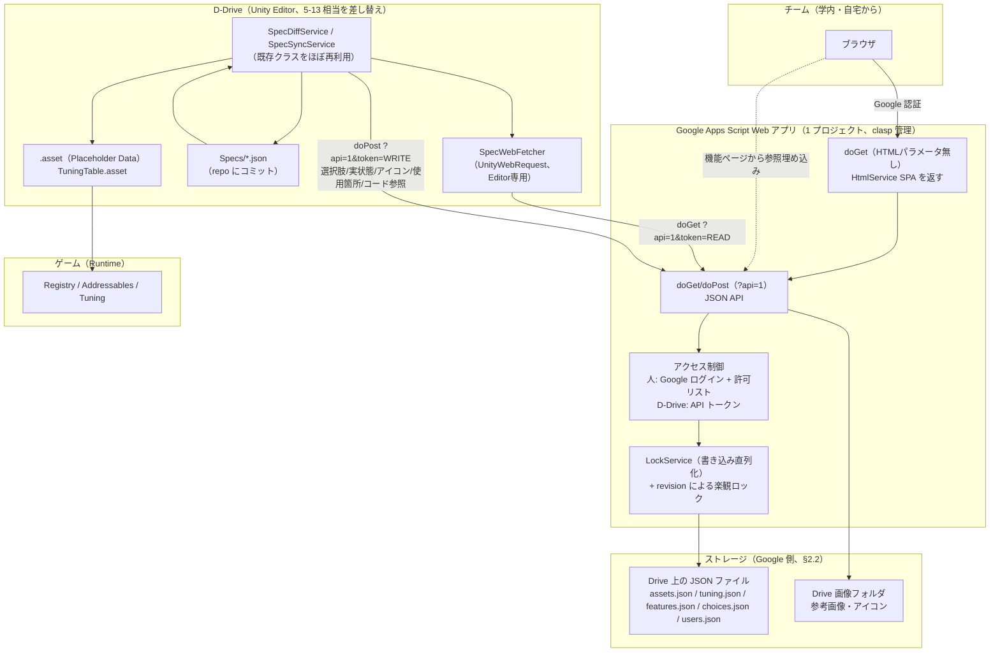

# 32. 仕様書 Web 化（Google Apps Script）詳細設計（ドラフト）

関連: [27_spec_sheet.md](27_spec_sheet.md)（旧方式・置き換え予定） / [10_workflow.md](10_workflow.md) §3 命名・ID 規約 /
[11_tasks.md](11_tasks.md) 5-12〜5-16, 6-9（本書 §8 で新チケットに置き換える） / [17_value_definition.md](17_value_definition.md)
ValueDef / [02_core_framework.md](02_core_framework.md) Registry・Codegen / [13_extensions.md](13_extensions.md) A-1
（発注リスト） / [11_tasks.md](11_tasks.md) 7-2（未実装タブ）

> 2026-09-14 ドラフト。ユーザー決定:「Google スプレッドシートへの入力が大変なので、仕様書を全部 HTML に置き換える
> （ツール向けのアセット一覧・調整値だけでなく、人が読む機能仕様も）。入力するのはチーム（学外・自宅からも）。
> この PC をサーバーにしない → Google Apps Script（GAS）の Web アプリで自作 HTML を動かす」。
> オーケストレーター推奨（ユーザー採用）: **編集の正本はオンライン（GAS 側のストレージ）、D-Drive は同期して
> repo の `Specs/*.json` にスナップショットとしてコミット**する。調整値の MVP 範囲は 2026-09-14 に追加確定
> （§3.2・§8 参照。テーブル型 + コメントは MVP、変更履歴・ロールバックは作らない）。

---

## 1. 目的と方針

### 1.1 docs/27 からの変更点

| 項目 | docs/27（旧方式） | 本書（新方式） |
|---|---|---|
| 入力先 | Google スプレッドシート（テンプレート） | GAS Web アプリの自作 HTML（SPA） |
| 対象 | ツール向け（アセット一覧・調整値）のみ。人向け「機能_<名前>」タブは自由記述で D-Drive は読まない | **ツール向け + 人向け機能仕様を 1 つのシステムに統合** |
| 正本 | スプレッドシート（Google 側） | **Web アプリのストレージ（Google 側）が正本のまま**。D-Drive は取得して repo にスナップショットを持つ |
| D-Drive との同期 | 一方向（シート → D-Drive）。取得は gviz CSV | 一方向（Web → D-Drive）は維持しつつ、**D-Drive → Web の送信 API を新設**（選択肢・実状態・アイコン等、§5.2） |
| 調整値 | float/int/bool/string のスカラーのみ、`TuningTable` に取り込み | **テーブル型・enum・ロック・コメントを追加**（§3.2）。カーブ・ベクトル・色・プリセットは v2 以降 |
| オフライン性 | シート未取得でもゲームは動く（.asset 化済みのため） | **同じ原則を維持**。`Specs/*.json` は D-Drive 側の同期の入力にすぎず、ビルド・ゲーム実行時は既存の `.asset`（`TuningTable` / 各 `AssetDataBase`）のみを参照する（§1.3） |

### 1.2 1 つのシステムへの統合と役割分担

- **人が読む機能仕様ページ**（旧: 人向け「機能_<名前>」タブ）と、**ツールが読むアセット一覧・調整値**（旧: 「アセット」「調整値」タブ）を、同じ Web アプリの中の別ページとして統合する。機能仕様ページからアセットカード・調整値を**参照で埋め込む**（値を二重に書かない。docs/27 §2.1 の原則を継承）
- **Web（GAS）が正本**。編集・コメント・状態管理はすべて Web 側で完結する
- **D-Drive は取得専門**（Web → D-Drive の既存原則、docs/27 §1 を継承: 「デザイナーの中身は上書きしない」）。D-Drive → Web は「選択肢」「実状態」など補助情報の送信のみで、企画側が入力した内容を上書きすることはない
- **ゲームは Web に依存しない**。同期で作られた `.asset`（Placeholder Data・`TuningTable`）だけを読む。Web アプリが落ちていても、学校のネットワークが繋がらなくても、直近に同期済みのビルドはそのまま動く

### 1.3 「ゲームは JSON だけを読む」の解釈（要確認、§9-1）

ユーザー決定の文言「ビルド・ゲーム実行時はこの JSON だけを読む」は、**ネットワーク（Web アプリ）に依存しない**という意味に解釈して設計する。具体的には:

- `Specs/*.json` は Web アプリから取得した内容をそのまま git にコミットするスナップショット（**オフラインの起点・履歴の代用**、§1.4）
- ゲームの実行時に JSON を直接パースするコードは**追加しない**。既存どおり `Specs/*.json` → 既存の同期パイプライン（`SpecDiffService`/`SpecSyncService`）→ `AssetDataBase` の `.asset` / `TuningTable.asset` に変換し、Addressables・Registry 経由で読む（CLAUDE.md §0-8「Manager を new するのは Bootstrap だけ」、[02_core_framework.md](02_core_framework.md) の既存資産管理と整合）
- これにより「禁止 API」「Data は読み取り専用」等の既存原則を変えずに済む

### 1.4 履歴・ロールバックを作らない代わりの git 履歴

ユーザー決定:「履歴はいらないがコメントは欲しい」。Web アプリ側に変更履歴・diff・ロールバック UI は**作らない**（§3.2、§8 MVP 範囲外）。その代わり:

- D-Drive が同期のたびに `Specs/assets.json` / `Specs/tuning.json` / `Specs/features.json` を**上書きしてコミット**する
- 「いつ・誰が・どの値をどう変えたか」は **git の commit log と diff で追える**（`git log -p Specs/tuning.json` 等）。Web アプリ自体に履歴機能を持たせる必要がなくなる
- 前提: **D-Drive 側で同期を実行してコミットする頻度**が実質的な履歴の粒度になる（Web 側で 1 日に何度値を変えても、次に D-Drive が同期してコミットするまでは 1 つの diff にまとまる）。頻繁な履歴が必要になった場合は v2 で Web 側に履歴機能を追加する余地を残す（§8 v2 未満の候補、§9-2）

---

## 2. 全体構成図

### 2.1 構成図



### 2.2 ストレージ方式の比較と推奨

| 観点 | A. スプレッドシートを DB として使う | B. Drive 上の JSON ファイル（**推奨**） |
|---|---|---|
| ネストしたデータ（テーブル型調整値の列定義・行、コメント配列） | セル=スカラーが前提。1 テーブル調整値ごとに別シート/別範囲が要り、行列とスキーマの対応がずれやすい | JSON はそのままネストを表現できる。列定義・行・コメントを 1 ドキュメントで一体管理できる |
| 人による誤操作 | シートを直接開けば誰でもセルを編集できてしまう（意味情報だけを人が打つ、という docs/27 の原則が崩れやすい） | アプリの API を通してしか書けない。バリデーション（範囲外・型違い・ロック）を書き込み経路 1 箇所に強制できる |
| 実装コスト | `SpreadsheetApp` は使い慣れているが、行 ID・範囲の管理が煩雑（挿入で行がずれる等） | `DriveApp`/`Utilities.newBlob` で読み書き。スキーマはコード側で完全に管理できる |
| 目視での緊急確認 | Google スプレッドシートを直接開けば一覧できる（アプリが壊れても) | JSON を直接読むのは人には不便。**緊急時用に「現在の JSON をスプレッドシート形式で書き出す」ボタンを Web アプリに用意する**ことで代替（読み取り専用のエクスポート。DB としては使わない） |
| 同時編集 | シート自体には行ロックの概念がなく、`LockService` を自分で挟む点は JSON 方式と同じ | 同じく `LockService` が必要（優劣なし） |
| セル数上限 | 1 スプレッドシートあたり 1000 万セルの上限あり（今回の規模では問題にならないが、テーブル型調整値が増えるとシートを分割する必要が出る） | Drive ファイルサイズ上限（Apps Script が扱えるテキストは数十 MB 単位まで問題ない）に対し、今回のデータ量（数百アセット・数百調整値）は 1 ファイル数百 KB 程度に収まる |

**推奨: B（Drive JSON ファイル）**。理由: (1) テーブル型調整値・コメント配列など今回追加する機能がネスト構造を前提とするため、(2) 「人はアプリの外からデータを直接触れない」という制約を構造的に作れるため（docs/27 §1 の「意味情報だけを人が打つ」の精神を、スプレッドシート以上に徹底できる）。目視確認用には「スプレッドシートへ書き出し」を v2 の任意機能として用意する（§8 v2）。

### 2.3 認証・アクセス制御

- **確定（2026-09-14 ユーザー回答）: GAS 所有者は個人の Gmail アカウント**（Google Workspace の学校ドメインではない）。**個人アカウントの Web アプリ デプロイには「特定のドメインに限定」オプションが存在しない**（Workspace アカウント限定の機能。[Deployments ガイド](https://developers.google.com/apps-script/concepts/deployments)）ため、ドメイン限定は使わず、**アプリのコード側で許可リスト（`users.json`）を持つ**方式で確定する（デプロイの権限設定だけでは実現できないための代替）
- **2 つの独立したデプロイを 1 つのスクリプトに対して作る**（Apps Script は 1 プロジェクトに複数デプロイを持てる。各デプロイは実行者・アクセス権を別々に設定できる）:

  | デプロイ | 実行者 | アクセス権 | 用途 | 認証方法 |
  |---|---|---|---|---|
  | ①人向け SPA | **User accessing the web app**（アクセスした人自身） | Anyone with Google account（ログイン必須。個人アカウントでも選択可） | ブラウザでの編集・閲覧 | `Session.getActiveUser().getEmail()` を取得できる（実行者=アクセスした人のときのみ信頼できる。[Session の既知の制約](https://developers.google.com/apps-script/reference/base/session)）→ **`users.json` の許可リストと照合**し、無ければ「メンバーのみ利用できます」ページを返す |
  | ② D-Drive API | **Me**（スクリプト所有者） | Anyone（ログイン不要。URL を知っていれば到達できるが中身はトークンで保護） | Unity Editor からの取得・送信 | クエリ/ヘッダの **API トークン**で判定（読み取り用・書き込み用を分ける）。Google 認証は使わない（`UnityWebRequest` から対話ログインはできないため） |

- 両デプロイは**同じ `doGet`/`doPost` 関数**を指す（コードは 1 つ）。リクエストに `token` パラメータがあれば② の経路（トークン検証のみ）、無ければ① の経路（Google アカウント許可リスト）に分岐する
- 初回アクセス時、①のデプロイは「実行者=アクセスした人」のため**各メンバーが個別に OAuth 同意**を求められる（学外からのアクセスでも Google アカウントさえあれば同意できる。人数が少ない社内利用のため [新規ユーザーの認可レート制限](https://developers.google.com/apps-script/guides/services/quotas) の対象にはなるが、チーム規模（数名〜十数名）なら問題にならない）
- 許可リスト（`users.json`）の追加・削除は管理者のみ（§3.4 ロール）。**個人情報はメールアドレスと表示名のみ**（§7）

### 2.4 GAS の制限と、設計が収まる根拠

| 制限 | 値 | 出典 | この設計での扱い |
|---|---|---|---|
| スクリプトの実行時間 | 6 分/実行 | [Apps Script quotas](https://developers.google.com/apps-script/guides/services/quotas) | 1 回の `doGet`/`doPost` は JSON 読み込み・パース・書き込みのみ（数百 KB）。数百ミリ秒〜数秒で終わる想定。6 分に到達する余地はない |
| 同時実行数 | 30 / user | 同上 | チーム規模（数名〜十数名）なら 1 人あたり同時に複数タブを開いても上限に達しない |
| URL Fetch 呼び出し | 20,000/日（個人）、100,000/日（Workspace） | 同上 | **GAS コード自身が外部 URL を `UrlFetchApp` で呼ぶ場合の上限**であり、D-Drive → Web アプリの着信リクエスト数には掛からない（着信は「Web アプリの実行」であり URL Fetch ではない）。本設計は `UrlFetchApp` を使わない（画像は `DriveApp` 直接操作のため） |
| トリガーの合計実行時間 | 90 分/日（個人）、6 時間/日（Workspace） | 同上 | v3 の「通知」（§8）で時間主導トリガーを使う場合のみ関係。1 日 1〜2 回の軽いチェックなら十分収まる |
| トリガー数 | 20 / user / script | 同上 | 通知用に 1〜2 個で足りる |
| PropertiesService | 500KB（総量）/ 9KB（1 値） | 同上 | トークン・許可リストの**キャッシュ**用途のみに使う（正データは Drive JSON 側）。9KB 制限に収まる小さな値のみ格納 |
| HtmlService の iframe サンドボックス | トップレベルナビゲーション不可・外部リンクは `target="_top"` 必須・アクティブコンテンツは HTTPS のみ | [HTML Service restrictions](https://developers.google.com/apps-script/guides/html/restrictions) | SPA 内のリンク（機能ページ間の遷移等）はすべて `<a target="_top">` か `history.pushState` 相当の SPA 内ルーティングで実装。外部 CDN は使わず、コードはすべてインライン（同一オリジンなので HTTPS 要件は自然に満たす） |
| 個人アカウントでのアクセス制限 | 「特定のドメイン」オプションは Workspace アカウント限定 | [clasp/deployment 関連スレッド](https://groups.google.com/g/google-apps-script-community/c/owFeX5fTcyo) | §2.3 のとおりコード側の許可リストで代替 |
| doGet/doPost レスポンスの 302 リダイレクト | Content Service のレスポンスは一度 `script.googleusercontent.com` へリダイレクトされる。外部クライアントはリダイレクト追従が必要 | [Content Service ガイド](https://developers.google.com/apps-script/guides/content) / [flow 解説](https://medium.com/google-cloud/understanding-flow-of-request-to-web-apps-created-by-google-apps-script-ac49e80f7c6b) | `UnityWebRequest` は既定でリダイレクトに追従する（`redirectLimit` 既定 32）。**実装時に実機で疑似トークン込みの `doPost` 呼び出しを確認すること**（§9-4、POST → 302 → GET の経路で本文が正しく処理されるかは Google 側フロントエンドで先に処理済みのため通常は問題にならないが、クライアント実装依存の既知の落とし穴として明記） |
| 実行者=アクセスした人での `getActiveUser` | 実行者が「Me」固定のときはアクセスした人のメールが取れない/信頼できない。「User accessing the web app」なら取得できる | [Session クラス](https://developers.google.com/apps-script/reference/base/session) / [getActiveUser が空になる条件の解説](https://bulldo.gs/get-the-active-users-email-in-apps-script/) | §2.3 のデプロイ①でこの制約を踏まえた設計にしている |

**結論**: 想定データ規模（アセット数百・調整値数百・機能ページ数十）とチーム規模（数名〜十数名、同時アクセスも同程度）であれば、上記のどの制限にも近づかない。最も注意すべきは「個人アカウントではドメイン制限が使えない」点と「302 リダイレクト」の 2 点で、いずれも本書の設計（許可リスト・リダイレクト追従の確認）で吸収できる。

### 2.5 ソース管理

- GAS のソースは repo の **`Tools/SpecWeb/`** に置き、[`clasp`](https://github.com/google/clasp) でローカル ⇔ Apps Script プロジェクトを同期する（`clasp push`/`clasp pull`/`clasp deploy`）
- 構成（実装時の目安。本チケットではコードを書かないため確定名ではない）:
  ```
  Tools/SpecWeb/
    appsscript.json        clasp が管理するマニフェスト（タイムゾーン・スコープ）
    Code.gs                doGet/doPost のルーティング（人向け/API 向けの分岐）
    Auth.gs                Google 許可リスト照合 + API トークン検証
    Storage.gs              Drive JSON の読み書き + LockService + 楽観ロック
    Assets.gs / Tuning.gs / Features.gs   各エンティティの CRUD ロジック
    Ui/Index.html           SPA 本体（テンプレート化された 1 ファイル、または include で分割）
    .clasp.json             ローカルのみ（scriptId 等。**git 管理しない**）
    .claspignore
  ```
- `.clasp.json` と API トークンの実値は `.gitignore` 対象。トークンは Web アプリ側で生成し、開発者が個別に `EditorPrefs`（D-Drive 側）や `clasp` の認証情報として個々に保持する（§7）

---

## 3. データモデル

全エンティティ共通のメタ情報:

```jsonc
{
  "id": "string",            // エンティティ内で一意。アセットは「種別::識別子」、調整値はキー、機能ページはスラッグ
  "revision": 3,              // 楽観ロック用。書き込み時にクライアントが最後に読んだ revision を送り、不一致なら 409 相当で拒否
  "updatedBy": "user@example.com",
  "updatedAt": "2026-09-14T09:00:00Z"
}
```

**変更履歴（複数世代の保持）は持たない**（§1.4）。`revision` は「今読んでいる内容が最新か」を判定するための番号であり、過去の値を遡れる機能ではない。

### 3.1 アセット仕様（`assets.json`）

| フィールド | 型 | 説明 |
|---|---|---|
| `assetType` | enum | [10_workflow.md](10_workflow.md) の種別。値は `AssetType` の enum 名（`Se`/`Vfx`/... 既存の対応表は [27_spec_sheet.md](27_spec_sheet.md) §7.2 のものを継承・そのまま使う） |
| `category` | string | D-Drive から送られる選択肢（`choices.json`、§3.3）から選ぶ。自由入力も許可（既存 D-Drive のカテゴリが自由記述のため） |
| `identifier` | string | PascalCase。ファイル名・ID 生成の元（docs/27 §3.1 を継承） |
| `displayName` | string | | 
| `status` | enum | `未着手` / `仮` / `本番` / `保留`（docs/27 §7.2 の語彙を継承） |
| `assignee` | string | 担当者（メンバー一覧 `users.json` から選ぶ） |
| `dueDate` | string(date) | 期限（新規。旧シートには無かった項目） |
| `priority` | enum | `高`/`中`/`低`（新規） |
| `note` | string | 備考 |
| `referenceImages` | array\<driveFileId\> | 参考画像（Drive 上のファイル ID） |
| `relatedFeaturePages` | array\<featurePageId\> | 関連する機能ページへの参照 |
| `comments` | array\<Comment\> | §3.5 |
| **`ddriveState`**（D-Drive → Web、§5.2） | object | `{ created: bool, isPlaceholder: bool, iconAssetId: driveFileId, usageCount: int, lastSyncedAt: string }` |

### 3.2 調整値（大幅に強化、MVP 範囲は §8 参照）

#### 3.2.1 スカラー型調整値（MVP）

```jsonc
{
  "id": "Influence/FanBase",          // <機能>/<名前>。既存の Signal キーと同じ書式(docs/27 §3.2 を継承)
  "kind": "scalar",
  "valueType": "float",                // float | int | bool | string | enum
  "value": 1.0,
  "enumOptions": [],                    // valueType=enum のときのみ。["Easy","Normal","Hard"] 等
  "min": 0, "max": 10, "step": 0.1,     // float/int のみ有効。範囲外は即時検証エラー(§4)
  "unit": "%",
  "description": "ファン1人あたりの影響力の素点",
  "group": "Influence",                 // グルーピング・タグ表示用
  "tags": ["Balance"],
  "locked": false,                      // true = プログラマーだけが変更可(§3.2.4)
  "comments": [ /* Comment[] 、§3.5 */ ]
}
```

#### 3.2.2 テーブル型調整値（**MVP**、2026-09-14 追加確定）

列定義（スキーマ）を持つ 2 次元表。「敵パラメータ一覧」「レベル別経験値」のような、キー 1 つでは表現できない調整値のための形式。

```jsonc
{
  "id": "Enemy/Params",
  "kind": "table",
  "columns": [
    { "key": "Hp",    "valueType": "int",   "min": 1, "max": 9999, "unit": "" },
    { "key": "Speed", "valueType": "float", "min": 0, "max": 20,   "unit": "m/s" },
    { "key": "Type",  "valueType": "enum",  "enumOptions": ["Melee", "Ranged", "Boss"] }
  ],
  "rows": [
    { "rowId": "Slime",   "cells": { "Hp": 10,  "Speed": 1.2, "Type": "Melee" },  "comments": [] },
    { "rowId": "Archer",  "cells": { "Hp": 20,  "Speed": 2.0, "Type": "Ranged" }, "comments": [] }
  ],
  "locked": false,
  "comments": [ /* テーブル全体へのコメント */ ]
}
```

- コメントの粒度は **行単位 + テーブル全体**とする（セル単位のコメントは見送り。§9-5）。
  行の `comments` は §3.6 の `Comment[]` と同じ構造の配列（**2026-09-14 W-6〜W-8 実装で確定**。
  当初のドラフトにあった `"comment": "初期敵"`（単一文字列）は §3.6 の「同じ構造で付けられる」との
  記述と矛盾していたため、行にも他のエンティティと同じ `Comment[]` を持たせる形に統一した）
- 行の追加・削除・列の追加・削除は Web 側の編集グリッドから行う（§4.4）。列を削除すると既存行の該当セルも削除される（確認ダイアログを出す）

#### 3.2.3 v2 以降（本チケットでは設計のみ、実装しない）

| 機能 | 概要 |
|---|---|
| カーブ | `valueType: "curve"`。D-Drive の `ValueDef`（[17_value_definition.md](17_value_definition.md)）と互換のキー列（時間キー×値のペア配列 + 補間種別）を持つ |
| ベクトル・色 | `valueType: "vector3"` / `"color"` |
| プリセット / バリアント | ベース値に対する「上書き差分」だけを持つオブジェクト配列。例: `{ "name": "Hard", "overrides": { "Enemy/Params.Archer.Hp": 40 } }` |
| 派生値（式） | 他の調整値を参照する式（例: `A * B + 1`）。循環参照の検出が要るため v2 でも後回し候補 |

#### 3.2.4 ロックとコード未使用検出・即時検証

- `locked: true` の調整値は、Web アプリの UI 上で**編集フィールドを無効化**し、「プログラマーだけが変更できます」の注記を出す（アプリ側のロールが `programmer` の場合のみ編集可、§3.4）。API 側でも `role` を見て拒否する（UI 制御だけに頼らない）
- **範囲外・型違いの即時検証**: `min`/`max`/`enumOptions` に対して、書き込み API がサーバー側で検証する（クライアント側の入力チェックだけに頼らない。docs/27 §6 の「調整値の値が最小〜最大の範囲外 = Error」を Web 側に前倒しする）
- **コード未使用の検出**: D-Drive が `TUNING` 定数への参照箇所をコード検索し、使われていないキーの一覧を送信する（§5.2）。Web 側は該当キーに「未使用」バッジを表示するのみ（削除は人が判断）

### 3.3 選択肢（`choices.json`）

| フィールド | 説明 |
|---|---|
| `assetTypes` | `AssetType` の enum 名一覧（D-Drive → Web、§5.2 で同期） |
| `categories` | 種別ごとのカテゴリ候補（D-Drive の既存アセットから収集して送信。docs/27 §4.4 の「選択肢をコピー」に相当する自動版） |
| `statuses` | `未着手`/`仮`/`本番`/`保留`（固定） |
| `tags` | 自由入力 + よく使われるタグの候補一覧 |

### 3.4 ユーザー / ロール（`users.json`）

| フィールド | 説明 |
|---|---|
| `email` | Google アカウントのメールアドレス（§2.3 の許可リストに使う） |
| `displayName` | 表示名 |
| `role` | `viewer`（閲覧のみ） / `editor`（アセット・調整値・機能ページを編集可、ロック済み調整値は不可） / `admin`（`locked` 調整値の編集・ユーザー管理・トークン再発行が可能） |

管理者（`admin`）は最低 1 名必須（Web アプリ所有者を既定で `admin` にする）。

### 3.5 機能仕様ページ（`features.json`、人向け）

```jsonc
{
  "id": "feature-influence",
  "title": "ファン影響力システム",
  "status": "検討中",
  "assignee": "よしだ",
  "updatedAt": "...",
  "body": "## 概要\n...(Markdown、§4.5)",
  "images": ["driveFileId1", "driveFileId2"],
  "embeds": [
    { "type": "asset",  "ref": "Se::Slash" },
    { "type": "tuning", "ref": "Influence/FanBase" }
  ],
  "comments": [ /* Comment[] */ ]
}
```

- `embeds` は**参照のみ**を保存する。表示時に最新の状態・値を都度読みにいく（docs/27 §2.1「値そのものは二重に書かない」の原則を継承）
- D-Drive はこのエンティティの本文（`body`/`images`）を一切扱わない。D-Drive 側が必要とするのは `AssetDataBase.SpecUrl` に埋め込む URL（このページの ID から組み立てる）だけ

### 3.6 コメント（`Comment`、共通構造）

```jsonc
{ "id": "c1", "author": "user@example.com", "body": "この値は要調整", "createdAt": "...", "resolved": false }
```

アセット・調整値（スカラー/テーブル行/テーブル全体）・機能ページのいずれにも同じ構造で付けられる。**スレッド機能・返信のネストは持たない**（フラットな配列。過剰設計を避ける）。

---

## 4. 画面と機能

MVP / v2 / v3 の区分は §8 のチケット分割と対応する。

### 4.1 アセット一覧（MVP）

```
┌ アセット一覧 ──────────────────────────────────────────┐
│ 検索[________]  種別[全て▾] 状態[全て▾] 担当[全て▾]  [+新規] │
├──────┬────────┬──────┬────┬──────┬────────┤
│種別   │識別子   │表示名 │状態 │担当  │D-Drive状態      │
├──────┼────────┼──────┼────┼──────┼────────┤
│ Se    │ Slash   │斬撃音 │ 仮 │よしだ│ ✅作成済 (icon)  │
│ Vfx   │ FireBall│火球   │未着手│─    │ ⬜未作成         │
└──────┴────────┴──────┴────┴──────┴────────┘
```

- 並べ替え・列ごとの絞り込み・種別ごとのグループ化
- 行を選ぶと右側にアセット詳細（§4.5）をスライドイン
- v2: 保存できるビュー（絞り込み条件を名前付きで保存）、一括編集（複数選択して状態・担当をまとめて変更）、CSV 入出力（初期データ流し込み・docs/27 の `.xlsx` テンプレートからの移行用）

### 4.2 カンバン（v2）

状態（未着手/仮/本番/保留）を列にしたカード表示。ドラッグで状態変更。フィルタはアセット一覧と共通。

### 4.3 ダッシュボード（v2）

```
┌ ダッシュボード ─────────────────────────────┐
│ 種別 × 状態                 担当別          │
│ Se   [███████░░░] 70%       よしだ: 12件    │
│ Vfx  [███░░░░░░░] 30%       たなか: 8件     │
│                                              │
│ 期限切れ: 3件   未作成(D-Drive): 21件         │
└──────────────────────────────────────────────┘
```

[13_extensions.md](13_extensions.md) A-1（発注リスト）・[11_tasks.md](11_tasks.md) 7-2（未実装タブ）が持つ「未登録 ID の見える化」を、Web 側のダッシュボードとしても提供する（D-Drive から送られる `ddriveState.created` を集計するだけで実現できる。D-Drive 側の該当機能を置き換えるものではなく、企画側が Unity を開かずに把握できる窓口を追加するもの）。

### 4.4 調整値編集（MVP: スカラー一覧 + テーブル編集グリッド。v2: カーブ・プリセット比較・履歴 diff）

```
┌ 調整値: Enemy/Params（テーブル型） ─────────────────────┐
│ [+行] [+列]                              🔒未ロック       │
├─────────┬───────┬────────┬──────────────┤
│ rowId    │ Hp     │ Speed   │ Type          │ コメント     │
├─────────┼───────┼────────┼──────────────┼─────────┤
│ Slime    │ 10     │ 1.2     │ Melee ▾       │ 💬1         │
│ Archer   │ 20     │ 2.0     │ Ranged ▾      │            │
└─────────┴───────┴────────┴──────────────┴─────────┘
  ↑ 範囲外の値はセルを赤く即時表示（min/max 検証）
```

- スカラー一覧はキー・値・範囲・単位・説明を 1 行 1 件で表示。スライダー/数値入力/トグル/enum ドロップダウンは `valueType` に応じて切り替える
- テーブル編集グリッドは行・列の追加削除、セル編集、行コメント
- v2: カーブ編集（ブラウザ上のグラフ、[17_value_definition.md](17_value_definition.md) の `ValueDef` 相当データを HTML5 canvas で編集）、プリセット比較（列に難易度を並べて差分だけ強調表示）、履歴 diff とロールバック（**MVP では作らない方針、§1.4・§9-2**）

### 4.5 アセット詳細（MVP）

一覧から選んだ 1 件の全項目編集 + 関連する機能ページへのリンク一覧 + コメント欄 + D-Drive 実状態（作成済み/アイコン/使用箇所数/最終同期時刻、読み取り専用）。

### 4.6 機能仕様ページ（v2: 編集・閲覧・埋め込み）

- 編集: Markdown エディタ（左に Markdown、右にプレビュー。**簡易 WYSIWYG は採用しない**、理由は §9-6）。`{{asset:Se::Slash}}` / `{{tuning:Influence/FanBase}}` のようなインライン記法でカード・値を埋め込む
- 閲覧: 埋め込みは実データを都度取得して表示（状態・値が自動更新される）
- 一覧（旧「概要」タブに相当): 機能ページの一覧・状態・担当

### 4.7 検索（v2）

アセット・調整値・機能ページ・コメント本文を横断するインクリメンタル検索。

### 4.8 書き出し（v2）

- 静的 HTML 書き出し（印刷・PDF 用。CSS を印刷用に切り替えるだけの素朴な実装でよい）
- 機能ページごとの「アセットリンク一覧」（そのページが参照する `embeds` を一覧化した付録ページ）
- 緊急時用のスプレッドシート書き出し（§2.2 で触れた目視確認用。読み取り専用）

### 4.9 通知（v3）

- D-Drive 未同期（最終同期からの経過時間がしきい値超え）・担当変更を検知し、時間主導トリガーでダイジェストメール（§2.4 のトリガー/メール送信クォータの範囲に収まる）

---

## 5. D-Drive との連携

### 5.1 Web → D-Drive（既存 5-13 パイプラインの差し替え）

既存コード（`Assets/DDrive/Editor/Spec/*`）を実際に読んだ上での置き換え方針:

| 既存クラス | 扱い | 理由 |
|---|---|---|
| `SpecFetcher`（`UnityWebRequest` + gviz CSV URL 組み立て + `Library/DDriveSpec/` キャッシュ） | **置き換え**（新設 `SpecWebFetcher`） | 取得先が CSV → GAS API（JSON）に変わるため。トークン付与・`?since=<revision>` の差分取得もここに実装する。`Library/` キャッシュの仕組みは流用できる |
| `SpecCsv`（gviz URL 組み立て + CSV パーサ） | **廃止** | JSON になるため CSV パースが不要になる |
| `SpecSheetParser`（CSV → `SpecAssetRow`/`SpecTuningRow`、必須列検証） | **置き換え**（新設 `SpecWebParser`）。ただし出力型 `SpecAssetRow`/`SpecTuningRow`（既存）は極力そのまま使う | 検証ロジック（識別子書式・種別・重複キー）は入力形式が変わっても同じ。パース元だけ JSON にする。テーブル型調整値は既存の `SpecTuningRow` では表現できないため、新設 `SpecTuningTableRow`（列定義 + 行データ）を追加する |
| `SpecIdentifierCodec` | **変更なし** | ファイル名からの識別子逆算ロジックは入力形式と無関係 |
| `SpecDiffService` | **変更なし**（入力の生成元が変わるだけ） | 「種別+識別子」キーでの比較ロジックは JSON でも CSV でも同じ |
| `SpecSyncService.ApplyNew` / `ApplyChanged` / `ApplyExtraFields` | **変更なし** | 上書きしてよい項目（表示名・カテゴリ・状態・担当・備考・仕様リンク）は変わらない |
| `SpecSyncService.ApplyTuning`（スカラーのみ） | **拡張**: `TuningValueType.Enum` に対応させ、新設 `ApplyTuningTable`（テーブル型 → `TuningTable.Tables`、§5.3）を追加 | enum・テーブル型は既存にない型のため |
| `TuningCodegen` | **拡張**: テーブルキーも `TUNING` 定数として出力する | 既存はスカラーキーのみ列挙している |
| `SpecCache` / `SpecSyncWindow` / `SpecAutoSync` | **変更なし**（呼び出し先を `SpecWebFetcher`/`SpecWebParser` に差し替えるだけ） | UI・キャッシュ保持の責務は取得方式と独立している |
| `DDriveSpecSettings` | **フィールド変更**: `SpreadsheetUrl`/`AssetSheetName`/`TuningSheetName` → `WebAppUrl` + トークン参照（実値は `EditorPrefs`、§7）。**シリアライズ形式の変更**にあたるため要判断（§9-1） | 接続先の性質が変わるため |
| （新設）`SpecSnapshotWriter` | **新規追加** | 取得した JSON を正規化して `Specs/assets.json` / `Specs/tuning.json` / `Specs/features.json`（ID とタイトルのみ）へ書き出す。既存 5-13 は `SpecCache`（`Library/` 配下、コミットしない）にしか結果を残していないため、**この書き出し + git コミットが今回最大の新規実装**（§1.4 の履歴代用の要） |

### 5.2 D-Drive → Web（Editor 専用、手動 + 同期時。新規）

送信する情報（すべて Web 側の該当項目に**追記/上書きするだけで、企画が入力した項目には触れない**）:

| 送信物 | 内容 | 送信タイミング |
|---|---|---|
| 選択肢 | `AssetType` 一覧・既存アセットから収集したカテゴリ一覧 | 同期時（自動） |
| アセットの実状態 | 作成済みか・Placeholder か・小さい PNG アイコン・使用箇所数（Registry/Validation の被参照カウント）・最終同期時刻 | 同期時（自動） |
| コードのタグ参照 | `TUNING` 定数へのコード内参照箇所数（未使用検出、§3.2.4） | 同期時（自動、ソース走査を伴うためやや重い処理。手動トリガーも用意） |

APIエンドポイント設計: `doPost(?api=1&token=WRITE)` に `{ kind: "choices" | "assetState" | "tuningUsage", payload: [...] }` を送る形とし、1 回の呼び出しで対象種別ごとにまとめて送る（呼び出し回数を抑える。§2.4 の同時実行数・実行時間には十分な余裕がある）。

**書き込みトークンの配布範囲（確定、2026-09-14 ユーザー回答）**: §9-9 の要判断は「チーム全員の D-Drive に配る」で確定した。全員の Editor が同期のたびに §5.2 の送信を行える（同期担当者だけに限定しない）。これに伴い、以下を設計に反映する:

- **送信できる内容をサーバー側で `kind` の許可リストに固定する**: 書き込みトークンで呼べる API は `choices` / `assetState` / `tuningUsage` の 3 `kind` のみ受け付け、それ以外（アセット仕様の本文・調整値の値そのもの・機能仕様ページ・コメント）を書き換えるエンドポイントは書き込みトークンでは実行できないようにコード側で分離する。つまり**書き込みトークンを持つ全員に配っても、企画が Web 側で入力した内容を D-Drive から上書きすることはできない**（§1.2 の役割分担を技術的に強制する）
- **送信 API のレート制限**: 同期は「Unity 起動時 + 手動同期」のたびに 1 回程度の想定のため、1 トークンあたり例えば 1 分に数回程度のレート制限を `PropertiesService`（直近呼び出し時刻の記録）で実装し、誤動作（無限ループ等）による過剰送信を防ぐ。上限に達した呼び出しは 429 相当を返し、D-Drive 側は次回同期まで待つ（例外で止めない。CLAUDE.md §0-4 と同じ考え方をエディタ拡張にも適用する）
- **配り方**: 書き込みトークンは git に入れない。Web アプリの管理画面（`admin` ロール）で発行し、Slack 等の既存の連絡手段でチームに配布 → 各メンバーが `DDriveSpecSettings` 相当の設定画面から Unity の `EditorPrefs`（マシンごと）に貼り付ける。読み取りトークンも同様に配る
- **定期ローテーションの手順**（推奨: 3 か月ごと、または漏洩が疑われた時点で即時）:
  1. 管理者が Web アプリの管理画面で新トークンを発行する（`PropertiesService` に新旧 2 つを一時的に共存させる。旧トークンはこの時点ではまだ有効）
  2. チームに新トークンを配布し、各メンバーが `EditorPrefs` を更新する（配布から反映までの猶予期間を設ける）
  3. 猶予期間終了後、管理者が旧トークンを失効させる（`PropertiesService` から削除）。**漏洩時は 1〜3 をまとめて即時実行し、猶予期間を設けずに旧トークンを即失効させる**

### 5.3 `TuningTable` の拡張（**確認済み: 案 A**、2026-09-14 ユーザー回答。§9-7 参照）

enum とテーブル型を D-Drive のランタイムで読めるようにするための拡張案。**案 A（既存 `TuningEntry`/`TuningTable` へのフィールド追加のみ。削除・型変更なし）で確定**した（§9-7）。CLAUDE.md §0-9 の「シリアライズ形式の変更は着手前に確認」に対する回答が本節にあたる。実装（W-10）はこの形で進めてよい:

```csharp
public enum TuningValueType : byte { Float, Int, Bool, String, Enum }   // Enum を追加

[Serializable]
public struct TuningEntry
{
    // 既存フィールドはそのまま
    public string[] EnumOptions;   // 追加。Type=Enum のときのみ使う（値自体は ValueString に入れる）
}

[Serializable]
public struct TuningTableColumn { public string Key; public TuningValueType Type; public float Min, Max; public string Unit; public string[] EnumOptions; }

[Serializable]
public struct TuningCellValue { public string ColumnKey; public float F; public int I; public bool B; public string S; }

[Serializable]
public struct TuningTableRow { public string RowId; public TuningCellValue[] Cells; }

[Serializable]
public struct TuningTableEntry { public string Key; public TuningTableColumn[] Columns; public TuningTableRow[] Rows; }

public sealed class TuningTable : ScriptableObject
{
    public TuningEntry[] Entries;            // 既存（スカラー）
    public TuningTableEntry[] Tables;         // 追加（テーブル型）
    // ...
}
```

- **コメントは `TuningTable` に一切持たせない**（§1.4「Data は読み取り専用」の運用を守るため、企画同士のやり取りである「コメント」はゲーム資産に混ぜない。閲覧は Web の該当ページ（`SpecUrl`）を開けば足りる）
- `Tuning` 静的ファサードに `Tuning.GetTableFloat(tableKey, rowId, columnKey, defaultValue)` 等を追加する想定（既存の `Tuning.GetFloat` と同じ「未登録は警告 1 回 + 既定値」方式、[12_review.md](12_review.md) §3 の定常経路制約（LINQ・boxing 禁止）を守り、`RebuildIndex` と同様に `Dictionary<string,int>` 索引を `Bind()` 時に構築する)

---

## 6. 移行計画

| 対象 | 扱い |
|---|---|
| 5-12（`.xlsx` テンプレート） | **廃止**。Web アプリの入力フォームに統合されるため、テンプレート配布は不要になる |
| 5-13（gviz CSV 取得・差分・Placeholder 作成・`TuningTable` 取り込み） | **§5.1 のとおり部分的に置き換え**（取得・パース層のみ差し替え、差分・適用層は再利用） |
| 5-14（`AssetDataBase.SpecUrl` + Inspector「仕様書を開く」） | **そのまま活用**。`SpecUrl` の値を「Web アプリのアセット詳細ページの URL」に変える（同期時に自動設定、値の意味が変わるだけでフィールド自体は変更不要） |
| 5-16（新規作成ダイアログ「仕様書から選ぶ」= `SpecCache.GetUncreatedRows`） | **そのまま活用**。`SpecCache` の入力元が Web API に変わるだけで、`NewAssetDialog` 側のロジックは変更不要 |
| `DDriveSpecSettings` / `SpecCache` | **再利用**（§5.1 のとおりフィールドのみ変更） |
| docs/27 本体 | **削除しない。冒頭に「旧方式」の注記を追加**し、実装が新方式へ移行し終えるまでの参照として残す（本 PR で対応、§0） |
| Google スプレッドシートからの初期データ取り込み | Web アプリに「CSV インポート」機能を用意し、既存スプレッドシートの `アセット`/`調整値` タブから 1 回だけ流し込む（v2、§8）。移行期間中は旧シートと Web アプリが並行稼働しないよう、**移行日を決めてシートを凍結**する運用を推奨（§9-8） |

---

## 7. セキュリティ

- **メンバー限定の公開範囲**: §2.3 のとおり、個人アカウントではデプロイ側の「ドメイン限定」が使えないため、**アプリのコードで許可リスト（`users.json`）を照合する**。Web アプリの URL 自体が漏れても、許可リストに無い Google アカウントは「メンバーのみ利用できます」で弾かれる
- **API トークンの扱い（確定、2026-09-14 ユーザー回答。詳細は §5.2）**:
  - 読み取り用・書き込み用を分ける（§2.3）。**書き込みトークンはチーム全員の D-Drive に配る**（同期担当者だけに限定しない、§9-9 決定）。全員に配っても安全なように、書き込みトークンで呼べる API を `choices`/`assetState`/`tuningUsage` の送信のみに絞り、アセット仕様・調整値の値・機能仕様ページ・コメントの書き換えには使えないようサーバー側で分離する（§5.2）
  - 送信 API にはレート制限を設ける（§5.2。誤動作による過剰送信の防止）
  - トークンは git に入れない。D-Drive 側は既存の `DDriveSpecSettings` と同様の SO に URL だけを持ち、トークンの実値は Unity の `EditorPrefs`（マシンごと）に保持する。配布は Web アプリの管理画面（`admin` ロール）で発行 → 既存の連絡手段でチームへ配布 → 各メンバーが `EditorPrefs` に貼り付ける
  - **定期ローテーション**（推奨 3 か月ごと、または漏洩が疑われた時点で即時。手順は §5.2）: 新トークン発行 → 配布・猶予期間 → 旧トークン失効。漏洩時は猶予期間を設けず即時失効させる
- **Drive の共有設定**: 画像フォルダ・JSON ファイルは「特定のユーザー（チームメンバーの Google アカウント）」に共有する。デプロイ①（実行者=アクセスした人）で Drive へアクセスするため、**各メンバー個人にも Drive 上のファイルへの編集権限が必要**（実行者がアクセスした人自身になるため、スクリプト所有者の権限を代理できない。§9-10）
- **個人情報を置かない**: `users.json` にはメールアドレスと表示名のみを持ち、それ以外の個人情報（電話番号・所属等）は置かない

---

## 8. チケット分割

粒度は [11_tasks.md](11_tasks.md) と同じ（1 チケット = 1〜3 人日）。本チケット表は **docs/32 のみに置く**（[11_tasks.md](11_tasks.md) 自体は本 PR では編集しない。ユーザー承認後にオーケストレーターが転記する）。

### MVP（アセット一覧 + 調整値〔スカラー全型・テーブル型・ロック・検証・コメント〕+ D-Drive 取得同期）

| # | チケット | 依存 | 日数 | AC |
|---|---|---|---|---|
| W-1 | GAS プロジェクト雛形（`Tools/SpecWeb/`、clasp、`appsscript.json`、2 デプロイの構成） | — | 1 | `clasp push`/`pull` が通る。空の `doGet` が 2 つの URL で応答する |
| W-2 | Drive JSON ストレージ層（読み書き + `LockService` + `revision` 楽観ロック） | W-1 | 2 | 同時に 2 リクエストが書き込んでも片方が revision 不一致で拒否される（手動テストで確認） |
| W-3 | 認証（Google 許可リスト `users.json` + API トークン 2 種 + ロール） | W-1, W-2 | 2 | 許可リスト外のアカウントで①にアクセスすると拒否される。トークン無しで②にアクセスすると拒否される |
| W-4 | アセット仕様 CRUD API + 一覧 SPA（検索・絞り込み・並べ替え・新規作成） | W-2, W-3 | 3 | §4.1 の一覧が実データで動く。範囲外入力の検証（§3.2.4 相当）はアセットには無いため対象外 |
| W-5 | アセット詳細画面（全項目編集・コメント・D-Drive 実状態の表示） | W-4 | 2 | §4.5 のとおり編集・コメント投稿ができる |
| W-6 | 調整値 API（スカラー: float/int/bool/string/enum、ロック、範囲/型検証） | W-2, W-3 | 3 | 範囲外・型違いの書き込みが 400 相当で拒否される。`locked` は `editor` ロールから拒否される |
| W-7 | 調整値: テーブル型 API（列定義 CRUD、行 CRUD、セル検証） | W-6 | 3 | 列追加・削除、行追加・削除、セル編集が一貫して保存される。列削除で該当セルも消える |
| W-8 | 調整値編集 SPA（スカラー一覧 + テーブル編集グリッド + コメント） | W-6, W-7 | 4 | §4.4 の画面が実データで動く。範囲外セルが即時に赤表示される |
| W-9 | `SpecWebFetcher` / `SpecWebParser`（D-Drive 側、既存 `SpecFetcher`/`SpecSheetParser` を置き換え） | W-4, W-6, W-7 | 3 | 既存 `SpecDiffService`/`SpecSyncService` のテストが入力元差し替え後も green |
| W-10 | `TuningTable` 拡張（`Enum`・`Tables`）+ `SpecSyncService.ApplyTuningTable` + `TuningCodegen` 拡張 | W-9 | 3 | **確認済み（案 A、§5.3・§9-7、2026-09-14 ユーザー回答）**。テーブル型調整値が `Tuning.GetTableFloat` 等で読める |
| W-11 | `Specs/*.json` 書き出し（`SpecSnapshotWriter`）+ 同期フロー結線 | W-9 | 2 | 同期実行後、`Specs/assets.json`/`Specs/tuning.json` が更新され、通常の git diff で変更内容が読める |
| W-12 | D-Drive → Web 送信 API（選択肢・実状態・アイコン・使用箇所数。書き込みトークンはチーム全員配布、`kind` 許可リスト + レート制限で保護、§5.2・§7） | W-4, W-6 | 2 | 同期実行後、Web の選択肢・アセット実状態バッジが更新される。書き込みトークンで `choices`/`assetState`/`tuningUsage` 以外は書き換えられない |

**MVP 合計: 30 人日**

### v2（テーブル型調整値以外の強化・機能仕様ページ・埋め込み・ダッシュボード・書き出し等）

| # | チケット | 依存 | 日数 | AC |
|---|---|---|---|---|
| W-13 | プリセット / バリアント（スカラー・テーブルへの上書き差分） | W-8 | 3 | Easy/Normal/Hard を切り替えて差分だけが表示・編集できる |
| W-14 | カーブ型調整値（ブラウザ上のグラフ編集、`ValueDef` 互換キー列） | W-8 | 4 | カーブを編集・保存・D-Drive で `ValueDef` に取り込める |
| W-15 | ベクトル・色型調整値 | W-8 | 2 | vector3/color の入力・保存ができる |
| W-16 | 機能仕様ページ CRUD + Markdown エディタ | W-3 | 3 | 見出し・本文・画像を編集・閲覧できる |
| W-17 | 埋め込み（`{{asset:...}}`/`{{tuning:...}}`）の解決・表示 | W-16, W-4, W-6 | 2 | 埋め込みが最新値で表示される |
| W-18 | ダッシュボード（種別×状態、担当別、期限切れ、未作成） | W-4 | 2 | §4.3 の集計が実データで出る |
| W-19 | カンバン（状態別ドラッグ変更） | W-4 | 2 | ドラッグで状態が変わり API に反映される |
| W-20 | 横断検索 | W-4, W-6, W-16 | 2 | アセット・調整値・機能ページ・コメントを 1 つの検索窓で見つけられる |
| W-21 | 一括編集・保存できるビュー・CSV 入出力（旧シートからの初期取り込み含む） | W-4 | 3 | CSV から旧テンプレートの内容を 1 回で流し込める |
| W-22 | 書き出し（静的 HTML/印刷用、機能ページの「アセットリンク一覧」、緊急用スプレッドシート書き出し） | W-16, W-17 | 2 | 印刷 CSS での表示確認、スプレッドシート書き出しが目視できる内容で出る |
| W-23 | 変更履歴機能の再検討（**当面は作らない**、必要になった場合のみ着手） | — | — | チケット化しない。§1.4 の git 履歴運用が不十分と分かった時点で再提案する |

**v2 合計: 30 人日（W-23 除く）**

### v3（ライブ調整・派生値・通知）

| # | チケット | 依存 | 日数 | AC |
|---|---|---|---|---|
| W-24 | ライブ調整（Editor Play Mode / 開発ビルドから読み取り専用トークンで最新値を取得し `Tuning` を差し替え） | W-6, W-9 | 3 | Play Mode 中に Web で値を変えると次の Tick で反映される（[13_extensions.md](13_extensions.md) の Live Tuning 相当） |
| W-25 | 派生値（式評価、循環参照検出） | W-8 | 3 | `A*B+1` 形式の式が評価され、循環参照はエラー表示される |
| W-26 | 通知（D-Drive 未同期・担当変更、時間主導トリガー + メール） | W-3 | 2 | しきい値超えでメールが飛ぶ（§2.4 のクォータ内で動作） |

**v3 合計: 8 人日**

**総合計: 68 人日（MVP 30 / v2 30 / v3 8）**。既存 5-12〜5-16・6-9 の実装コスト（すでに投入済み）とは別枠。

---

## 9. 要判断

2026-09-14 にユーザーが 1・2・3・6・7・9 に回答した（オーケストレーター経由）。決定済みの項目は関連節（§1.3・§1.4・§2.3・§5.2・§5.3・§7・§8）にも反映済み。4・5・8・10 は実装時・運用で決める項目として残す。

### 決定済み（2026-09-14 ユーザー回答）

1. **§1.3「ゲームは JSON だけを読む」の解釈**: 「ネットワーク非依存」の意味と解釈し、ランタイムは `.asset`（既存の `TuningTable`/`AssetDataBase`）のみを読む設計で確定。これまでのユーザー回答（履歴は git で代用、Web が落ちてもゲームは動く前提）と一致する
2. **履歴機能**: MVP では変更履歴・diff・ロールバックを作らない。git commit 単位の履歴（`Specs/*.json`）で代用する運用で確定（§1.4）。より細かい履歴が要る場面が出た場合にのみ v2 以降で再検討する
3. **GAS 所有者アカウントの種別**: **個人の Gmail アカウント**で確定。ドメイン限定オプションは使わず、アプリ側の許可リスト（`users.json`）方式で進める（§2.3）
6. **機能仕様ページのエディタ**: **Markdown + プレビュー**で確定（簡易 WYSIWYG は採用しない）
7. **`TuningTable` の拡張方式**: **案 A（既存 `TuningEntry`/`TuningTable` へのフィールド追加のみ。削除・型変更なし）**で確定（§5.3）。CLAUDE.md §0-9 が求める「シリアライズ形式変更の着手前確認」への回答にあたる。W-10 はこの形で実装してよい
9. **書き込みトークンの配布範囲**: **チーム全員の D-Drive に配る**で確定。同期担当者だけに限定しない。安全性の確保策（`kind` 許可リストで送信内容を制限、レート制限、配布・ローテーション手順）は §5.2・§7 に記載

### 実装時・運用で確認する項目（残り）

4. **302 リダイレクトの実機確認**: `UnityWebRequest` から GAS の `doPost`（トークン付き）を呼ぶ経路を、W-9 着手時に実機で確認する（§2.4）。問題があれば `doGet` + クエリパラメータのみに寄せる代替も検討する
5. **調整値コメントの粒度**: セル単位のコメントは見送り、行単位 + テーブル全体のみとした（列ごとの意味を跨いだやり取りが多いと想定したため）。セル単位が要る場合は v2 で追加する（実装後の使い勝手で判断）
8. **旧シート凍結のタイミング**: 移行期間中の二重入力を避けるため、Web アプリの MVP がひとまず動いた時点で旧スプレッドシートを「閲覧のみ」に切り替える運用としたい。具体的な切替日は実装スケジュール確定後に運用で決める
10. **Drive 共有の運用**: デプロイ①が「実行者=アクセスした人」であるため、各メンバー個人に Drive 上の JSON ファイル・画像フォルダへの編集権限を配る必要がある。人数が増えたときにメンバー個別共有ではなく Google グループ共有に切り替えるかどうかは、実際の人数が増えた時点で運用で決める

---

## 実装メモ（2026-09-14、W-1〜W-3）

W-1（GAS プロジェクト雛形）・W-2（Drive JSON ストレージ層）・W-3（認証）を実装した。
ソースは `Tools/SpecWeb/`（README = セットアップ手順、実際のデプロイ・Google ログイン・トークン発行はユーザー本人が行う）。

### ファイル構成

```
Tools/SpecWeb/
  appsscript.json         timeZone=Asia/Tokyo、webapp(既定値。実際のデプロイ①/②は個別に上書きする、後述)、oauthScopes 最小
  .clasp.json.example     scriptId はダミー。実物の .clasp.json は .gitignore 対象
  .claspignore            test/・*.md・.clasp.json 等を push 対象から除外
  README.md               Node/clasp インストール・デプロイ作成・トークン発行の手順（ユーザー向け）
  src/
    Code.js                doGet/doPost の唯一の入口。?api=1 の有無で ①UI / ②API を振り分ける
    Storage.js              Drive JSON コレクションの読み書き + LockService + revision 楽観ロック
    Auth.js                 ① Google 許可リスト照合 + ② API トークン検証 + ロール判定(hasRole)
    adapters/               DriveAdapter / LockAdapter / PropertiesAdapter / SessionAdapter /
                            ContentAdapter / UtilitiesAdapter（GAS ホストグローバルを薄く包む境界）
    Api/
      Registry.js           registerApi(name, handler) 拡張点 + 組み込み ping API
      TokenAdmin.js          issueApiToken/revokeApiToken/rotateApiToken/revokeAllApiTokens/countApiTokens
                            （Web API 経由では呼べない。admin がエディタから手動実行する想定）
      UserAdmin.js           upsertSpecWebUser/removeSpecWebUser/listSpecWebUsers（同上、users.json 許可リスト管理）
  html/
    Index.html              SPA のシェル（<base target="_top">、Styles/App を include）
    Styles.html              共通 CSS
    App.html                 registerScreen(id, render) 拡張点 + ルーター(location.hash) + SpecWebClient.callApi
  test/
    load-gas.js              GAS の複数ファイル連結を Node の vm で再現するローダー。DriveApp 等の
                            ホストグローバルだけをフェイクに差し替え、Storage/Auth/Code は本物のまま検証する
    storage.test.js / auth.test.js / routing.test.js   node:test + node:assert のみ（npm install 不要）
```

### 拡張点の規約（後続チケットが足す場所）

- **サーバー API を増やす（W-4/5 アセット・W-6/7 調整値・W-16 機能ページ 等）**: 自分のファイル
  （例 `src/Assets.js`）を追加し、そのファイルの中で `registerApi('assets', function ({e, params, auth}) {...})`
  のようにトップレベルで呼ぶだけでよい。`Code.js`/`Api/Registry.js` は編集不要。
  ハンドラは `{ ok: true, ... }` 相当のオブジェクトを返すか、revision 不一致では
  `throw new RevisionConflictError(message, currentRevision)`（`Storage.js`）を投げればよい
  （`Code.js` の `handleApiRequest_` が本文の `status` フィールドに変換する）
- **画面を増やす**: `html/Assets.html` のような新しい画面 html を追加し、その中の `<script>` で
  `registerScreen('assets', function (root) {...})` を呼ぶ。`html/Index.html` に
  `<?!= include('html/Assets'); ?>` を追記する（**`html/App.html` の include より後に**書くこと。
  ブラウザは `<script>` をドキュメント順に実行するため、`registerScreen` が未定義だとエラーになる）
- **GAS の複数ファイル連結順序について**: GAS は 1 プロジェクトの全ファイルを 1 つのグローバルスコープに
  連結するが、トップレベルの実行順序はファイル名に依存し保証されない。このため
  `registerApi`/`getApi`（`Api/Registry.js`）は状態を関数オブジェクト自身のプロパティに遅延初期化して持ち、
  トップレベルの `var` には持たない。他ファイルが自分のトップレベルで `registerApi(...)` を呼んでも、
  連結順序に関係なく必ず動作する。**新しい登録式の拡張点を増やす場合もこの形を踏襲すること**
  （`Storage`/`Auth` のような「関数の中でだけ他ファイルの値を読む」オブジェクトは、トップレベルで
  他ファイルから参照されない限り `var` 代入でも問題ない）

### テストの流儀

- Node 組み込みの `node:test`/`node:assert` のみ。**npm install しない・依存ゼロ**
- `test/load-gas.js` が `src/**/*.js` を `vm.createContext` 上の 1 つの共有コンテキストへ読み込み、
  `DriveApp`/`LockService`/`PropertiesService`/`Session`/`ContentService`/`HtmlService`/`Utilities`/`Logger`
  という GAS ホストグローバルだけをインメモリのフェイクに差し替える（`loadGas(options)` の
  `activeUserEmail`/`driveFiles`/`scriptProperties` で初期状態を注入し、`context.__fakes` で実行後も操作できる）。
  アダプタより上の層（`Storage`/`Auth`/`Code`）は本物のコードのまま検証される
- vm コンテキストはテスト実行プロセスとは別の実現域（realm）になるため、`ctx.Storage.listItems(...)` が
  返す `{}` を Node 側の `assert.deepEqual/strict` でオブジェクトリテラルの `{}` と直接比較すると
  prototype 不一致で失敗する。**`Object.keys(...)` の配列同士で比較する**などで避ける
  （`storage.test.js` 参照）
- 実行結果（2026-09-14、`node --test Tools/SpecWeb/test`。Node は PATH には無かったが
  `C:\Program Files\nodejs\node.exe` v24.19.0 が導入済みだったためフルパス指定で実行できた）:
  **29 件全て green**（storage.test.js 7 件・auth.test.js 13 件・routing.test.js 9 件）

### 公式ドキュメントで確認した注意点（推測せず developers.google.com を確認）

- `LockService.getScriptLock()`: `tryLock`/`waitLock` を呼ぶまで実際には取得されない。書き込みの直列化に使う
- `Session.getActiveUser().getEmail()`: デプロイの実行者設定が `USER_ACCESSING`（アクセスした人）のときに
  意味のある値が返る。`USER_DEPLOYING`（Me）や未ログイン・スコープ未許可では空文字列になりうる
  （§2.3 の設計どおり、デプロイ①でのみ許可リスト判定に使う）
- HtmlService の iframe サンドボックスは `allow-same-origin`/`allow-scripts` 等を許可するが、
  トップレベルナビゲーションは不可。外部リンクは `target="_top"`（`html/Index.html` で `<base target="_top">`
  を設定済み）。アクティブコンテンツ（script 等）は HTTPS 必須（デプロイ URL は元から HTTPS）
- GAS のクォータ（実行時間 6 分/実行、同時実行 30/user、PropertiesService 500KB 総量・9KB/値、
  URL Fetch 上限は個人 20,000/日）は本設計の想定データ量・チーム規模には十分な余裕がある
- Apps Script API の `deployments.create`（`WebAppConfig`）は `access`（`MYSELF`/`DOMAIN`/`ANYONE`/
  `ANYONE_ANONYMOUS`）・`executeAs`（`USER_ACCESSING`/`USER_DEPLOYING`）をマニフェスト（`appsscript.json`
  の `webapp` フィールド）とは**独立して**デプロイごとに持てる。そのため `appsscript.json` には
  デプロイ①相当の値（`access: ANYONE`, `executeAs: USER_ACCESSING`）を既定値として置き、
  デプロイ②（実行者=Me、ログイン不要）は Apps Script エディタの「新しいデプロイ」ダイアログで
  個別に設定する（README §7）。**clasp の CLI 自体がこの個別設定をコマンドラインから直接指定できるかは
  未確認**（今回は確認できなかったため、エディタ UI での作成を手順として案内している。要判断として残す）
- Content Service（`ContentService.createTextOutput`）には HTTP ステータスコードを設定する API が
  存在しない（`setMimeType` に相当する `setStatusCode` の記載が無い）。そのため本実装は
  「40x/50x 相当」を常に本文の `status` フィールドで表現する方式にした（`ContentAdapter.json`）

### 未確認のまま残っている項目（実装時に確認する、既存の要判断に合流）

- §9-4「302 リダイレクトの実機確認」は今回 W-1〜W-3 の範囲では確認していない（`UnityWebRequest` からの
  実アクセスが必要なため、W-9 着手時に確認する）
- デプロイ②（実行者=Me）を `clasp` の CLI から直接作成できるか（Apps Script エディタでの手動作成を
  前提に手順化した。上記参照）

---

## 実装メモ（2026-09-14、W-6〜W-8）

W-6（調整値: スカラー API）・W-7（調整値: テーブル型 API）・W-8（調整値編集 SPA + コメント）を実装した。
W-4/W-5（アセット仕様、`feat/specweb-assets`）と並行実装のため、共通ファイル
（`html/App.html`・`src/Code.js`・`src/Api/Registry.js`）は極力触らず、自分のファイルを
追加する形にした（唯一 `src/Code.js` の汎用化と `html/Index.html` への 2 行追加は必要だったため、
下記「共通ファイルへの変更」に理由を書く）。

### ファイル構成（追加分）

```
Tools/SpecWeb/
  src/
    TuningCommon.js     エラー型（400/403/404 相当）・スカラー値検証・ロールチェック・
                        コメント原子的追記（specWebMutateItemAtomic_）等の共通ヘルパー
    Tuning.js            スカラー調整値 CRUD（collection="tuning"、W-6）
    TuningTable.js       テーブル型調整値 CRUD（collection="tuningTables"、W-7）
    TuningComments.js    コメント投稿・一覧（スカラー/テーブル全体/テーブル行 共通）
  html/
    TuningGrid.html      グリッドの純粋関数（貼り付け解析・セル移動・型変換・即時検証）。
                        DOM に一切触らないため Node の vm でそのまま単体テストできる
    Tuning.html          調整値編集画面本体（`registerScreen('tuning', ...)`）
  test/
    tuningScalar.test.js / tuningTable.test.js / tuningComments.test.js
                        node:test + node:assert のみ。ctx.getApi(name)(...) で
                        ハンドラを直接呼ぶ形を中心に、doGet 経由の統合テストも数件持つ
    tuningGrid.test.js   TuningGrid.html の純粋関数のテスト
    load-html-script.js  html/*.html の <script> 本体だけを vm で実行する小さなローダー
                        （load-gas.js のクライアント側版）
```

### API 一覧

| API 名 | 権限 | 概要 |
|---|---|---|
| `tuningScalarList` / `tuningScalarGet` | viewer 以上 | スカラー調整値の一覧・取得 |
| `tuningScalarCreate` | editor 以上（`locked:true` は admin） | 作成。キー書式・重複・型/範囲/enum を検証 |
| `tuningScalarUpdate` | editor 以上（対象が `locked` または `locked` 自体を変更する場合は admin） | revision 楽観ロック必須 |
| `tuningScalarDelete` | editor 以上（`locked` は admin） | revision 楽観ロック必須 |
| `tuningTableList` / `tuningTableGet` | viewer 以上 | テーブル型調整値の一覧・取得 |
| `tuningTableCreate` | editor 以上（`locked:true` は admin） | 列定義・初期行を検証して作成 |
| `tuningTableDelete` | editor 以上（`locked` は admin） | |
| `tuningTableSetLocked` | **常に admin** | `locked` フラグそのものの変更専用エンドポイント |
| `tuningTableAddColumn` / `tuningTableRemoveColumn` / `tuningTableUpdateColumn` | editor 以上（`locked` は admin） | 列削除で該当セルも全行から削除。型変更・範囲変更時の既存セルの扱いは下記 |
| `tuningTableAddRow` / `tuningTableRemoveRow` / `tuningTableReorderRows` | editor 以上（`locked` は admin） | |
| `tuningTableUpdateCell` / `tuningTableUpdateCells` | editor 以上（`locked` は admin） | 後者は貼り付け相当の一括更新。**all-or-nothing**（1 件でも検証に落ちれば何も保存しない） |
| `tuningCommentAdd` | editor 以上 | `targetKind: "scalar"\|"table"\|"tableRow"` + `key`（+ `tableRow` のみ `rowId`） |
| `tuningCommentList` | viewer 以上 | 同上のターゲット指定で一覧を返す |

書き込み系（create/update/delete 系すべて）は `params.payload` に JSON 文字列で本体を渡す規約にした
（`html/App.html` の `SpecWebClient.callApi` は GET のみでクエリパラメータしか送れないため、
複雑な構造はこの 1 パラメータに詰める。共通ファイルは変更していない）。

### 確定した JSON スキーマ（`Specs/tuning.json` にそのまま書き出せる形、W-9/W-10 向け）

サーバー側の実データ形状（`Storage` の `tuning`/`tuningTables` コレクション）をそのまま
`Specs/tuning.json`（W-11）の入力として使えることを確認した。W-9/W-10 が読む最終形:

```jsonc
// スカラー（tuning コレクションの 1 アイテム）
{
  "id": "Influence/FanBase",       // <機能>/<名前>。TUNING_KEY_PATTERN = /^[A-Za-z][A-Za-z0-9]*\/[A-Za-z][A-Za-z0-9]*$/
  "kind": "scalar",
  "valueType": "float",             // float | int | bool | string | enum
  "value": 1.0,
  "enumOptions": [],                 // enum 以外は常に []
  "min": 0, "max": 10, "step": 0.1,  // 対象外の型は null
  "unit": "%",
  "description": "...",
  "group": "Influence",
  "tags": ["Balance"],
  "locked": false,
  "comments": [ { "id": "...", "author": "...", "body": "...", "createdAt": "...", "resolved": false } ],
  "revision": 3, "updatedBy": "user@example.com", "updatedAt": "2026-09-14T09:00:00Z"
}

// テーブル型（tuningTables コレクションの 1 アイテム）
{
  "id": "Enemy/Params",
  "kind": "table",
  "columns": [
    { "key": "Hp", "valueType": "int", "min": 1, "max": 9999, "unit": "", "enumOptions": [] },
    { "key": "Type", "valueType": "enum", "min": null, "max": null, "unit": "", "enumOptions": ["Melee","Ranged","Boss"] }
  ],
  "rows": [
    { "rowId": "Slime", "cells": { "Hp": 10, "Type": "Melee" }, "comments": [] }
  ],
  "locked": false,
  "comments": [],
  "revision": 1, "updatedBy": "...", "updatedAt": "..."
}
```

W-10（`TuningTable` 拡張、案 A）へのマッピング補足: `columns[].min/max` は D-Drive 側の
`TuningTableColumn.Min/Max`（`float`）に対応するため、`valueType` が `bool`/`string`/`enum` の列は
Web 側で `min`/`max` を `null` のまま送る（D-Drive 側で未使用の値として無視される想定。W-10 側で
「int/float 以外は Min/Max を読まない」ことを確認する必要がある。要判断として引き継ぐ）。

### 実装上の決定（要判断への回答）

- **列の型変更で既存セルが検証に通らない場合の扱い**（依頼文にあった要判断）:
  **型そのものが変わる場合は、その列の全セルを新しい型の既定値へ完全リセットする**
  （`TuningCommon.js` の `specWebCoerceCellForColumn_`。型が変わると値の意味を保証できないため、
  中途半端な変換をするより、全部リセットして「後で入れ直してもらう」方を選んだ）。
  **型は変えず min/max/enumOptions だけが変わる場合は、数値は新しい範囲にクランプ、enum は
  選択肢から外れたら先頭の選択肢へ自動修復する**（例外にして作業を止めない、CLAUDE.md §0-4 と同じ方針）。
  いずれの場合も列削除と同じ確認ダイアログ（クライアント側）を推奨するが、サーバー側は無条件で実行する
  （デザイナーの作業を止めない。取り消しは git 履歴でしか追えない点は §1.4 のとおり）
- **行/テーブルのコメント構造**: §3.2.2 のドラフトにあった行の `"comment": "初期敵"`（単一文字列）は
  §3.6 の「同じ構造で付けられる」という記述と矛盾していたため、行にも `comments: Comment[]` を
  持たせる形に統一した（上記スキーマ参照）
- **コメント投稿は revision を要求しない**: 値の編集（revision 楽観ロック必須）とは別に、コメント追記は
  `TuningCommon.js` の `specWebMutateItemAtomic_`（`Storage.js` の内部関数 `withStorageLock_` 等を
  そのまま使い、ロックの中で読み直してから追記する）で「他の人の値の編集と競合しない」ようにした。
  これにより、値を編集中の人がいてもコメントは即座に投稿できる
- **貼り付け（複数セル入力）**: `tuningTableUpdateCells` で all-or-nothing の一括更新 API を用意し、
  クライアント側（`TuningGrid.html`）でタブ区切りテキストを解析して updates 配列を作る形にした
  （1 件でも解釈できない/検証に落ちるセルがあれば、クライアント側で送信前に警告して止める設計）

### 既知の未対応・引き継ぎ事項

- **D-Drive 書き込みトークンの `kind` 許可リスト（W-12 予定）が未実装のため、現状は write トークンでも
  `tuningScalar*`/`tuningTable*` を呼べてしまう**。`src/Auth.js`（W-3 実装済み）のコメントに
  「D-Drive → Web の書き込みトークンで呼べる内容自体は…ハンドラ側で choices/assetState/tuningUsage の
  kind 許可リストに固定する（実装は W-12）」とあり、この分離は W-12 のスコープとして明示的に残っている
  ものであり、本チケット（W-6〜W-8）で対応する範囲ではない。**W-12 実装時に、`tuningScalar*`/`tuningTable*`
  等の値書き換え系 API を write トークン（`principal` が `ddrive:write`）から呼べないようにする
  ゲートを追加すること**（docs/32 §5.2・§7 のセキュリティ設計を実際に満たすための必須対応）
- §9-4「302 リダイレクトの実機確認」は本チケットでも未確認（Node テストのみのため。W-9 着手時に確認）

### 共通ファイルへの変更

- `src/Code.js`（+3/-6 行）: `handleApiRequest_` のエラー処理を、`RevisionConflictError` 専用の
  名前チェックから `err.status` を汎用的に見る形に一般化した。W-6〜W-8 で追加した
  `SpecWebValidationError`（400）・`SpecWebNotFoundError`（404）・`SpecWebForbiddenError`（403）を
  既存の `RevisionConflictError`（409）と同じ仕組みで返せるようにするための必須の一般化で、
  既存の動作（`RevisionConflictError` → 409 + `currentRevision`）は変えていない
  （`routing.test.js` の既存テストは無変更で green）
- `html/Index.html`（+2 行）: `window.SpecWebCurrentUser`（Auth.js の認証結果）をクライアント JS に
  渡す `<script>` を 1 行追加、`html/App.html` の後に `TuningGrid`/`Tuning` の include を 2 行追加。
  いずれも既存の `template.currentUser`（元々テンプレートに束縛済みだったが未使用だった変数）を
  使うだけで、既存の構造は変えていない

### テスト結果

`"/c/Program Files/nodejs/node.exe" --test Tools/SpecWeb/test/*.test.js`（この環境では `node --test <dir>`
がディレクトリを直接引数にすると `MODULE_NOT_FOUND` になったため、README §8 に既にある glob 形式
`Tools/SpecWeb/test/*.test.js` で実行した）で **85 件全て green**
（既存 29 件（W-1〜W-3・PR #39 マージ時点） + 本チケット追加 56 件（API: scalar 18・table 20・
comments 7・grid 11）。
